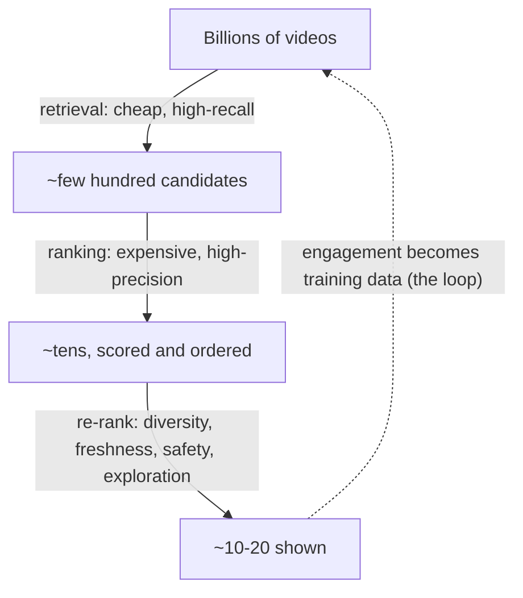
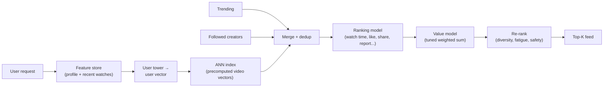
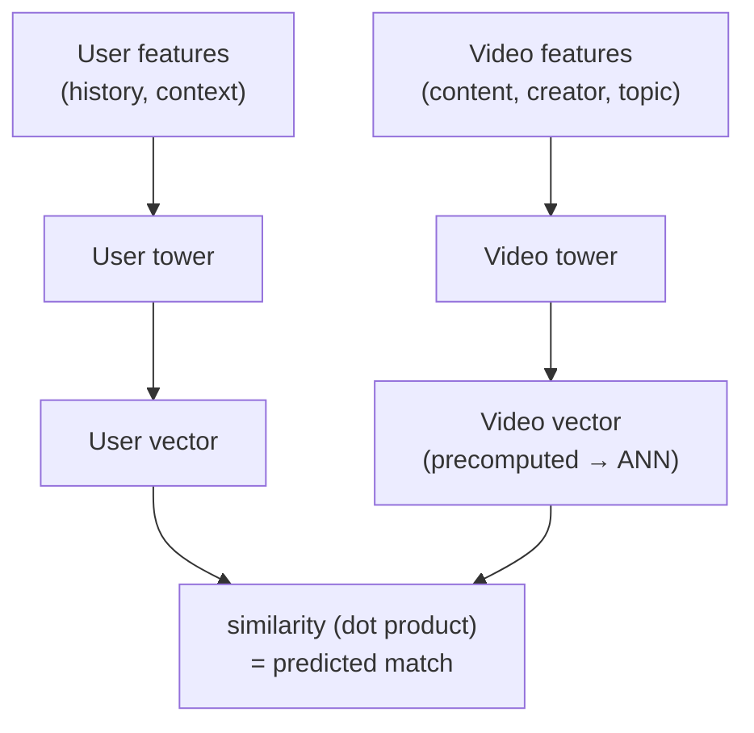

# Case Study: Video Recommendation — YouTube / TikTok Home Feed

> **Q1** · Tag: **[Core]** · Family: Recommendation & Ranking
>
> **Prompt:** *"Design the video recommendation system for a billion-user platform."*
>
> **Teaches:** The two-stage retrieve-then-rank funnel, two-tower embeddings for cheap large-scale candidate generation, multi-task ranking with a tunable value model, and the cold-start / feedback-loop problems inherent to any closed-loop recommender.

This is one of the most common ML system design questions, and one of the most transferable — the core pattern here (retrieve cheaply, then rank precisely) reappears in search, ads, and RAG. This document teaches the whole thing from the ground up, with worked examples, and finishes with drill material and interview tactics.

**How to read it.** Go through it once end-to-end to build the picture. Then use the **Interview delivery guide** and **Flashcards** as practice. The most valuable thing you can do is a timed 30-minute out-loud whiteboard pass, noting *which step you stumbled on* — that gap is what you practice next.

> **A running example.** To make the abstract concrete, we'll follow three users throughout: **Maya**, who watches cooking videos; **Tom**, who watches fitness videos; and **Sara**, who watches painting tutorials. Whenever a concept feels slippery, come back to what it means for Maya.

---

## The 60-second answer

If you had to compress the whole design into one breath:

> We serve a personalized feed with a **two-stage funnel**. **Retrieval** cheaply narrows billions of videos to a few hundred candidates — mainly via a **two-tower model** whose video embeddings are precomputed and searched with an **ANN index**, plus simple sources like trending and followed creators. **Ranking** then runs a heavier model over those few hundred, predicting several signals (watch time, like, share, "not interested"), which a **value model** combines into one score using weights we tune with live experiments. A final **re-ranking layer** handles diversity, freshness, fatigue, and safety. We optimize an offline proxy but *decide with online A/B tests* against a long-term goal like retention, and we run **exploration** to stop the system collapsing into a filter bubble. New videos and users are handled with **content features** and popularity until real engagement data accrues.

Every clause of that paragraph is unpacked below.

---

## Mental model

Three ideas carry most of the answer. Internalize these and you can improvise the rest.

### Idea 1 — The funnel exists because of a hard constraint

You cannot run an accurate, expensive model over billions of videos for every request in ~100 milliseconds. So you split the work into a cheap stage and an expensive stage:

**Remember it as →** a fisherman casting a **wide, cheap net** to pull in a manageable catch, then **carefully sorting** only what's in the boat. The net (retrieval) is fast and imprecise; the sorting (ranking) is slow and precise, but it only has to sort a few hundred fish, not the whole ocean.

```
Billions of videos
      │  retrieval  — cheap, approximate, "don't miss the good ones" (recall)
      ▼
~few hundred candidates
      │  ranking    — expensive, precise, "get the order exactly right" (precision)
      ▼
~tens of scored, ordered videos
      │  re-ranking — diversity, freshness, safety, exploration
      ▼
~10–20 shown to the user
```

Whenever you're unsure how to start this question, **draw the funnel first**. It buys you time and structures everything after.

### Idea 2 — Engagement is a biased *proxy* for satisfaction, not a clean label

There is no column in your data that says "Maya was satisfied." You only have signals like clicks and watches, and those are noisy:

- A **click** can be clickbait (a misleading thumbnail Maya regrets clicking).
- A **long watch** can be a train wreck she couldn't look away from, not something she valued.
- The top video gets engaged with partly *because it was on top* — that's **position bias**.
- Your data only contains outcomes for videos the *old system chose to show*. You never find out what Maya would have done with the video you didn't show — that's **selection bias**.

Almost every subtle, senior-level part of the answer flows from taking this seriously.

### Idea 3 — It's a closed loop, not a one-shot predictor

Today's recommendations become tomorrow's training data. If you naively optimize for immediate clicks, the loop feeds on itself: popular videos get shown more → get more clicks → get shown even more (rich-get-richer), and Maya sees only cooking videos forever (a filter bubble). So a good system deliberately (a) records *why* each video was shown, (b) mixes in **exploration**, and (c) optimizes **long-term** goals like retention rather than only the next click.

**The chain to say out loud in an interview:** *feedback loop → biased training data + narrowing → so we need exploration, debiasing, and long-term objectives.* That sentence alone signals seniority.

### YouTube vs. TikTok — clarify this early, it changes the design

| | YouTube (grid feed) | TikTok (For You Page) |
|---|---|---|
| Presentation | Grid of many videos | One full-screen video at a time |
| Main signal | Watch time on longer videos | Completion %, replays, fast reactions |
| Feedback speed | Minutes to hours | Seconds — an extremely tight loop |
| Structure | Subscriptions and channels matter | Follows matter less; virality dominates |
| Training cadence | Frequent batch retraining | Often near-real-time / online learning |

Stating this distinction in the first two minutes is a strong senior signal. Pick one (or design for both), because it drives your choices on freshness, online learning, and how you define a "positive" label.

---

## The 9-step walkthrough

This is the standard framework applied to this problem. You won't narrate all nine linearly in an interview — you'll spend the first ~5 minutes on steps 1–3 and go deep wherever the interviewer probes — but you should be able to fill every box.

**Step 1 — Clarify & scope.** Turn the vague prompt into a spec. Ask, then state assumptions: which surface (assume the home/For-You feed — the hard case with no current-video context)? YouTube-style or TikTok-style (assume TikTok-style short video; it stresses freshness most)? Primary objective (**long-term retention**, driven by session engagement — explicitly *not* raw clicks, because clicks reward clickbait)? Scale (~1B users, billions of videos, on the order of hundreds of thousands of requests/second)? Latency budget (~100–150 ms server-side)? Freshness (new videos recommendable within minutes)? Constraints (content safety, age-gating, regional rules, privacy).

> **Interview move →** The single most common way to fail a senior loop is jumping straight to "I'll use a two-tower model." Spend real time here. Ask two or three sharp questions, then say "I'll assume X, Y, Z — tell me if you'd rather I change one," and move on.

**Step 2 — Frame as an ML problem.** Input: a user (history, profile, context) + candidate videos + context. Output: a ranked list — concretely, a *score per candidate* estimating predicted satisfaction, then sort and take the top. Paradigm: ranking, split into a **retrieval** sub-problem and a **scoring** sub-problem. Always name a non-ML **baseline** first (global popularity, trending, "from creators you follow") — it's your floor to beat, your cold-start fallback, and a candidate source.

**Step 3 — Metrics.** Name three tiers and the gap between them: an **offline proxy** you can compute cheaply, an **online north-star** the business actually cares about, and **guardrails** you must not regress. (Full plain-English breakdown in the "Metrics, in plain English" deep dive below.) The senior point: offline and online *disagree*, because offline data is biased by what the old system showed — so you ship on A/B tests, not offline numbers.

**Step 4 — Data & labels.** This is the genuinely hard part; talk about it before you're asked. Sources: implicit feedback (impressions, watches, watch %, skips, replays, likes, shares, follows, "not interested," reports), explicit feedback (surveys), video content (thumbnail, title, transcript, audio, creator), user profile, and context. The label is a *design decision*: a "positive" is better defined as a **valid/long watch or a completion**, not a click (which rewards clickbait). See the retrieval deep dive below for how negatives are chosen.

> **Senior signal →** Most candidates rush past labeling. Owning it — how positives are defined, how noisy signals are cleaned, how near-duplicate re-uploads are deduplicated so they don't dominate training, how you'd build a trustworthy evaluation set — is exactly where senior candidates separate themselves. This "how are labels actually made" muscle is worth 5 minutes of airtime.

**Step 5 — Features & leakage.** User features (a long-term embedding plus the **sequence of recent watches** — the single most predictive signal), item features (a learned collaborative embedding *plus* **content embeddings** from vision/text/audio models, which is what makes brand-new videos recommendable), context (time, device, session), and real-time features (what the user watched *this session*).

> **Say this unprompted →** "Every feature must be computed **as of the moment the video was shown**, never using information that only existed later — otherwise I leak the future into training and my offline metrics lie. A feature store with point-in-time-correct joins enforces this." Dropping that line early is a reliable senior signal.

**Step 6 — Model.** The two-stage funnel: retrieval then ranking (both covered in the deep dives below). This is the heart of the answer.

**Step 7 — Training.** Ranking models retrain **frequently** (daily to continuous) to track drift and freshness; retrieval models can retrain more slowly, but item embeddings must refresh fast for new content. The embedding tables are enormous (billions of IDs), so they're **sharded across machines** (model-parallel) while the dense network is **data-parallel**. Version data + labels + code + config together so any shipped model can be reproduced and rolled back.

**Step 8 — Evaluation & serving.** Promotion pipeline: offline eval → **shadow** (score live traffic silently) → **canary** (tiny % of real users) → **A/B test** against the north-star with guardrails → full ramp. The request path (feature fetch → user tower → ANN + other retrievers → merge → ranking → re-rank) must fit the latency budget; levers are caching, precomputation, dynamic batching, and a distilled ranker.

**Step 9 — Monitoring & iteration.** Distinguish **data drift** (inputs shift — new region, new device mix) from **concept drift** (behavior changes — a holiday, a viral trend). Monitor inputs, predictions, and (delayed) outcomes separately. Fight the feedback loop with exploration, and keep retraining triggers and a reproducibility trail so a bad model can be diagnosed and reverted.

---

## Deep dive: Retrieval and the two-tower embedding model

This is the part most people find confusing, so we'll build it slowly.

### The problem retrieval solves

Out of billions of videos, we need to pull a few hundred *good candidates* for Maya, in a handful of milliseconds. We can't score every video for her individually — that's billions of computations per request. We need a way to find "videos like what Maya enjoys" almost instantly.

### The core idea: put users and videos on the same map

Imagine a map. Every video is a pin on this map, and so is every user. The map is arranged so that **a user's pin sits close to the videos they'd enjoy**. Maya's pin lands in the "cooking neighborhood," surrounded by cooking-video pins. Tom's pin lands in the "fitness neighborhood."

If we have such a map, recommending becomes trivial: **find the video-pins nearest to Maya's pin.** Those nearby pins are her candidates.

**Remember it as →** two-tower recommendation is *matchmaking by coordinates* — place people and videos on one shared map, then recommend whatever sits nearby.

This "map" is a mathematical space (say, 128 dimensions instead of 2), and each pin is a **vector** (a list of 128 numbers) called an **embedding**. Two things being "close" means their vectors point in a similar direction — measured by a **dot product** or cosine similarity (a single, fast number).

### The two towers: how pins get their coordinates

We need one function that turns a user into a vector, and another that turns a video into a vector. These are two small neural networks — the "two towers."

**The user tower** eats everything we know about Maya and outputs her 128-dimensional vector:
- her user ID (as a learned embedding),
- her **recent watch history** (a sequence of video IDs, each embedded, then pooled or attended over),
- language, country, device, time of day.

All of these get turned into numbers, concatenated, and passed through a couple of dense layers → **Maya's 128-d vector**.

**The video tower** eats everything we know about a video (say "Garlic Pasta in 10 Minutes") and outputs *its* 128-d vector:
- its video ID and creator ID (learned embeddings),
- its topic/category, language, length,
- **content embeddings** from models that look at the thumbnail (vision), the title and transcript (text), and the audio.

Concatenate, pass through dense layers → **the video's 128-d vector**.

Crucially, both towers output vectors **in the same space** (same 128 dimensions), so a dot product between a user vector and a video vector is meaningful: a big number means "good match."

A subtlety worth stating plainly, because it's the hinge everything else turns on: **a pin's position is *computed*, not *stored*.** It's tempting to picture Maya's vector as a fixed coordinate saved in a database. It isn't. Her vector is the *output* of the user tower run on her features:

```
Maya's vector = user_tower(Maya's features; weights)
```

Her raw features — her ID, her watch-history IDs, her language — don't change. But the tower is a function with adjustable **weights**, and those weights are what training edits. Same fixed input, different weights → a different output vector → the pin lands somewhere else. Picture a tower as a formula that places a city on a map from its fixed properties (`position = a·population + b·latitude + …`): the city's population never changes, but turning the knobs `a, b, …` moves where the city lands. Training turns the knobs.

This also answers a question the "just a dot product" description tends to raise: *if similarity is only a dot product, which has no parameters, what exactly is being trained?* The dot product is just the ruler — it measures distance and learns nothing. All the weights live in the two towers that *produce* the vectors the ruler measures. In the simplest version, a video's vector literally **is** a row in a large trainable table: "Garlic Pasta" (ID 12345) maps to row 12345, which begins as 128 random numbers and gets edited directly during training. In the richer version, the vector is the output of a small network over the video's features, and then that network's weights plus the feature tables are what get edited. Either way, the ruler is parameter-free and the towers are where all the learning happens.

### How the map gets arranged: the training task

Here's the part that usually clicks last, so let's be concrete. We want training to *move the pins* until users sit near videos they engage with. We frame it as a guessing game:

> **"Given this user, which video (out of many) did they actually watch?"**

If the model can consistently make the watched video score higher than the alternatives, its map is arranged correctly.

Comparing against *every* video is impossible (billions), so we use a trick called **in-batch negatives**. Take a small training batch of real (user, watched-video) pairs:

| User | Video they watched (the positive) |
|---|---|
| Maya | Garlic Pasta |
| Tom | Deadlift Tutorial |
| Sara | Watercolor Basics |

Now, for **Maya's** row, we treat *Garlic Pasta* as the correct answer and the **other users' videos in the batch** — Deadlift Tutorial and Watercolor Basics — as the wrong answers (negatives). The loss pushes:

- similarity(Maya, Garlic Pasta) **up**, and
- similarity(Maya, Deadlift Tutorial) and similarity(Maya, Watercolor Basics) **down**.

We do this for every row in the batch simultaneously (it's a softmax/cross-entropy over the batch — a **contrastive loss**). The negatives are essentially free because they're just the other examples already loaded. Run millions of batches, and the pins settle into a sensible arrangement.

To see what "moves" in a single step, suppose that early in training Maya's computed vector happens to sit near *Deadlift Tutorial* and far from *Garlic Pasta* — the opposite of what her watch history says. The loss is large, and the gradient nudges three sets of weights at once: the user-tower weights (so Maya's vector drifts toward the cooking region), Garlic Pasta's row (so it drifts toward Maya), and Deadlift's row (so it drifts away from her). After the update, `similarity(Maya, Garlic Pasta)` might rise from 0.10 to 0.12 — one microscopic correction. Repeated across billions of interactions, these corrections accumulate into the clustered map. The thing that changes so that certain videos "come close" is never the fixed input data; it is always the weights.

Two points about scale, since this is where people picture the wrong thing. First, you never compare a user against all billion videos to compute the loss — that is exactly what in-batch negatives avoid. Each step costs roughly *batch × batch* comparisons (a few thousand squared), not *user × billions*. Second, the training rows are **interactions** — `(user, video-they-watched)` — not videos. There are far more interactions than videos, since each video is watched by many people, and a video with no interactions can't appear as a positive at all (that's the cold-start case, handled later with content features). The billion-scale pass over *videos* happens somewhere else entirely, after training is finished — described under "Serving it" below.

**What emerges — and why it generalizes.** Because Maya (and thousands of other cooking fans) keep getting pulled toward cooking videos, and cooking videos keep getting pulled toward the users who watch them, **all the cooking videos end up clustered together**, with cooking-loving users nearby. So when we look up the pins nearest Maya, we retrieve cooking videos — *including ones she has never seen*, because they live in the same neighborhood. That generalization to unseen videos is the whole payoff.

> **One nuance, one line for the interview:** popular videos appear as in-batch negatives very often, which unfairly punishes them. A **logQ correction** (subtracting the log of each item's sampling frequency from its score) fixes this. Mention it exists; you don't need the derivation.

### Why the two towers must stay separate

This is the detail that makes the whole thing servable, and it's a great point to make in an interview.

The video tower **does not take the user as input**. So a video's vector is the *same for every user* and can be **computed once, in advance, for the entire catalog**. We store all those precomputed video vectors in a special index and reuse them for everybody.

This is worth dwelling on, because it's easy to imagine the map being rebuilt for each person. It isn't. There is exactly **one map, shared by all billion users**. "Garlic Pasta" has a single vector and a single spot; it is not re-plotted for Maya, then again for Tom, then again for Sara. Each user is simply a *query* dropped onto that one shared map. The only thing computed per user, per request, is that user's own vector — used for a single lookup and then discarded.

If instead we built one network that mixed Maya's features and the video's features together early (which would be more accurate), we'd have to recompute the score for *every* (Maya, video) pair at request time — billions of computations. Impossible in 100 ms.

**Interview move →** State the trade-off explicitly: *"The two-tower model is separable, so I can precompute video vectors and serve fast — but it can't model rich user×video interactions. That's exactly why I keep the cheap separable model for retrieval and put the expensive interaction-heavy model in ranking, where it only sees a few hundred videos."* This sentence shows you understand *why* the architecture is shaped the way it is.

### Serving it: the ANN index

We have Maya's fresh vector (computed at request time by running the user tower once) and a few billion precomputed video vectors. We need the nearest few hundred, fast. Checking all billion is too slow, so we use an **ANN index — Approximate Nearest Neighbor search**.

It's worth being precise about the division of labor here, because ANN search and tower training are easy to blur together. **Training builds the map; ANN only navigates it.** The towers are the *cartographer* — they decide *where* each pin sits, so that closeness means relevance. ANN is the *GPS* — it finds the nearest pins to a query fast, but has no idea what they mean; it sees only numbers and distances. That's why ANN on its own is never enough: run ANN over vectors that were never trained — say, raw features like video length and upload hour — and it will faithfully return the videos most similar *in length and upload hour*, which has nothing to do with what Maya likes. ANN over a meaningless space returns meaningless results, quickly. Its speed only becomes valuable once training has arranged the space so that "near" means "relevant." In one line: **ANN finds the nearest vectors; training decides what "near" should mean.**

**Remember it as →** finding the nearest coffee shops to you on a map *without* measuring the distance to every coffee shop on Earth. ANN builds a clever data structure (a common one is **HNSW**, a graph you can hop through) that jumps you to the neighborhood and checks only nearby candidates. "Approximate" means it might occasionally miss the true closest pin, and you accept that tiny error in exchange for a huge speedup. The tuning knob is a triangle: **recall (accuracy) vs. latency vs. memory** — push one and you trade off the others.

### Retrieval isn't only the two-tower model

In practice you run **several retrievers in parallel and merge them**, because no single source covers everything: the two-tower model (personalized), a **trending/popular** source (fresh + covers new users), **followed creators**, and a dedicated **exploration** source. Merging these is itself a senior-level point — say it.

### Training frequency (a common follow-up)

Three different clocks, worth separating clearly:

- **The tower *weights*** (the networks themselves) retrain relatively slowly — daily or a few times a week — because people's tastes, in aggregate, are fairly stable.
- **Video *embeddings*** refresh **fast, continuously** — a brand-new video is pushed through the current video tower the moment it's uploaded (using its content features, since it has no engagement yet) so it becomes retrievable within minutes.
- **The user *vector*** is computed **live at request time**, so Maya's shift toward, say, baking this week is reflected immediately — no retraining needed.

That "weights slow, item embeddings fast, user vector live" summary is a crisp thing to say.

One more thing follows from all this, and it's a natural place for an interviewer to push: *when the tower weights do change, what happens to the catalog?* Because the two towers are trained jointly into one shared coordinate system, a new user tower and the *old* video vectors no longer speak the same language — their similarities stop meaning anything. So a genuine tower update does force a re-embedding of the catalog to keep the map and the ANN index consistent. That sounds expensive, but it's a cheap kind of expensive:

- It's a **forward pass only** — no gradients, no epochs — so it's far cheaper than the training that produced the weights, and it's *embarrassingly parallel*: split the catalog across many machines for a near-linear speedup.
- It runs **offline, as a scheduled batch job**, never inside a user's request path.
- You re-embed only the **active corpus** — the tens of millions of videos actually eligible to be shown — not every dormant upload sitting in cold storage.
- The new index is built in full and then **swapped in atomically** (blue-green style), so users are always served by a single consistent version, never a half-rebuilt mix.

So the full picture is: embed the catalog once per tower version, offline and in parallel; add new uploads through the current frozen tower as they arrive; and compute exactly one fresh vector per request — the user's. The design that first looks wasteful is precisely the one that *avoids* waste — you embed once and serve that map to a billion users for a whole cycle, instead of recomputing anything per user or per request.

---

## Deep dive: Ranking and the value model

Retrieval handed us ~few hundred candidates for Maya. Ranking decides their exact order. It can afford a much heavier model because it only scores a few hundred videos, not billions.

### One model, personalized through inputs

Before the details, clear up a common question: *is the ranking model personalized per person?* Yes — but not by giving each user their own model. There is **one ranking model**, one shared set of weights, used for all billion users; a separate model per person would be impossible to train or serve.

The personalization comes from the **inputs**, not from a private model. The user's features go in alongside the video's, so the same shared model produces a different score for the same video depending on *who* it's scoring for: Maya's watch history, her recent-session behavior, her user embedding, and **cross features** that combine her with this specific video ("does this creator appear in her history?", "how close is this video's embedding to what she watched today?"). Score the same cooking video for Maya and for Tom, and the model — reading Maya-features versus Tom-features — returns a high score for her and a low one for him, all from one model.

**Remember it as →** a single doctor who gives personalized diagnoses because they read each patient's chart. You don't need a different doctor per patient; you need one good doctor who conditions on the chart. This mirrors retrieval exactly: retrieval personalizes by searching near *your* live user vector, ranking personalizes by feeding *your* features into the shared scorer — neither gives you a private model. **One model, personalized inputs.** And because your recent-session actions are inputs, the model reacts to what you did seconds ago with no retraining — the freshness arrives through the features, not through a personal model.

### What the ranking model predicts

A single "will she like it?" number is too crude and invites clickbait. Instead the ranking model predicts **several outcomes at once** for each candidate:

- probability of a valid watch, and expected **watch time**,
- probability of a **like**, a **share**, a **comment**, a **follow**,
- probability of a **negative** reaction — "not interested" or a report.

This is **multi-task learning**: one model with a shared body and several output "heads," one per prediction.

### The two architecture ideas worth remembering

You don't need a laundry list. Remember two:

1. **DCN — Deep & Cross Network.** Recommendation quality often comes from *feature combinations*: "user speaks Italian" × "video is an Italian recipe" is far more predictive than either feature alone. DCN has a "cross" component that **learns these feature interactions automatically**, so you don't have to hand-craft every combination. Remember it as *the part that discovers useful feature pairings on its own.*

2. **MMoE — Multi-gate Mixture-of-Experts.** When you predict several outcomes that partly conflict (a rage-bait video scores high on watch time but high on reports), a naive shared model forces them to compromise badly. MMoE keeps a set of shared "expert" sub-networks and gives **each task its own gate** that decides how much to draw from each expert. Remember it as *letting each objective pull from the shared knowledge in its own way.*

A common real-world ranker is roughly "DCN-style feature crossing feeding an MMoE multi-task head." That single phrase is enough to say in an interview.

### How the ranking model is trained

It's ordinary **supervised learning** on logged impressions. Each training example is one impression: Maya was shown "Garlic Pasta" in this context, and the labels record what happened (watched 90 seconds ✓, liked ✓, shared ✗, reported ✗). Each head gets its own loss — binary cross-entropy for the yes/no heads (like, share, report), and a regression or weighted-logistic loss for watch time — and the total loss is their sum. Because behavior and content drift, it retrains **frequently** (daily to continuous).

One catch to mention: ranking only trains on **videos that were actually shown**, which bakes in position and selection bias. A standard fix is a small side-input for **position during training** (so the model learns *relevance* rather than "it was near the top"), which you set to a fixed value at serving time.

### The value model: turning many predictions into one score

The ranking model outputs several numbers per video. To sort the feed, we need **one** score. The **value model** is the formula that combines them:

```
score = w1 · (watch_time)
      + w2 · P(like)
      + w3 · P(share)
      − w4 · P(report)
      + …
```

Here's the crucial and often-missed point: **the weights `w` are not learned by gradient descent.** They encode a *business and values judgment* — "how much is a share worth versus a minute of watch time? how heavily do we punish a report?" — and that trade-off only reveals itself in **long-term** outcomes. So you pick the weights and **tune them with live A/B experiments**: try weight set A against weight set B on real traffic and keep whichever lifts retention without hurting guardrails.

**Worked example.** Suppose a video is predicted to have very high watch time but also a meaningful report probability. Should Maya see it? The prediction model can't answer that — it just reports the numbers. The **weights** answer it. If `w4` (the report penalty) is large, the video is suppressed; if it's small, engagement wins. The interview-worthy sentence: *"The model predicts the ingredients; the value model's weights — chosen by experiment — decide the recipe, because the engagement-vs-health trade-off is a judgment that only shows up in long-term metrics."*

### The final re-ranking layer

On the handful of top-scored videos, apply rules the score alone won't capture: **diversity** (don't show Maya eight clips from one creator), **freshness** injection, **fatigue/dedup** (don't re-show videos or near-duplicates she just saw), **exploration** slots for new content, and **safety** filtering.

### How often the funnel runs while scrolling

Now that the full funnel is on the table (retrieve → rank → re-rank), a natural question is how often it fires while someone scrolls a short-video feed. The key point: **you don't re-run the whole funnel for every swipe.** That would be wasteful and too slow to hide. The system works in **prefetched batches** instead.

One funnel pass produces a *page* of ranked videos — say 10–20 — not a single video. The app shows the top few and **caches the rest on the device**. Swiping through those cached videos is instant and triggers *no* new funnel run; that's why the next clip is always ready with no spinner. When the buffer is running low (a few videos from the end), the app fires the *next* funnel pass in the background. So the retrieve → rank loop runs roughly **once every ~5–10 videos**, ahead of the user, rather than once per swipe.

There are really two clocks:

| Clock | Frequency | What it does |
|---|---|---|
| The user's swipe | Every few seconds | Consumes one already-ranked video from the local buffer |
| The funnel (retrieve → rank → re-rank) | Every ~5–10 videos, prefetched in the background | Produces the next page of candidates |

Batching this way amortizes the expensive retrieval and ranking across many videos, keeps latency invisible (the work finishes before it's needed), and cuts server load by roughly 10x versus running the funnel on every swipe.

This raises a fair question: if the funnel only refetches every ~10 videos, how does the feed still feel so reactive? Two mechanisms. First, **signals are logged in real time** — a one-second skip, a double replay — so the *very next* funnel pass, moments later, already conditions on that fresh behavior; the tight loop is per-swipe *logging* feeding a near-immediate refill, not per-swipe recompute. Second, a **strong signal can force an early refetch** — a hard skip, a "not interested," or a long watch on an unexpected topic can make the system discard the rest of the cached page and run a fresh funnel immediately, so it stops feeding a page that no longer fits. That combination — real-time logging, short prefetched batches, and the option to abandon a stale batch — is what produces the "it read my mind" feeling without a full pipeline run per swipe.

---

## Metrics, in plain English

Interviews throw acronyms around. Here's what each one actually means, with a tiny example. Use the ones that fit; don't recite all of them.

**Three tiers, and the gap between them.** *Offline* metrics are computed on logged data (fast, cheap, but biased by what the old system showed). The *online north-star* is what the business actually wants (measured with live experiments). *Guardrails* are things you must not break while chasing the north-star. The **offline-online gap** — the fact that a model can look better offline yet lose online — is why you ship on A/B tests. Say this explicitly.

**recall@k** *(a retrieval metric).* Of the videos Maya actually engaged with, what fraction did retrieval manage to include in the top *k* it returned? Example: she engaged with 10 videos today; retrieval's top 500 contained 8 of them → **recall@500 = 0.8**. It answers "did the wide net even catch the good fish?" — retrieval's one job.

**AUC** *(short for ROC-AUC, a ranking metric for yes/no predictions).* Pick one video Maya liked and one she didn't, at random. AUC is the probability the model gave the liked one a higher score. **0.5 = random guessing, 1.0 = perfect.** It measures whether the model orders positives above negatives, ignoring the exact probability values.

**Log loss** *(also called cross-entropy).* Penalizes confident wrong predictions harshly. Saying "95% chance she'll like it" and being wrong hurts far more than saying "55%." It rewards being both correct *and* honest about uncertainty.

**Calibration.** A separate, important property: when the model says "20% chance of a like," does a like actually happen ~20% of the time? A model can rank perfectly (great AUC) yet be badly calibrated (all its probabilities are too high). Calibration matters whenever the *number itself* feeds a downstream decision — most of all in ad pricing, but also in the value model's weighted sum.

**NDCG** *(Normalized Discounted Cumulative Gain, a ranking metric for graded relevance).* When items aren't just relevant/irrelevant but "very / somewhat / not," NDCG rewards putting the most relevant ones near the top. "Discounted" = a great result at position 10 counts less than at position 1. "Normalized" = 1.0 means the perfect order. Use it when you have graded relevance labels.

**DAU** — **Daily Active Users**, a common north-star proxy for whether people keep coming back.

**Guardrail examples:** content/creator **diversity**, **report / "not interested" rate**, **new-creator exposure**, prediction **latency**, and user-**satisfaction surveys**. These catch a model that lifts short-term watch time by feeding outrage or by narrowing the feed.

---

## Cold-start and the feedback loop

The model deep-dives covered "why two-tower" and "why multi-objective." Two systemic topics remain, and interviewers reliably probe them.

### Cold-start: no history to learn from

Two distinct cases — keep them separate.

**A brand-new video** has no engagement, so collaborative signal (who-watched-what) is useless. Fall back to **content features**: run vision on the thumbnail/frames, text on the title/transcript, audio on the soundtrack, and add a **creator prior** (how this creator's past videos performed). That's enough to place it on the map and start recommending it. Then give it a deliberate **exploration budget** — show it to a small, well-chosen audience so it can gather real feedback fast. Example: a new pasta video from a known cooking creator gets placed near other pasta content by its thumbnail and title alone, then shown to a slice of cooking fans like Maya to see if it lands.

**A brand-new user** has no history. Lean on **context** (country, language, device), **popularity/trending**, an optional onboarding step ("pick a few interests"), and **rapid exploration** to learn their taste within the first session.

**The unifying sentence:** *"Content features bridge the gap until collaborative signal exists."*

### The feedback loop and filter bubbles

The mechanism (from Idea 3): recommendations → engagement → training data → recommendations. Left alone, it amplifies popular videos and narrows every user. Four counters, roughly in order of how much they impress:

1. **Exploration** — deliberately show some uncertain or new items (via bandit algorithms or dedicated exploration traffic) so the system keeps learning about content it hasn't shown, and new creators aren't starved.
2. **Debiasing** — record the **propensity** (how likely each video was to be shown) and correct for it. **IPS (Inverse Propensity Scoring)** means weighting each logged example by 1 ÷ its show-probability, so rarely-shown-but-engaged items count more and you learn true relevance instead of just "what was already popular."
3. **Diversity** in re-ranking — cap how much any one creator or topic can dominate the feed.
4. **Long-term objectives** — optimizing retention and satisfaction, not just the next click, resists the short-term collapse.

---

## Diagrams

Sketch the funnel first, then the request flow, then the two-tower map when asked about retrieval.

**The funnel:**



**The request flow:**



**The two-tower map:**



---

## Interview delivery guide

The design content gets you a passing score; *how you run the room* gets you the senior title. Below is a timed script to internalize the pacing, followed by the meta-tips interviewers are actually grading.

### The timed script (45-minute loop)

Use this as a *rhythm*, not something to memorize word-for-word. Timings assume a 45-minute round.

**0–5 min — Scope (talk, don't draw yet).**
> "Let me scope first. I'll assume the **For-You home feed** — the hard case with no current-video context — for a **TikTok-style short-video** product, since that stresses freshness; I can adapt for YouTube. Primary objective is **long-term retention**, driven by session engagement, and explicitly *not* raw clicks, which reward clickbait. Scale: ~1B users, billions of videos, hundreds of thousands of requests/second, ~100–150 ms latency, new videos live within minutes. I'll need content-safety filtering. Does that framing work?"

**5–8 min — Frame + metrics.**
> "It's a ranking problem, split into retrieval and scoring. Offline I track **recall@k** for retrieval and **AUC plus calibration** for the ranking heads; my online north-star is **retention**, with session watch time as a driver, guarded by diversity, report rate, and latency. The key subtlety: offline and online disagree because logged data is biased by what the old system showed — so I ship on **A/B tests**."

**8–13 min — Data & labels (go deep here).**
> "The hardest part is labels — there's no 'satisfaction' column, so I construct one. A click rewards clickbait, so a positive is a **valid or completed watch**. Negatives are biased by position and selection, so for retrieval I use **in-batch negatives** and I log show-probabilities so I can debias later. Sources are implicit feedback, content signals from vision/text/audio, user history, and context."

**13–27 min — Model (draw the funnel, then the two-tower map).**
> "The core is a **two-stage funnel**. Retrieval uses a **two-tower model**: a user tower and a video tower map users and videos into the same space, and because the video tower ignores the user, I **precompute every video's vector and serve it from an ANN index** — that's what makes billions feasible in milliseconds. I add trending and followed-creator retrievers and merge them. Ranking is heavier — a multi-task model predicting watch time, like, share, and report — and a **value model combines them with weights I tune via A/B**. Then re-ranking for diversity, fatigue, and safety."

**27–35 min — Cold-start, feedback loop, serving.**
> "New videos use **content features** plus a creator prior and an exploration budget; new users use context and popularity plus fast exploration. The **feedback loop** is the big systemic risk — recommendations become training data — so I add exploration, propensity-based debiasing, diversity, and long-term objectives to avoid filter bubbles. Serving is feature fetch → user tower → ANN and other retrievers → merge → ranking → re-rank, kept within budget by caching and batching."

**35–42 min — Training & monitoring (close the loop).**
> "Training shards the giant embedding tables across machines with a data-parallel dense network, retrains ranking frequently for freshness, and versions data and code for reproducibility. In production I monitor inputs, predictions, and delayed outcomes separately, tell **data drift** from **concept drift**, and trigger retraining on degradation."

**42–45 min — Trade-offs.**
> Offer one honest weakness (the hand-tuned value weights) and take the interviewer's follow-up.

### Delivery tips for a senior loop

- **Drive the interview.** Don't wait to be led. Lay out your plan ("I'll scope, then metrics, then the two-stage model, then serving and monitoring"), then execute it. Check in: "Shall I go deeper on retrieval, or move to ranking?"
- **Narrate trade-offs, not just choices.** Never say only "I'll use X." Say "I'll use X *because* Y, accepting the cost Z." Every "because" and "accepting" is a point scored. The two-tower separability trade-off (see the retrieval deep dive) is the model example of this.
- **Go two levels deep in exactly one place.** You can't be deep everywhere in 45 minutes. Pick one area — retrieval, or labeling, or monitoring — and go genuinely deep to prove you *can*, while staying crisp elsewhere. Uniform shallowness reads as junior.
- **Volunteer the non-obvious three, unprompted.** The offline-online gap, how labels are actually made, and the feedback loop. Bringing these up before the interviewer asks is the clearest senior tell in this question.
- **Show it's a system, not a model.** Juniors design a model and stop. Seniors talk about serving latency, monitoring, drift, retraining triggers, and rollback. Always close the loop back to "how does this stay healthy in production."
- **State assumptions and keep moving when stuck.** "I'm not certain of the exact index here, so I'll assume HNSW and note the recall/latency trade — I can revisit." Decisiveness under uncertainty is exactly the senior behavior.
- **Manage time; don't rat-hole.** If you feel yourself over-explaining one component, stop and say "I could go deeper here, but let me make sure I cover serving and monitoring first."
- **Critique your own design.** Near the end, name a weakness voluntarily: "One risk in this design is that the value-model weights are hand-tuned, so a bad weight can quietly hurt retention for weeks before guardrails catch it — I'd add a faster proxy metric." Self-critique signals maturity and pre-empts the interviewer's own objection.
- **Emphasize the data-centric angle.** Most candidates over-index on model architecture. Talking credibly about label quality, curation, deduplication, and how monitoring feeds back into the training set is where senior signal concentrates — and it's often underweighted by other candidates, so it stands out.

---

## Curveballs

The move is always: **restate the new constraint, name which part of the funnel it stresses, then adapt only that part.** Don't redesign everything.

- **"Run it on the device."** Push a small **distilled/quantized** ranker onto the phone for the final re-rank over a candidate set the server retrieved; keep heavy retrieval and training server-side. (Lower latency, more privacy, smaller model.)
- **"Cut latency to 50 ms."** Attack the budget: **cache** more (user vectors, candidate lists), add a **cheap pre-ranker** to shrink the set before the expensive ranker, distill the ranker, and accept slightly more ANN approximation (name the recall trade).
- **"New videos must go viral within minutes."** Stress the **freshness + cold-start** path: near-real-time video-embedding computation, an **exploration budget** for fresh content, real-time counters as features, near-online ranking updates. (This is the TikTok design point.)
- **"Retention is only known days later."** You can't train the long-term head on fresh data. Use an **immediate proxy** (session completion, next-session return) that correlates with retention, train the slow head on delayed labels at a slower cadence, and confirm via A/B that the proxy actually moves retention.
- **"It keeps recommending engaging-but-harmful content."** Safety filtering as a **hard gate** in re-ranking, a **negative** term in the value model for reports, and **guardrail** metrics that can block a launch even when watch time rises.
- **"How do you know a new model is better?"** Offline is necessary but not sufficient; you **decide with an A/B test** with proper statistical power and guardrails, watching for network/marketplace effects.

---

## Common failure modes

- Jumping to architecture before scoping. (The biggest killer.)
- Treating "engagement" as a clean label instead of a noisy, biased, *constructed* one.
- Claiming a model is better because offline AUC went up (forgetting the offline-online gap).
- Proposing a fancy model with no simple baseline to beat.
- Designing a model but not a *system* — no monitoring, no retraining, no feedback-loop discussion.
- Optimizing a single objective and never mentioning the perverse incentives.
- Hand-waving serving — no latency budget, no explanation of *why* the funnel exists.
- Over-engineering — reaching for exotic methods before the two-tower + multi-task backbone is even on the board.

---

## Flashcards

Cover the right column; recall it from the left.

| Cue | What you must be able to say |
|---|---|
| Why two stages? | Can't score billions per request; cheap approximate **retrieval** → expensive precise **ranking** on a few hundred. |
| Two-tower, in one line | Map users and videos into one space; recommend nearest video-pins to the user-pin. |
| Why two-tower is servable | Video tower ignores the user → precompute all video vectors → ANN lookup; only the user tower runs live. |
| How two-tower trains | "Which video did this user watch?" — push watched pair together, in-batch others apart (contrastive loss). |
| What's an embedding | A vector of numbers placing a user or video as a pin on the shared map; closeness = match. |
| ANN | Approximate nearest-neighbor search — find nearby pins fast without checking all of them; trades recall vs latency vs memory. |
| Ranking architecture | **DCN** (auto-learns feature crosses) feeding **MMoE** (multi-task heads for conflicting objectives). |
| How ranking trains | Supervised on logged impressions; one loss per head; retrained frequently. |
| Value model | Weighted sum of predicted heads into one score; **weights tuned by A/B**, not gradient descent. |
| Is ranking personalized? | Yes, but **one shared model** — personalized through per-user features, not a model per person. |
| Funnel cadence while scrolling | Runs per **batch**, prefetched ~5–10 videos ahead; every swipe is logged in real time so the next refill reacts fast. |
| Why not optimize clicks | Rewards clickbait; use completions, penalize reports, optimize long-term retention. |
| recall@k / AUC | recall@k: fraction of engaged items retrieval caught in top-k. AUC: chance a liked item outscores a disliked one. |
| Calibration | Predicted 20% actually happens ~20% of the time; matters when the number feeds a decision. |
| Offline-online gap | Logged data is biased by the old policy → ship on A/B tests, not offline metrics. |
| Cold-start | New video: content features + creator prior + exploration. New user: context + popularity + fast exploration. |
| Feedback loop fix | Exploration + IPS debiasing + diversity + long-term objectives. |
| Leakage fix | Point-in-time-correct features via a feature store. |
| Drift | Data drift = inputs shift; concept drift = behavior shifts. Monitor inputs, predictions, outcomes separately. |

---

## One-page cheat sheet

**Problem:** rank billions of videos per user in ~100 ms, optimizing long-term retention — not raw clicks.

**Scope:** For-You feed, TikTok-style (hardest case) · ~1B users, billions of videos · ~100–150 ms latency budget · new videos must be recommendable within minutes · content-safety required.

**Framing:** ranking problem = retrieval (recall) + scoring (precision), on top of a popularity/trending non-ML baseline.

**Metrics:**
- Offline: recall@k (retrieval); AUC + calibration + log loss (ranking heads)
- Online north-star: retention / session engagement
- Guardrails: diversity, report/"not-interested" rate, new-creator exposure, latency
- Offline ≠ online (old-policy bias) → ship on A/B, never on offline lift alone

**Labels:** positive = valid/completed watch, not a click (click rewards clickbait). Log each item's show-probability for later debiasing.

**Features:** user embedding + recent-watch sequence (single strongest signal); item ID/creator embedding + content embeddings (vision/text/audio, the cold-start bridge); context; real-time session features. Everything point-in-time correct via a feature store — no future leakage.

**Retrieval (two-tower):**
- User tower + video tower → same embedding space; match score = dot product
- Video tower ignores the user → precompute every video vector once → ANN index (e.g., HNSW) for lookup; only the user vector is computed live, per request
- Trained with in-batch negatives / contrastive loss ("which video did this user watch?"); logQ correction offsets popularity bias in the negatives
- Merge several retrievers: two-tower (personalized) + trending + followed creators + dedicated exploration

**Ranking:**
- One shared model, personalized via per-user input features + cross features — not one model per user
- Multi-task: watch time, like, share, follow, report — MMoE gates shared experts per task
- DCN-style automatic feature-interaction learning
- Value model = hand-picked weighted sum of the predicted heads → one score; weights tuned by **A/B experiment**, not gradient descent
- Re-rank: diversity, freshness, fatigue/dedup, exploration slots, safety filtering

**Serving cadence:** the funnel runs once per prefetched page (~5–10 videos), not per swipe; real-time logging feeds the next refill; a strong negative signal can force an early refetch.

**Training:** ranking retrains daily/continuous; tower weights retrain slower; video embeddings refresh continuously as content is uploaded; embedding tables sharded (model-parallel), dense net data-parallel. A tower-weight update forces an offline, parallel re-embed of the active catalog and an atomic index swap.

**Rollout:** offline eval → shadow → canary → A/B → full ramp, with rollback via versioned data + labels + code.

**Cold start:** new video → content features + creator prior + exploration budget. New user → context + popularity + onboarding + fast exploration.

**Feedback-loop defenses:** exploration (bandits), IPS debiasing (weight by 1/propensity), diversity caps in re-ranking, long-term objective instead of next-click.

**Monitoring:** data drift (inputs shift) vs. concept drift (behavior shifts); watch inputs/predictions/outcomes separately; retraining triggers tied to a reproducible pipeline.

**Say unprompted:** the offline-online gap, how labels are actually constructed, the feedback-loop risk.

---

## Glossary

- **ANN (Approximate Nearest Neighbor) search** — finding vectors close to a query vector without comparing against every item; trades a little accuracy for a lot of speed.
- **AUC (Area Under the ROC Curve)** — probability a model ranks a random positive example above a random negative one; 0.5 = random, 1.0 = perfect.
- **Calibration** — whether a predicted probability matches the real-world frequency (a 20% prediction should come true ~20% of the time).
- **Contrastive loss** — a training objective that pulls a matching pair (e.g., user and watched video) closer together in embedding space while pushing non-matching pairs apart.
- **Cross features** — features built by combining two other features (e.g., "user's language" × "video's language") so the model can learn interactions directly.
- **DAU (Daily Active Users)** — count of unique users active in a day; a common retention proxy.
- **DCN (Deep & Cross Network)** — a ranking architecture with a "cross" component that automatically learns useful feature interactions instead of requiring hand-crafted crosses.
- **Embedding** — a fixed-length vector of numbers representing an entity (a user, a video) such that geometric closeness corresponds to similarity/relevance.
- **Feature store** — infrastructure that serves features consistently between training and inference, typically enforcing point-in-time correctness.
- **Filter bubble** — a feedback-loop failure mode where a recommender narrows a user's exposure to an increasingly small slice of content.
- **HNSW (Hierarchical Navigable Small World)** — a graph-based ANN algorithm that supports fast approximate nearest-neighbor lookups over large vector sets.
- **In-batch negatives** — using other examples already present in a training batch as negative examples, avoiding the cost of sampling negatives separately.
- **IPS (Inverse Propensity Scoring)** — a debiasing technique that reweights logged examples by 1 ÷ (probability the system showed that item), so rarely-shown items aren't undervalued.
- **Log loss (cross-entropy)** — a loss function that penalizes confident wrong predictions more than uncertain wrong ones.
- **logQ correction** — an adjustment subtracted from a candidate's score during in-batch-negative training to offset the unfair penalty popular items receive from appearing as a negative more often.
- **MMoE (Multi-gate Mixture-of-Experts)** — a multi-task architecture where shared "expert" sub-networks are combined differently per task via per-task gating, so competing objectives don't force a bad compromise.
- **Multi-task learning** — training one model with a shared body and multiple output heads, one per prediction target.
- **NDCG (Normalized Discounted Cumulative Gain)** — a ranking metric for graded relevance that rewards placing highly relevant items near the top of a list.
- **Point-in-time correctness** — the property that a feature's value used in training/serving reflects only information available at that historical moment, preventing label leakage.
- **Position bias** — the tendency for items shown higher in a list to get more engagement regardless of true relevance.
- **QPS (Queries Per Second)** — a standard measure of system request throughput.
- **recall@k** — of the items a user actually engaged with, the fraction that appeared in the top *k* candidates a retrieval stage returned.
- **Selection bias** — the bias in logged data caused by only observing outcomes for items the previous system chose to show.
- **Two-tower model** — an architecture with two independent neural networks (one for users, one for items) that map both into a shared embedding space so relevance can be scored with a simple dot product.
- **Value model** — the function (often a weighted sum) that combines a ranking model's several predicted outcomes into the single score used to sort a feed.

---

## Further reading & tools

Read these to move from "can answer it" to "have conviction." Search for the current versions.

**Papers**

- [Covington, Adams, Sargin — "Deep Neural Networks for YouTube Recommendations" (2016)](https://scholar.google.com/scholar?q=Deep+Neural+Networks+for+YouTube+Recommendations) — the origin of the retrieval + ranking split. Start here.
- [Zhao et al. — "Recommending What Video to Watch Next" (2019)](https://scholar.google.com/scholar?q=Recommending+What+Video+to+Watch+Next) — YouTube's MMoE multi-objective ranking with position-bias correction.
- [Yi et al. — "Sampled-softmax / two-tower retrieval" (2019)](https://scholar.google.com/scholar?q=Sampling-Bias-Corrected+Neural+Modeling+for+Large+Corpus+Item+Recommendations) — the in-batch-negatives and logQ-correction details.
- [Wang et al. — "Deep & Cross Network (DCN)"](https://scholar.google.com/scholar?q=Deep+%26+Cross+Network+for+Ad+Click+Predictions) — automatic feature-interaction learning for ranking.

**Tools**

- [FAISS](https://github.com/facebookresearch/faiss) — a widely used library for efficient similarity search and ANN indexing over dense vectors.
- [hnswlib](https://github.com/nmslib/hnswlib) — a fast, header-only implementation of HNSW, the graph-based ANN algorithm referenced in the retrieval deep dive.

---

*Part of the [ML System Design Case Studies](../README.md) series.*
