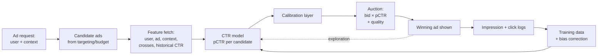

# Case Study: Ad Click-Through-Rate (CTR) Prediction

> **Q3** · Tag: **[Core]** · Family: Recommendation & Ranking
>
> **Prompt:** *"Predict P(click) to drive the ad auction."*
>
> **Teaches:** Calibrated probability estimation (not just ranking), massive sparse features, extreme class imbalance, and near-online learning.

---

## How to use this document

This is a **teaching document**, not a cheat sheet to memorize. The goal is that after reading it once and drilling the framework twice, you can walk into a room, get handed *any* prediction-feeds-an-auction problem, and reason from first principles for 45 minutes without freezing.

Read it in three passes:

1. **Understand pass** — read start to finish, including the analogies. Don't skip the auction section even though it feels like "not ML." It *is* the reason the whole design looks the way it does.
2. **Framework pass** — cover the answers and try to fill out all 9 steps of the framework yourself. The point where you stumble is your gap, not the topic.
3. **Curveball pass** — read the "Follow-ups" section and practice re-deriving your answer under each new constraint out loud.

There's a one-page cheat sheet at the very bottom. Earn it by reading the rest first.

---

## Part 0 — The one thing that matters most

If you remember nothing else from this document, remember this:

> **A CTR model does not exist to rank ads. It exists to output a number that is *literally true*.**

Most ML ranking problems only care about **order**: is item A better than item B? CTR is different because its output is multiplied into an **auction** and a **billing** system. The number `0.02` has to *mean* "2 clicks per 100 impressions," because real money is charged against it.

This single fact is what separates a senior answer from a junior one. A candidate who says "I'll train a deep model and optimize AUC" has missed the entire point of the problem. A candidate who opens with "the output has to be a *calibrated* probability because it feeds an auction, so my primary metric is log loss, not AUC" has already signaled seniority in the first two minutes.

We'll unpack exactly what "calibrated" means and why it's non-negotiable. But plant the flag now.

### The umbrella analogy (calibration vs. ranking)

Imagine two weather forecasters.

- **Forecaster A (great ranking, bad calibration):** On days it will rain, they always give a higher number than on dry days. But their numbers are inflated — they say "90%" on days that turn out to rain only 60% of the time.
- **Forecaster B (perfect calibration):** When they say "70%," it rains on 70% of those days. Exactly.

If you're just deciding *"should I carry an umbrella today?"* — a threshold decision — Forecaster A is fine. Their ranking is perfect; you'd carry the umbrella on the right days.

But now suppose you **sell umbrella insurance** and you price each policy as `payout × P(rain)`. Forecaster A will bankrupt you: they say 90% when it's really 60%, so you overcharge, lose customers to competitors, and your books don't balance. You need Forecaster B.

**The ad auction is the umbrella-insurance business, not the umbrella-carrying decision.** That's why CTR is a calibration problem, not just a ranking problem.

---

## The 60-second answer

If you had to compress the whole design into one breath:

> We're predicting **pCTR = P(click | user, ad, context)** to feed an ad auction where `ad_rank = bid × pCTR` both **ranks** ads and, in a second-price auction, sets what the winner **pays** — so the output has to be a genuinely calibrated probability, not just a good ranking. That's why **log loss** (a proper scoring rule) is the primary offline metric, backed by **Normalized Entropy** and a **calibration ratio/reliability diagram**, with AUC reported only as a secondary ranking sanity check. At scale (~1M QPS, a ~10–50 ms model slice of a ~100 ms auction budget), we start from a smoothed-historical-CTR heuristic and climb a **model ladder** — logistic regression on hashed/crossed sparse features trained with **FTRL** (calibrated, online, sparse) → factorization machines that learn feature crosses automatically → the **GBDT+LR** hybrid → deep models (Wide & Deep, DeepFM, DCN, **DLRM**) with billion-ID embedding tables — justifying each rung against the latency budget rather than reaching for the biggest model. Negatives are **downsampled** for efficiency and then **recalibrated** (`q = p / (p + (1-p)/w)`); **position bias** and **selection bias** are handled with the position-feature trick and **exploration**, respectively. Because ad performance is sharply non-stationary, training is **continuous/near-online**, pushing fresh models within an hour, with data-parallel dense layers and model-parallel embedding tables. Models ship through **offline → shadow → canary → A/B**, never straight from an offline number, and in production the single most-watched signal is the **calibration ratio** (Σpred/Σactual ≈ 1.0), alongside data/concept drift and ad coverage — with exploration doing double duty as the fix for both cold-start and the rich-get-richer feedback loop.

Every clause of that paragraph is unpacked below.

---

## Mental model

Three ideas carry most of the answer. Internalize these and you can improvise the rest.

### Idea 1 — The output has to be *literally true*, not just well-ordered

Two weather forecasters can both rank days perfectly (rain days always score higher than dry days) while only one of them is *calibrated* — when they say "70%," it rains 70% of the time. Ranking is enough if you're just deciding whether to carry an umbrella. It is **not** enough if you're pricing umbrella insurance as `payout × P(rain)`, because a ranking-only forecaster can be systematically wrong on the actual number and bankrupt you.

**Remember it as →** the ad auction is the insurance business, not the umbrella-carrying decision. `bid × pCTR` multiplies your number by real money, so `0.02` must mean "2 clicks per 100 impressions" — not merely "more likely to be clicked than the next ad."

### Idea 2 — pCTR lives inside one equation that both ranks *and* prices

`ad_rank_score = bid × pCTR`. The platform shows whoever has the highest expected value per impression, and in a second-price-style auction the winner pays roughly what the runner-up's `bid × pCTR` implies. This is why a calibration bug isn't a cosmetic ranking nuisance: get pCTR wrong and you can (a) rank the wrong ad above a better one, and (b) charge the winner the wrong price — two distinct failure modes from one bad number.

**Remember it as →** pCTR is the exchange rate that converts a per-click bid into a per-impression price. Get the exchange rate wrong and every downstream transaction is wrong.

### Idea 3 — Three parties, conflicting interests

Users want relevant, unobtrusive ads (mostly none at all). Advertisers want cheap clicks/conversions and honest measurement. The platform wants revenue without burning the user trust it depends on long-term. Maximize raw CTR and you get clickbait ads, which win the metric while poisoning all three relationships at once.

**Remember it as →** almost every "why not just maximize X" or "what guardrail would you add" question is this triangle in disguise — trace the question back to which of the three sides gets hurt.

---

## Part 1 — Understand the auction *before* you touch ML

You cannot design a CTR system well if you don't understand what consumes its output. Spend two minutes of the interview here; it shows you think about the *system*, not just the model.

### Why an auction at all?

An ad platform (Google, Meta, TikTok, Amazon) has one ad slot and many advertisers who want it. It has to decide, in ~100 milliseconds, **which ad to show** and **how much to charge**. It does this with an auction that runs on every single ad request — billions of times a day.

### The core equation

Most advertisers bid on a **cost-per-click (CPC)** basis: "I'll pay up to \$2 when someone clicks my ad." But the platform doesn't get paid per *impression shown unless there's a click*. So to compare advertisers fairly, the platform computes each ad's **expected value per impression**:

```
ad_rank_score  =  bid  ×  pCTR          (simplified)
expected_revenue_per_impression = bid × pCTR
```

The platform shows the ad with the highest `bid × pCTR` (plus quality and relevance terms in reality — often called a "quality score"). This is why `pCTR` is central: **it converts a per-click bid into a per-impression expected value so different advertisers can be compared.**

### Where calibration bites

Two places, and naming both is a senior signal:

1. **Ranking across advertisers.** Advertiser X bids \$1 with a true CTR of 4%; Advertiser Y bids \$3 with a true CTR of 1%. Expected values: X = \$0.04, Y = \$0.03. X should win. But if your model is miscalibrated *non-uniformly* — say it overestimates low-CTR ads — you might rank Y above X and show the worse ad. You lose revenue *and* show users a less relevant ad.

2. **Pricing.** In a **second-price / generalized second-price (GSP)** auction, the winner pays roughly the minimum bid they'd have needed to still win — which is computed from the *runner-up's* `bid × pCTR`. If pCTR is wrong, the price is wrong. Advertisers who systematically overpay leave; advertisers who underpay starve the platform. Budget pacing (spending an advertiser's daily budget evenly) also relies on accurate pCTR to forecast spend.

> **Interview line to bank:** *"Because pCTR both ranks ads and sets the price the winner pays, a systematic bias of even a few percent isn't a ranking nuisance — it's a direct, compounding revenue and trust problem. So my primary offline metric is log loss / calibration, and AUC is secondary."*

### The three-sided marketplace

Keep this diagram in your head. Ads is not a two-party system; it's three parties whose interests conflict:

- **Users** want relevant, non-annoying ads (and mostly, no ads).
- **Advertisers** want clicks/conversions at a good price and honest measurement.
- **The platform** wants revenue *without* burning user trust (which is its long-term asset).

Almost every "guardrail metric" and "why not just maximize CTR" follow-up comes from this tension. If you maximize raw CTR you'll show clickbait, users leave, advertisers get junk traffic, and the platform dies slowly. Senior answers always name the user-experience guardrail.

---

## Part 2 — The framework, applied to CTR

Now we walk the 9-step skeleton from the curriculum's Part 0, applied concretely. In a real loop, spend your first ~5 minutes on steps 1–3. Jumping to model architecture before scoping is the classic senior-loop failure.

Here's the whole system at a glance; we'll build up to it:



Note the two loops: the **serving loop** (left to right) and the **feedback loop** (logs back to training). The dotted exploration arrow is what keeps the feedback loop from eating itself — we'll get there.

---

### Step 1 — Clarify & scope

Turn the vague prompt into a written spec *out loud*. Ask (and then answer for yourself so you don't stall):

**Functional questions:**
- Search ads (query present, strong intent) or feed/display ads (no query, weaker intent)? This changes features heavily. Assume **feed/display ads** unless told otherwise — it's the harder, more general case.
- Are we predicting **click**, or click-then-**conversion**? Start with click; conversions have far worse label delay (a purchase can happen days later). Mention you know the difference.
- One ad slot or many? Ranking a slate introduces slot/position effects — flag it.

**Non-functional questions (these drive the architecture):**
- **Scale:** A large platform sees on the order of **hundreds of thousands to over a million ad requests per second** at peak, billions per day. Each request may score tens to hundreds of candidate ads. So you might run **tens of millions of model evaluations per second**.
- **Latency:** The whole ad-serving path is often budgeted at ~100 ms. The CTR model gets a slice — plan for **~10–50 ms** including feature fetch. This immediately constrains model size.
- **Freshness:** Ad performance is **highly non-stationary**. New campaigns launch hourly; a creative can go viral or fatigue in a day. The system must incorporate fresh data in **minutes to hours**, not weeks. This is why "near-online learning" is in the "teaches" line.
- **Coverage / cold start:** New ads and new users arrive constantly and have no history.

Write the spec down. A senior candidate produces something like: *"Feed display ads, predict P(click), ~1M QPS, ~30 ms budget for the model, calibrated output required, must ingest fresh data within ~1 hour, must handle brand-new ads gracefully."*

---

### Step 2 — Frame as an ML problem

**Input → output, precisely:**
- **Input:** a `(user, ad, context)` triple.
- **Output:** a single number `pCTR ∈ [0, 1]` = P(this user clicks this ad in this context).
- **Learning paradigm:** **binary probabilistic classification**, trained to produce *calibrated* probabilities — not ranking, not regression on a raw count.

**Is ML even the right tool?** For a brand-new tiny system, a heuristic works: show the ad with the highest *historical* CTR, smoothed. That's your zeroth baseline and it's genuinely useful — it handles the 80% case and gives you a comparison point. ML earns its keep because (a) historical CTR alone can't personalize, (b) it can't handle cold-start ads, and (c) it can't exploit the thousands of interacting signals. Say this. "Is ML necessary?" is a question interviewers *love* candidates to raise unprompted.

---

### Step 3 — Metrics (spend real time here — it's where senior signal lives)

This is the step most people rush. Don't. Structure it as offline proxy, online north-star, and guardrails, and *explicitly name the offline-online gap*.

#### Offline metrics

**Log loss (binary cross-entropy) — your primary metric.**
Log loss is a **proper scoring rule**: it is minimized only when your predicted probabilities equal the true probabilities. It punishes both bad ranking *and* bad calibration. A model that's confidently wrong (predicts 0.9 on a non-click) is punished hard. This is why it's primary and AUC is not.

```
log_loss = -(1/N) Σ [ y·log(p) + (1-y)·log(1-p) ]
```

**Normalized Entropy / Normalized Cross-Entropy (NE) — the metric that makes log loss comparable.**
Raw log loss depends on the base click rate. A dataset with 0.1% CTR and one with 10% CTR produce log-loss numbers that can't be compared. NE fixes this by dividing your model's log loss by the log loss of the trivial model that always predicts the average CTR:

```
NE = (model log loss) / (log loss of "always predict background CTR")
```

- **NE < 1** means you beat the naive baseline. (Meta's ads papers use exactly this.)
- Lower is better. NE lets you track improvement across time periods with drifting base rates. Mention NE and you sound like you've read the literature — because you have.

**AUC-ROC — secondary.**
AUC measures **ranking** quality: the probability that a random positive scores higher than a random negative. Useful, but it is **invariant to calibration** — you can double every prediction and AUC won't change. So AUC alone can't tell you if the auction will price correctly. Report it, don't optimize it.

**Calibration directly.**
- **Calibration plot (reliability diagram):** bucket predictions (e.g., all predictions near 0.02), and plot predicted vs. actual click rate in each bucket. A perfectly calibrated model lies on the diagonal.
- **Calibration ratio:** `Σ predictions / Σ actual clicks` over a slice. Should be ≈ 1.0. This one number is what you'll also **monitor in production** (Step 9).
- **Expected Calibration Error (ECE):** weighted average gap between predicted and actual across buckets.

> ⚠️ **The trap almost everyone falls into:** naming AUC as the primary metric. For CTR, that's a tell that you don't understand the auction. Lead with log loss / calibration, mention AUC as a ranking sanity check.

#### Online metrics (what actually decides if it ships)

- **North-star:** platform **revenue** (often RPM — revenue per mille, revenue per 1,000 impressions) *subject to* not degrading user experience. Some teams frame it as long-term value, not immediate clicks.
- **Guardrails:** user-experience signals (hide/report rates, dwell, session length, next-day retention), advertiser value (conversion rate, ROI, complaint rate), **latency**, and **coverage** (fraction of ads that ever get shown — a dead-ads problem is a marketplace-health problem).

#### The offline–online gap (say this explicitly)

Better log loss offline does **not** guarantee more revenue online. Three reasons, and naming them is gold:

1. **Selection/feedback bias:** you only observe clicks on ads you *chose to show*. Your logs are censored by your current model. Offline eval on that biased data can flatter a new model that would behave differently in the wild.
2. **The auction is a system:** a "better" pCTR changes *which* ads win, which changes user behavior, which changes the data — effects a static offline test can't see.
3. **Position/presentation effects** don't transfer cleanly from logs to live.

This is why the shipping pipeline is offline → **shadow** → **canary** → **A/B**, never "good offline number → ship."

---

### Step 4 — Data

The label is deceptively simple and the imbalance and bias are where the craft is.

**The example:** one row per impression = `(user, ad, context) → clicked (1) or not (0)`.

#### Extreme class imbalance

CTR is typically **0.1% to a few percent**. So negatives outnumber positives 30:1 to 1000:1. Two consequences:

**1. Accuracy is a meaningless metric here.** A model that predicts "no click" for everything is 99%+ accurate and 100% useless. (This is the same lesson as fraud detection, [Q11](./11-real-time-fraud-detection.md) — the imbalance patterns transfer.)

**2. Negative downsampling — and the recalibration you must not forget.**
Training on all those negatives is wasteful. The standard trick: **keep all positives, subsample negatives** at rate `w` (e.g., keep 10%, `w = 0.1`). Faster training, less storage, less skew.

But downsampling **breaks calibration** — you've artificially inflated the positive rate, so the model's raw output `p` is too high. You **must recalibrate** back to the true distribution:

```
q = p / ( p + (1 - p)/w )
```

where `p` is the model's prediction on downsampled data, `w` is the negative keep-rate, and `q` is the corrected, calibrated probability. Sanity checks: if `w = 1` (no downsampling), `q = p`. As `w → small`, the denominator grows and `q < p`, pulling predictions back down. **Being able to write this formula on the whiteboard is a distinct senior signal** — it shows you've thought past the model to the distribution it's trained on.

#### Label delay and the "how long do we wait?" problem

A click can arrive seconds or minutes after the impression. So when you log an impression, you don't *immediately* know if it's a negative — the click might still be coming. You face a tradeoff:

- Wait a long attribution window → cleaner labels but stale training data (bad for a non-stationary system).
- Wait a short window → fresh data but some true clicks get mislabeled as negatives.

For **clicks** this is manageable (short windows). For **conversions** (purchase after click) delay can be days, and there's a whole technique — **delayed-feedback modeling** (Criteo's work) — that models the delay distribution so you can train before the label is "final." Mention it as the harder cousin of the click problem.

#### Two biases you must name

- **Position / presentation bias:** users click the top slot far more, *regardless of relevance*. If you train on raw clicks, the model learns "position 1 → high CTR," which is circular and useless for scoring a specific ad. **Fixes:** include position as a training feature, then at serving time feed a *fixed* position (e.g., "position 1") for every candidate so the model outputs position-independent relevance — the "position feature trick." Or use inverse-propensity weighting (weight each example by `1 / P(examined)`).
- **Selection bias:** you only get labels for ads your current system chose to show. Ads never shown have no data forever. The cure is **exploration** (Step 9) — deliberately showing some uncertain ads to learn about them.

---

### Step 5 — Features

CTR features are dominated by **high-cardinality sparse categoricals**, and handling them is the technical heart of the model.

**Feature families:**
- **User:** demographics, device, location, coarse interests, historical engagement, user's own historical CTR.
- **Ad/advertiser:** advertiser ID, campaign, creative ID, category, ad text/image embeddings, ad's historical CTR (smoothed).
- **Context:** page/placement, position, time of day, day of week, device, and — for search ads — the **query**.
- **Cross features:** interactions like `user_city × ad_category`.

#### The high-cardinality problem

User IDs and ad IDs number in the **billions**. One-hot encoding is impossible (a billion-dimensional vector per feature). Two tools:

1. **The hashing trick:** hash each categorical value into a fixed number of buckets (say 10 million). Collisions happen — two different ad IDs may share a bucket — but at scale it's a tolerable, memory-bounded approximation. Great for a lightweight baseline.
2. **Embeddings:** learn a dense vector (say 16–128 dims) per category value. This is the modern approach (the DLRM family). The catch: embedding tables for billions of IDs can be **hundreds of GB to terabytes** — they are the memory bottleneck of the whole system and drive the distributed-training design (Step 7).

#### Feature crosses — the "Seattle umbrella" example

Some signal only exists in the *combination* of features. Classic illustration: neither "user is in Seattle" nor "ad is for umbrellas" is individually very predictive, but **"Seattle user × umbrella ad"** might be. A plain linear model can't discover this on its own — you either:

- **Hand-engineer crosses** (the pre-deep-learning norm; Google shipped enormous hand-crafted cross feature sets), or
- Let the model learn them: **Factorization Machines** learn *pairwise* interactions automatically via embeddings; deep models (Wide & Deep, DeepFM, DCN, DLRM) learn higher-order ones.

This "crosses" idea is the through-line of the whole model progression below.

#### Leakage / point-in-time correctness (mention before they ask)

The killer leakage in CTR is **historical-CTR features computed over a window that includes the future**. If your "ad's historical CTR" for a training example from Monday accidentally includes Tuesday's clicks, you've leaked the label. Every aggregate feature must be **point-in-time correct**: computed only from data available *before* the impression. This is exactly the guarantee a feature store provides (Q23 (coming soon)), and it's a place where MLOps discipline — versioning data + features + code together — pays off directly.

---

### Step 6 — Model (baseline first, then justify every step up)

**Never** open with "I'll use a deep neural network." Open with a baseline and climb the ladder, justifying each rung against the latency/cost budget. Here's the ladder:

#### Rung 0 — Heuristic

Smoothed historical CTR per ad: `(clicks + α) / (impressions + α + β)`. The `α, β` are a Bayesian prior (Beta smoothing) that gives new ads a sensible default instead of a wild 0/0. Useful, honest baseline. Handles cold start crudely via the prior.

#### Rung 1 — Logistic Regression (the real baseline)

A linear model over (hashed/crossed) sparse features with a **sigmoid** output. Why it's a fantastic starting point:

- The sigmoid produces a **probability directly**, and trained with log loss it's naturally **well-calibrated** — perfect for the auction.
- It handles enormous sparse feature spaces efficiently.
- Trained with **FTRL (Follow-The-Regularized-Leader)** — Google's online-learning algorithm from the classic "View from the Trenches" paper — it supports **online updates** (great for non-stationarity) and yields **sparse** models (most weights exactly zero, so cheap to serve).
- **Cons:** can't learn interactions automatically → you pay in hand-engineered crosses.

A well-tuned LR + good crosses + FTRL was a *production* CTR system at Google/Meta for years. Respect the baseline.

#### Rung 2 — Factorization Machines (FM / Field-aware FM)

FMs model each pairwise interaction `x_i × x_j` as the dot product of learned embeddings. This **automates the cross-feature problem** — no more hand-crafting every interaction. Field-aware FM (FFM) refines this by learning field-specific embeddings. Cheap, strong, still fairly calibratable.

#### Rung 3 — GBDT + LR (the famous hybrid)

Meta's classic architecture: train **gradient-boosted decision trees**, then use each example's **leaf indices as categorical features** feeding a **logistic regression**. Intuition: trees are excellent at finding non-linear interactions among *dense/continuous* features and effectively "auto-engineer" crosses; the LR layer absorbs the massive *sparse* space and keeps the output calibrated and online-updatable. Trees alone struggle with billion-cardinality sparse IDs, which is *why* it's a hybrid, not pure GBDT.

#### Rung 4 — Deep models (Wide & Deep → DeepFM → DCN → DLRM)

When accuracy gains justify the serving cost:

- **Wide & Deep (Google):** a **wide** linear part that *memorizes* specific crosses ("people who did X click Y") plus a **deep** part that *generalizes* via embeddings to unseen combinations. The analogy: the wide side is rote memorization of exceptions; the deep side is learning the general pattern. You want both.
- **DeepFM:** replaces Wide & Deep's hand-built wide crosses with an FM component and shares embeddings between the FM and deep towers — less manual feature work.
- **DCN (Deep & Cross Network):** adds explicit "cross layers" that compute bounded-degree feature interactions efficiently.
- **DLRM (Meta):** the reference large-scale architecture — big **embedding tables** for categoricals + an MLP for dense features + explicit pairwise **dot-product interactions** + a top MLP. Its defining engineering challenge is the terabyte-scale embedding tables, which force a hybrid parallelism strategy (Step 7).

**The tradeoff to say out loud:** each rung buys accuracy but costs latency, serving \$, calibration stability, and update speed. In a 30 ms budget at 1M QPS, you don't reach for the biggest model reflexively — you reach for the smallest model that hits the accuracy bar, and you keep a cheaper fallback.

---

### Step 7 — Training

**Data scale:** billions of impressions over days/weeks. Everything is distributed.

**Near-online / continuous learning (the key CTR-specific point):** because ad performance drifts fast, you don't retrain monthly — you retrain continuously or incrementally and push fresh models **hourly or faster**. FTRL enables true online updates for the linear family; deep systems typically do frequent **incremental training** on the latest data with regular checkpoints and pushes. Always tie this back to Step 1's freshness requirement.

**Distributed strategy (this is where distributed-systems depth pays off):**
- **Data parallelism** for the MLP layers (replicate the dense network, shard the batch).
- **Model parallelism** for the giant embedding tables — they don't fit on one device, so shard them across machines (parameter-server style, or sharded embedding stores). DLRM's whole architecture is shaped by this split: dense compute is data-parallel, sparse embedding lookups are model-parallel.
- **Throughput tricks:** mixed precision, efficient data loading, and data-pruning/importance-sampling methods to skip low-value examples. If you've used things like InfoBatch-style pruning or multi-GPU training elsewhere, this is where you say so concretely.

**Reproducibility:** version **data + features + labels + code** together (DVC/MLflow or equivalent). In a system that retrains hourly and feeds an auction, "which exact model + data produced this pricing decision last Tuesday?" is a question you *will* be asked when something breaks — and being able to answer it is a differentiator.

---

### Step 8 — Evaluation & serving

**The shipping pipeline** (never skip a stage — recall the offline-online gap):

```
offline eval  →  shadow (score live traffic, don't act, compare)  →  canary (small % live)  →  A/B test  →  full ramp
```

- **Shadow mode** is especially valuable here: run the new model on real live requests, log its predictions, but *don't* let it affect what's shown. You get real-distribution calibration numbers with zero user risk.

**Serving path & latency budget decomposition** (know where the milliseconds go):
1. **Candidate retrieval** — targeting/budget filters produce the eligible ads.
2. **Feature fetch** — user features, ad features, precomputed historical-CTR aggregates, context. Often the *dominant* latency cost. Cache aggressively; keep hot features in memory.
3. **Forward pass** — embedding lookups + network. Use **dynamic batching** (batch the candidate ads for one request), quantization, and compiled/optimized kernels.
4. **Calibration layer** — apply the recalibration/Platt/isotonic mapping (cheap).
5. Hand pCTR to the auction.

**Model versioning & rollback:** every pushed model is versioned; you can instantly roll back to the last-known-good if calibration or revenue metrics regress. In a continuously-training system this is not optional.

**Batch vs. real-time:** scoring is real-time (per request). But the heavy **aggregate features** (historical CTRs, counters) are computed in **batch or streaming** and looked up at serve time — a classic split you should name.

---

### Step 9 — Monitoring & iteration (close the loop)

A CTR system left alone rots within *days*, not months. Monitoring is first-class.

**What to monitor:**
- **Calibration ratio over time** (`Σ pred / Σ actual`) — the single most important production health metric. If it drifts from 1.0, recalibrate or retrain *now*.
- **Data drift:** input feature distributions shifting (new ad categories, seasonal traffic).
- **Concept drift:** the *relationship* changing — the same ad's true CTR moves because user tastes or competitor ads changed. (Distinguishing data drift from concept drift is Case Study 28's core lesson.)
- **Coverage / dead ads:** what fraction of eligible ads never get shown? A rising number means the feedback loop is collapsing the marketplace.
- Latency, error rates, feature-store freshness.

**The feedback loop and why it's dangerous:** your model decides what's shown → that determines what data you collect → that trains the next model. Left unchecked this is a **rich-get-richer** trap: an ad that happened to get shown early accumulates data and keeps winning; a genuinely-better new ad that never got shown stays invisible forever. This is the *selection bias* from Step 4 turned into a runaway process.

**The cure — exploration (explore/exploit):** deliberately allocate a slice of traffic to *uncertain* candidates so you learn their true CTR.
- **Bayesian smoothing** gives new ads a sensible prior instead of 0.
- **Thompson sampling** or **UCB** picks ads partly by uncertainty, not just by point estimate — an ad the model is *unsure* about gets a chance to prove itself.
- This directly solves **cold start** for new ads and keeps the marketplace healthy. Naming exploration as the answer to *both* cold-start and the feedback loop is a strong senior move.

**Retraining triggers:** scheduled (hourly), plus event-driven (calibration drift alarm, sudden traffic-mix change, major campaign launch).

---

## Part 3 — Deep dives (the topics interviewers probe on)

### Calibration methods (the toolbox)

You'll need a calibration *layer* regardless of model, because downsampling and drift both break raw calibration:

- **Downsampling recalibration** — the `q = p / (p + (1-p)/w)` formula from Step 4. Use whenever you subsampled negatives.
- **Platt scaling** — fit a small logistic regression mapping model score → calibrated probability. Simple, data-efficient, parametric.
- **Isotonic regression** — a non-parametric *monotonic* mapping fit to a reliability diagram. More flexible than Platt, needs more data, can overfit small buckets.
- **Continuous recalibration** — re-fit the calibration layer on very recent data on a fast cadence to track drift. Cheap insurance.

### Position bias, revisited

The "position feature trick" is worth being able to explain crisply: **train** with position as an input feature so the model can attribute some clicks to *being on top* rather than *being relevant*; at **serve time**, hold position fixed (same value for every candidate) so the model's output reflects pure relevance and candidates are compared apples-to-apples. The alternative, inverse-propensity weighting, reweights training examples by the inverse probability that the slot was examined.

### Cold start (users and ads)

- **New ad:** no historical CTR. Fall back to **content features** (ad category, text/image embeddings, advertiser priors) + **exploration** to gather data fast + **Bayesian prior** so its initial estimate isn't 0.
- **New user:** no history. Fall back to context + coarse segments (device, geo, time) and generalize via the deep tower's embeddings.

### Why not just maximize CTR? (the guardrail question)

Because raw CTR rewards **clickbait**: shocking thumbnails, misleading copy. That spikes short-term clicks while destroying user trust and advertiser value — the platform's long-term asset. Real systems optimize a blend (clicks *and* post-click quality/conversions/dwell) with **guardrail metrics** on user experience, and increasingly optimize **long-term value** over immediate clicks. This ties straight back to the three-sided marketplace.

---

## Interview delivery guide

The design content gets you a passing score; *how you run the room* gets you the senior title. Below is a timed script that paces through this file's own Parts 0–3, followed by the meta-tips interviewers are actually grading.

### The timed script (45-minute loop)

Use this as a *rhythm*, not something to memorize word-for-word.

**0–2 min — Plant the flag (Part 0).**
> "Before I scope, one framing point: a CTR model doesn't just rank ads, it feeds an auction and a billing system, so its output has to be a *calibrated* probability, not just a good ranking. That shapes almost every choice I'll make, so I wanted to say it up front."

**2–5 min — The auction (Part 1).**
> "Quickly, on the system this feeds: the platform ranks and prices ads by `bid × pCTR`, and in a second-price-style auction the winner pays roughly the runner-up's `bid × pCTR`. So a calibration bug isn't cosmetic — it can misrank *and* mis-price in the same stroke."

**5–10 min — Scope and framing (Steps 1–2).**
> "Assume feed/display ads, predicting click (not conversion, which has worse label delay), one slot per request. Scale is on the order of ~1M QPS with a ~10–50 ms model budget inside a ~100 ms auction, and freshness has to land within an hour because ad performance is highly non-stationary. Framed as binary probabilistic classification — output a calibrated `pCTR ∈ [0,1]`. My zeroth baseline is smoothed historical CTR; ML earns its keep on personalization, cold start, and interactions."

**10–20 min — Metrics and data (Steps 3–4, go deep here).**
> "Primary offline metric is **log loss**, a proper scoring rule — AUC is secondary because it's invariant to calibration. I'd also track **Normalized Entropy** and a **calibration ratio**, and name the offline-online gap explicitly: better log loss offline doesn't guarantee more revenue, because logs are censored by what my current model chose to show. On data: CTR is 0.1–5%, so I'd downsample negatives and then **recalibrate** with `q = p / (p + (1-p)/w)` — forgetting that step silently breaks pricing. I'd also flag position bias (fix: train with position, serve with it fixed) and selection bias (fix: exploration)."

**20–25 min — Features (Step 5).**
> "User/ad IDs are billions-cardinality, so hashing or embeddings, not one-hot. The interesting signal is in **crosses** — 'Seattle user × umbrella ad' — which FMs and deep models learn automatically instead of hand-engineering. And every aggregate feature, like an ad's historical CTR, has to be point-in-time correct or I leak the future."

**25–32 min — Model (Step 6, draw the ladder).**
> "I'd climb a ladder rather than open with a deep model: logistic regression with hashed crosses trained via FTRL — naturally calibrated, online, sparse — then factorization machines to automate crosses, then the GBDT+LR hybrid, then Wide&Deep/DeepFM/DCN/DLRM if the accuracy gain justifies the latency and serving cost. Each rung is a trade against the 30 ms budget, not a default upgrade."

**32–40 min — Training, serving, monitoring (Steps 7–9).**
> "Training is near-online — hourly-or-faster pushes — with data-parallel dense layers and model-parallel embedding tables, since DLRM-scale tables can be terabytes. Shipping goes offline eval → shadow → canary → A/B, never straight from an offline number. In production the single most important health metric is the **calibration ratio**; I'd also watch data vs. concept drift and ad coverage, and I'd run **exploration** (Thompson sampling/UCB) because it solves both cold-start and the rich-get-richer feedback loop at once."

**40–45 min — Trade-offs and curveball.**
> Offer one honest weakness unprompted (e.g., hand-tuned model-ladder choice, or the offline-online gap being hard to close), then take whatever constraint the interviewer throws next.

### Meta-tips: what to volunteer unprompted

- **Log loss over AUC, before being asked.** Naming AUC as your primary metric is the single biggest tell that you've missed the point of the problem (Part 3, Common failure mode #1). Say "log loss, not AUC" early and explain why.
- **The downsampling recalibration formula, on the whiteboard.** Writing `q = p / (p + (1-p)/w)` unprompted — not just saying "I'd recalibrate" — is a distinct senior signal (Step 4).
- **Exploration as the answer to two problems at once.** Don't wait for a cold-start or feedback-loop question; volunteer that exploration fixes both.
- **The offline-online gap, by name.** State the three reasons (selection bias, the auction being a closed system, position/presentation effects) before the interviewer has to ask why a better offline number might not ship more revenue.
- **The three-sided marketplace, when asked "why not just maximize CTR."** Naming users/advertisers/platform explicitly, rather than gesturing at "user experience," shows you understand the tension structurally.

---

## Part 4 — Curveball follow-ups (practice re-deriving under each)

Interviewers rarely let your first answer stand. They add a constraint and watch you adapt. Rehearse these out loud:

- **"Now it must run in 10 ms."** → Drop down the model ladder (deep → FM/GBDT+LR → LR), quantize, distill the deep model into a smaller student, precompute and cache more aggregate features, prune candidates harder before scoring, use a cheap first-stage model then a heavier one only on survivors (a cascade).
- **"Labels are delayed 3 weeks (conversions, not clicks)."** → Switch to conversion modeling with a **delayed-feedback model**: model the delay distribution, treat "no conversion yet" as *censored* rather than definitely-negative, and update labels as conversions arrive. Expect noisier training and lean harder on calibration monitoring.
- **"A new advertiser floods in with brand-new ads."** → Cold-start playbook: content features + priors + turn up exploration for those ads; watch coverage and calibration for that segment specifically.
- **"Your CTR looks great but revenue is flat."** → Offline-online gap. Suspect calibration drift (ranking improved, pricing didn't), selection bias in your offline eval, or a guardrail (users seeing worse ads and disengaging). Check the calibration ratio and UX guardrails; run a proper A/B, not an offline comparison.
- **"How do you keep advertisers from gaming pCTR?"** → Monitor for anomalous CTR patterns, keep exploration honest, use quality scores beyond raw pCTR, and detect click fraud as its own model (ties to [Q9](./09-spam-abuse-detection.md)/[Q11](./11-real-time-fraud-detection.md) abuse detection).
- **"Model parallelism for the embeddings — how?"** → Shard embedding tables by feature/ID across machines; each worker owns a slice; dense MLP is data-parallel; an all-to-all shuffles the looked-up embeddings. This is the DLRM training topology.

---

## Part 5 — Common failure modes (the "don't do this" checklist)

1. **Naming AUC as the primary metric.** The single biggest tell. Lead with log loss / calibration.
2. **Jumping to a deep model before scoping or baselining.** Climb the ladder; justify each rung against the latency budget.
3. **Downsampling negatives and forgetting to recalibrate.** Silent, catastrophic pricing bias.
4. **Ignoring position and selection bias.** Your model learns "top slot = good" and your logs are censored.
5. **No exploration.** Cold-start ads die; the feedback loop collapses the marketplace.
6. **Treating the system as static.** CTR is non-stationary; without continuous training + drift monitoring it rots in days.
7. **Leaking future data into historical-CTR features.** Point-in-time correctness is not optional.
8. **Forgetting the label is delayed** and defining the "negative" window carelessly.

---

## Part 6 — How this generalizes (the payoff for learning it)

The reason CTR is a *pattern*, not just a question: master it and you've half-solved several others.

- **Calibration feeding a decision/economic mechanism** → any system where a score sets a price, allocates a resource, or triggers an action: dynamic/surge pricing (Q22 (coming soon)), credit and insurance risk, medical risk scores. Whenever the *number itself* is consumed, not just its rank, you're in CTR territory.
- **Massive sparse categorical + embeddings/hashing** → the entire large-scale recsys and ranking family ([Q1](./01-video-recommendation.md), [Q2](./02-news-feed-ranking.md), Q4, Q5, Q6 (coming soon)), the DLRM lineage, and the retrieval/ranking split.
- **Extreme class imbalance + cost-sensitive metrics** → fraud ([Q11](./11-real-time-fraud-detection.md)) and spam/abuse ([Q9](./09-spam-abuse-detection.md)). Same "accuracy is a lie, use PR-AUC/log loss, downsample carefully" muscle.
- **Near-online learning under non-stationarity** → any fast-moving domain; trending content, real-time personalization.
- **Feedback loops + exploration** → recommendation filter bubbles ([Q1](./01-video-recommendation.md)), marketplace health (Q22 (coming soon)), and active learning ([Q27](./27-data-labeling-active-learning.md) — deliberately choosing what to learn about is exploration by another name).

One meta-point that generalizes past CTR specifically: most candidates over-index on model architecture. The senior signal in an ML system design loop usually concentrates elsewhere — in how concretely you can talk about **data curation, labeling quality, and deduplication**, and in **MLOps/reproducibility discipline** (versioning data + features + code together, continuous training, drift monitoring, and safe rollout). A candidate who can go deep on those two axes reliably outperforms one who can only discuss which model to pick.

---

## Flashcards

| Cue | What you must be able to say |
|---|---|
| Why calibration, not just ranking? | pCTR feeds `bid × pCTR` in the auction — it sets both **ranking and price**. Miscalibration is a revenue/trust bug, not a ranking nuisance. |
| Primary offline metric | **Log loss** (binary cross-entropy) — a proper scoring rule, minimized only when predicted probabilities equal true probabilities. |
| Why not AUC as primary? | AUC measures ranking only and is **invariant to calibration** (double every prediction, AUC is unchanged) — it can't tell you if the auction will price correctly. |
| Normalized Entropy (NE) | Model log loss ÷ log loss of a trivial model predicting the background CTR. Makes log loss comparable across base rates; NE < 1 beats baseline. |
| Downsampling recalibration formula | `q = p / (p + (1-p)/w)` — `p` = model output on downsampled data, `w` = negative keep-rate, `q` = corrected probability. |
| Position bias fix | Train with position as a feature; at serve time hold position **fixed** for every candidate so the output is pure relevance, comparable apples-to-apples. |
| Selection bias cure | **Exploration** — deliberately show some uncertain ads (Thompson sampling / UCB) so you get labels on ads you wouldn't otherwise show. |
| Core auction equation | `ad_rank_score = bid × pCTR` (plus quality/relevance terms); in GSP the winner pays roughly the runner-up's `bid × pCTR`. |
| Why hashing/embeddings for features? | User/ad IDs number in the billions — one-hot is impossible. Hashing buckets values into a fixed space (tolerating collisions); embeddings learn dense per-ID vectors (DLRM-style), at the cost of TB-scale tables. |
| The "Seattle umbrella" example | Illustrates a feature **cross**: neither "Seattle user" nor "umbrella ad" alone is predictive, but their combination is. FMs/deep models learn crosses automatically instead of hand-engineering them. |
| DLRM architecture | Embedding tables for categoricals + MLP for dense features + explicit pairwise dot-product interactions + a top MLP. The embedding tables force a hybrid data-parallel (MLP) / model-parallel (embeddings) training split. |
| GBDT + LR hybrid | Train GBDT trees, feed each example's **leaf indices** as categorical features into a logistic regression. Trees auto-engineer non-linear crosses; LR absorbs the sparse ID space and keeps output calibrated and online-updatable. |
| Wide & Deep, in one line | Wide (linear) part **memorizes** specific crosses; deep part **generalizes** to unseen combinations via embeddings. You want both. |
| Why continuous/near-online training? | Ad performance is highly non-stationary — campaigns launch hourly, creatives fatigue in a day — so fresh data must land in minutes to hours, not weeks. |
| #1 production health metric | **Calibration ratio** = Σ predictions / Σ actual clicks, tracked over time. Should be ≈ 1.0; drift means recalibrate or retrain now. |
| Why exploration solves two problems at once | It fixes **cold start** (get data on unshown ads) and breaks the feedback loop's **rich-get-richer trap** (selection bias compounding over time). |
| Delayed feedback problem | Conversions can arrive days after a click. Delayed-feedback modeling treats "no conversion yet" as **censored**, not definitely-negative, rather than picking one fixed attribution window. |
| Shipping pipeline for a new model | offline eval → **shadow** (score live traffic, don't act) → **canary** (small % live) → **A/B test** → full ramp. Never "good offline number → ship" — that's the offline-online gap. |

---

## One-page cheat sheet

*A dense, scannable reference — the bulleted counterpart to the spoken "60-second answer" above. Use that one to talk; use this one to look something up fast.*

**The thesis:** CTR outputs a *calibrated probability*, not a ranking, because it feeds an auction (`ad_rank = bid × pCTR`) that both **ranks** ads and **prices** them. Miscalibration = revenue + trust loss.

**Framework speed-run:**
1. **Scope:** feed ads, P(click), ~1M QPS, ~10–50 ms budget, fresh within ~1 hr, cold-start matters.
2. **Frame:** binary *probabilistic* classification; calibrated output required. Heuristic (smoothed historical CTR) is the honest zeroth baseline.
3. **Metrics:** **log loss** (primary, proper scoring rule) + **NE** (comparable across base rates) + **calibration plot/ratio**; **AUC** secondary. Name the offline-online gap.
4. **Data:** extreme imbalance (0.1–5% CTR) → **downsample negatives**, then **recalibrate**: `q = p / (p + (1-p)/w)`. Handle **label delay**, **position bias** (position trick), **selection bias** (→ exploration).
5. **Features:** high-cardinality sparse categoricals → **hashing** or **embeddings** (TB-scale tables). **Crosses** ("Seattle × umbrella") via FM/deep. Watch **point-in-time leakage** on historical-CTR features.
6. **Model ladder:** heuristic → **LR + FTRL** (calibrated, online, sparse) → **FM/FFM** → **GBDT+LR** → **Wide&Deep / DeepFM / DCN / DLRM**. Justify each rung vs. latency.
7. **Training:** billions of rows, **continuous/near-online** (drift), data-parallel MLP + model-parallel embeddings, version data+features+code.
8. **Serving:** offline → **shadow** → canary → A/B. Latency: feature fetch dominates; dynamic batching + quantization; calibration layer; versioning + instant rollback.
9. **Monitoring:** **calibration ratio** (#1), data vs. concept drift, coverage/dead-ads; **exploration** (Thompson/UCB + Bayesian prior) fixes cold-start *and* the feedback loop.

**Top traps:** AUC as primary · deep model before baseline · downsample-without-recalibrate · ignore position/selection bias · no exploration · treat as static · leak future into historical-CTR features.

---

## Glossary

- **A/B test** — a live experiment that randomly splits real traffic between two models/policies to measure actual impact before a full rollout.
- **AUC-ROC (Area Under the ROC Curve)** — the probability a model ranks a random clicked example above a random non-clicked one; measures ranking quality only and is invariant to calibration.
- **Bayesian smoothing** — using a prior (e.g., a Beta distribution, as in `(clicks + α) / (impressions + α + β)`) to produce a sensible probability estimate for items with little or no data, instead of a raw, noisy ratio.
- **Calibration** — the property that a predicted probability matches the real-world frequency of the outcome (a 2% prediction should come true ~2% of the time).
- **Calibration ratio** — Σ predicted probabilities ÷ Σ actual clicks over a slice of traffic; should be ≈1.0, and is the single most-watched production health metric for a CTR system.
- **Canary** — releasing a new model to a small percentage of live traffic before a full rollout, to catch regressions with limited exposure.
- **Cascade** — a serving pattern where a cheap first-stage model filters candidates before a heavier, more expensive model scores only the survivors, to fit a tight latency budget.
- **CPC (Cost-Per-Click)** — an advertiser pricing model where the advertiser pays only when their ad is clicked.
- **Data parallelism** — a distributed-training strategy that replicates the full (dense) model across machines and splits the training batch across them.
- **DCN (Deep & Cross Network)** — a deep architecture with explicit "cross layers" that learn bounded-degree feature interactions efficiently.
- **DeepFM** — a deep CTR architecture that combines a Factorization Machine component with a deep neural network, sharing embeddings between them.
- **Delayed-feedback modeling** — techniques for training on outcomes (like conversions) that may not be observed until long after the event, by modeling the delay distribution instead of treating "no outcome yet" as a fixed negative.
- **DLRM (Deep Learning Recommendation Model)** — Meta's reference large-scale CTR architecture, combining big embedding tables for categoricals, an MLP for dense features, and explicit pairwise dot-product interactions.
- **Downsampling (negative downsampling)** — subsampling the majority class (non-clicks) during training to reduce data volume; requires recalibrating the model's output afterward to correct for the artificially inflated positive rate.
- **ECE (Expected Calibration Error)** — a single number summarizing calibration quality: the weighted-average gap between predicted and actual outcome rates across probability buckets.
- **Embeddings** — dense, learned vectors that represent high-cardinality categorical values (like a user ID or ad ID) in a fixed, low-dimensional space.
- **Feature cross** — a feature formed by combining two or more other features (e.g., `user_city × ad_category`) to capture an interaction effect a linear model can't learn on its own.
- **FM / FFM (Factorization Machines / Field-aware Factorization Machines)** — models that learn pairwise feature interactions automatically as dot products of learned embeddings, removing the need to hand-craft every cross feature.
- **FTRL (Follow-The-Regularized-Leader)** — an online-learning optimization algorithm (from Google's "View from the Trenches" paper) used to train logistic regression incrementally, yielding sparse, easily-updated, well-calibrated weights.
- **GBDT (Gradient-Boosted Decision Trees)** — an ensemble of decision trees trained sequentially, each correcting the errors of the previous ones; in CTR systems often paired with logistic regression (the GBDT+LR hybrid).
- **GSP (Generalized Second-Price auction)** — an auction format where the winner pays roughly what the runner-up's `bid × pCTR` implies they'd have needed to bid to still win.
- **Hashing trick** — mapping an unbounded set of categorical values into a fixed number of buckets via a hash function, tolerating occasional collisions to keep memory bounded.
- **Inverse-propensity weighting** — reweighting training examples by the inverse of the probability they were shown/examined, to correct for position or selection bias.
- **Isotonic regression** — a non-parametric, monotonic mapping fit to a reliability diagram to recalibrate a model's raw scores into true probabilities; more flexible than Platt scaling but needs more data.
- **Log loss (binary cross-entropy)** — a loss/metric that is minimized only when predicted probabilities equal true probabilities; a "proper scoring rule" that punishes confidently wrong predictions harshly.
- **Model parallelism** — a distributed-training strategy that splits a single model's parameters (e.g., massive embedding tables) across multiple machines because they don't fit on one.
- **Normalized Entropy (NE)** — a model's log loss divided by the log loss of a trivial model that always predicts the background click rate; makes log loss comparable across datasets with different base rates.
- **pCTR** — predicted click-through rate: the model's estimate of P(click | user, ad, context).
- **Platt scaling** — fitting a small logistic regression that maps a model's raw score to a calibrated probability; simple and data-efficient.
- **Position bias** — the tendency for an ad shown in a more prominent slot to get more clicks regardless of its actual relevance.
- **Proper scoring rule** — a scoring function for probabilistic predictions (like log loss) that is minimized only when the predicted probabilities exactly match the true probabilities, so a model has no incentive to game the score.
- **QPS (Queries Per Second)** — a standard measure of system request throughput.
- **Quality score** — a platform's combined measure of an ad's relevance/quality beyond raw pCTR, factored in alongside bid and pCTR when ranking and pricing ads.
- **Reliability diagram** — a plot of predicted probability (bucketed) against actual observed click rate; a perfectly calibrated model traces the diagonal.
- **RPM (Revenue Per Mille)** — revenue per 1,000 impressions, a common online north-star metric for ad systems.
- **Selection bias** — bias in logged data caused by only observing outcomes for ads the current system chose to show.
- **Shadow mode** — running a new model on live traffic and logging its predictions without letting it affect what's actually shown, to validate it with zero user risk.
- **Thompson sampling / UCB (Upper Confidence Bound)** — exploration algorithms that choose which candidates to show partly based on uncertainty, not just the current best estimate, so uncertain candidates get a chance to prove themselves.
- **Wide & Deep** — an architecture combining a "wide" linear component that memorizes specific feature crosses with a "deep" neural component that generalizes to unseen combinations.

---

## Further reading & tools

**Papers**

- McMahan et al., [**"Ad Click Prediction: a View from the Trenches"**](https://scholar.google.com/scholar?q=Ad+Click+Prediction%3A+a+View+from+the+Trenches) (Google, 2013) — FTRL, engineering lessons.
- He et al., [**"Practical Lessons from Predicting Clicks on Ads at Facebook"**](https://scholar.google.com/scholar?q=Practical+Lessons+from+Predicting+Clicks+on+Ads+at+Facebook) (2014) — GBDT+LR, Normalized Entropy, downsampling + recalibration.
- Cheng et al., [**"Wide & Deep Learning for Recommender Systems"**](https://scholar.google.com/scholar?q=Wide+%26+Deep+Learning+for+Recommender+Systems) (Google, 2016).
- Guo et al., [**"DeepFM"**](https://scholar.google.com/scholar?q=DeepFM%3A+A+Factorization-Machine+based+Neural+Network+for+CTR+Prediction) (2017); Wang et al., [**"Deep & Cross Network (DCN)"**](https://scholar.google.com/scholar?q=Deep+%26+Cross+Network+for+Ad+Click+Predictions) (2017) and [DCN v2](https://scholar.google.com/scholar?q=DCN+V2%3A+Improved+Deep+%26+Cross+Network+and+Practical+Lessons+for+Web-scale+Learning+to+Rank+Systems).
- Naumov et al., [**"Deep Learning Recommendation Model (DLRM)"**](https://scholar.google.com/scholar?q=Deep+Learning+Recommendation+Model+for+Personalization+and+Recommendation+Systems) (Meta, 2019).
- Chapelle, [**"Modeling Delayed Feedback in Display Advertising"**](https://scholar.google.com/scholar?q=Modeling+Delayed+Feedback+in+Display+Advertising) (Criteo, 2014).
- Juan et al., [**"Field-aware Factorization Machines for CTR Prediction"**](https://scholar.google.com/scholar?q=Field-aware+Factorization+Machines+for+CTR+Prediction) (2016).

*(Read the Facebook 2014 and Google 2013 papers first — between them they cover ~70% of what an interviewer probes.)*

**Tools**

- [DVC](https://dvc.org) — versioning data and features alongside code, so a training run (and the model it produced) is reproducible.
- [MLflow](https://mlflow.org) — tracking experiments and versioning models, useful for tying a served model back to the exact data/code that produced it.

---

*Part of the [ML System Design Case Studies](../README.md) series. Connects to: [Q1](./01-video-recommendation.md) and [Q2](./02-news-feed-ranking.md) (shared retrieval/ranking and feedback-loop patterns), [Q9](./09-spam-abuse-detection.md) and [Q11](./11-real-time-fraud-detection.md) (extreme class imbalance, cost-sensitive metrics), [Q27](./27-data-labeling-active-learning.md) (exploration as active learning by another name).*
