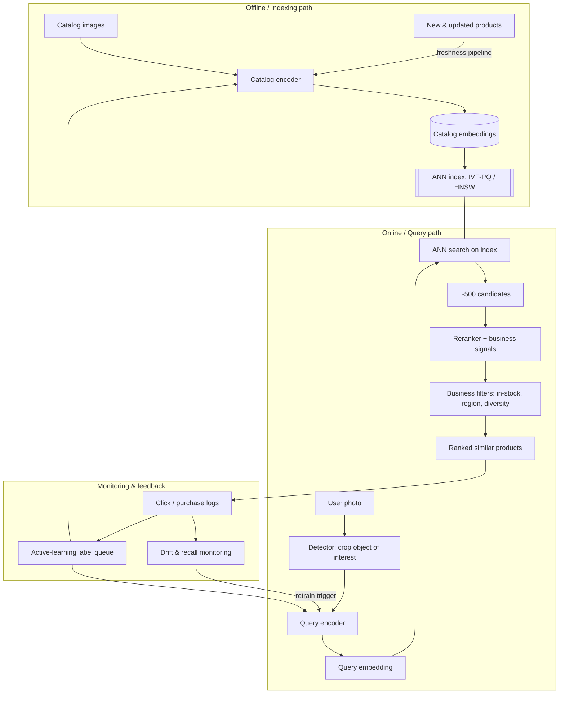

# Case Study: Visual Search (Image-to-Image) — Pinterest Lens / Google Lens

> **Q7** · Tag: **[Domain]** · Family: Search & Retrieval
>
> **Prompt:** *"A user takes a photo; return visually similar products."* (Pinterest Lens, Google Lens, and Amazon's "search by image" all field this exact prompt.)
>
> **Teaches:** Metric learning / embedding retrieval + ANN for images — the recall/latency/memory tradeoff and closing the domain gap between user photos and catalog images.

This is a computer-vision retrieval problem. A generalist answer reaches for a two-tower model and stops; a strong answer goes two levels deeper on the parts that are easy to skip — the domain gap between messy real-world photos and clean catalog images, detection-first cropping for cluttered scenes, synthetic data, and the labeling loop. Once this pattern is internalized, it also unlocks the retrieval half of *search*, *RAG*, *recommendation candidate generation*, and *dedup* — they're all the same skeleton: turn things into vectors, arrange the vectors so "close = similar," then find nearby vectors fast.

---

## How to use this document

Read it once end-to-end to build the mental model. Then do the drill: close the doc, set a 30-minute timer, and whiteboard the whole thing out loud using the 9-step framework. The sections below are ordered to match that framework exactly, so you can practice in the same order you'll speak.

Callout conventions you'll see throughout:

- 🗣️ **Say this** — a sentence or framing you can literally use in the room.
- 🪤 **Trap** — the mistake that quietly fails you at senior level.
- 💡 **Make it concrete** — if you have a real example from your own work, use it here — a specific number beats a generic claim. If not, reasoning clearly about the trade-off is enough.
- 🧮 **Math moment** — a back-of-envelope number. Senior signal lives in these.

---

## The one-paragraph mental model (read this first)

Imagine a giant library where, instead of shelving books by author, you shelve every object in the world so that **things that look alike sit physically near each other** — all the tan leather ankle boots in one aisle, all the mid-century floor lamps in another. If you could build that library, "visual search" becomes trivial: take the user's photo, walk to where it *would* be shelved, and hand back its neighbors.

The entire system is just two hard problems hiding inside that fantasy:

1. **Arranging the shelves** — training a model to convert any image into a coordinate (a vector / *embedding*) such that visually similar images get nearby coordinates. This is **metric learning**.
2. **Walking to the right aisle instantly** — with a billion items you can't check every shelf, so you use an index that gets you to *approximately* the right neighborhood in milliseconds. This is **ANN search**.

Everything else — detection, domain gap, reranking, monitoring — is in service of making those two things accurate and fast. Keep this picture in your head and you will never get lost in an answer.

---

## The 60-second answer

Before you touch architecture, plant a flag so the interviewer knows you see the whole board. Something like:

> 🗣️ *"At its core this is a **retrieval** problem, not a classification problem — the label space is the entire catalog and it changes daily, so I can't train a fixed classifier. I'll frame it as: learn an embedding where visual similarity equals vector proximity, index the catalog with ANN, and serve nearest-neighbor lookups. The three places this gets hard, and where I'll spend most of my time, are (1) the **domain gap** between messy user photos and clean catalog images, (2) **cluttered queries** where the user photographs a whole scene but wants one object, and (3) the **recall/latency/memory tradeoff** in the index at catalog scale. I'll baseline simple and justify each step up against a latency budget."*

That single paragraph already signals senior: you named the paradigm, you named the hard parts before being asked, and you promised a baseline-first discipline. Now walk the framework.

🪤 **Trap:** jumping straight to "I'll use a ResNet/CLIP and cosine similarity." That's not wrong, it's just *shallow* — you've skipped scoping and you've told the interviewer you think this is an architecture question when it's a systems question.

---

## Step 1 — Clarify & scope

Spend real time here. A candidate who scopes turns a vague prompt into a written spec; a candidate who doesn't builds the wrong system beautifully.

### Questions to ask the interviewer

Ask these out loud; each one changes the design, and asking them *is* the signal.

- **What's the catalog size and churn?** 1M vs 1B products changes the index. Do items get added/removed hourly (fast fashion, marketplace) or rarely?
- **What's the query?** A single cropped product, or a raw phone photo of a cluttered scene? (This decides whether you need a detector.)
- **What does "similar" mean to the business?** *Exact same product* (find this exact boot to buy it) vs *visually similar style* (find boots like this)? These are different objectives with different training labels. This is the single most clarifying question you can ask.
- **Latency and where it runs.** Is this a server-side call from a phone (200–300ms is fine) or on-device (a much tighter compute/memory budget)?
- **QPS and traffic shape.** Peak queries/sec, bursty or smooth?
- **What happens with the result?** Just show similar items, or drive a purchase (then business filters — in-stock, ships-to-region, margin — matter a lot)?

### The written spec (fill this in out loud)

| Dimension | Assumed value (state your assumptions) |
|---|---|
| Catalog size | ~100M products, +1M/day churn |
| Query type | Raw user photo, often cluttered/multi-object |
| "Similar" means | Primarily *same/near-same product*, secondarily *same style* |
| Latency budget (p99) | ~300ms end-to-end, server-side |
| Peak QPS | ~10K queries/sec |
| Freshness | New products searchable within ~1 hour of listing |
| Deployment | Server-side; embedding model may be distilled for mobile later |

🗣️ **Say this:** *"I'll state assumptions and design to them — if any is wrong the interviewer can correct me and we adjust, but I won't design in a vacuum."*

### Functional vs non-functional

- **Functional:** given an image, return a ranked list of similar purchasable items, filtered by business rules.
- **Non-functional:** low latency, high availability, fresh catalog, cost-efficient at scale, and — because it drives purchases — **calibrated relevance** (garbage results erode trust fast).

---

## Step 2 — Frame it as an ML problem

### Input → output, precisely

- **Input:** an image (optionally + context: user location, past behavior, a text hint like "shoes").
- **Output:** a ranked list of catalog item IDs, by visual similarity, post-filtered by business constraints.

### Why retrieval, not classification (say this clearly)

🗣️ *"I deliberately won't frame this as classification. The 'classes' are catalog items — hundreds of millions of them, added and removed daily. A softmax over a moving billion-way label space is untrainable and unservable. Instead I learn a **similarity function**: an embedding space where distance means dissimilarity. New products just get embedded and indexed — no retraining to add a class. That decoupling of 'what's in the catalog' from 'the model' is the whole reason this scales."*

That is a genuinely important insight and it separates people who *understand* retrieval from people who memorized "use two towers."

### The core object: the embedding

An **embedding** is a fixed-length vector (say 256 or 512 numbers) that represents an image's *visual content* as a point in space. The training goal is one sentence:

> Pull embeddings of similar images **together**; push embeddings of dissimilar images **apart**.

That's metric learning. We'll get to *how* in Step 5. For now, internalize the payoff: once every catalog image is a point, and the query image is a point, "find similar products" = "find nearest points." Similarity is now geometry.

🧮 **Analogy:** think of it like GPS coordinates for looks. Two cafés near each other have similar coordinates; the model's job is to assign "look-coordinates" so that a tan boot and another tan boot end up as near-neighbors even though their pixels differ.

---

## Step 3 — Metrics (offline, online, guardrails)

Interviewers grade whether you know that *the metric you can measure offline is not the thing the business cares about.* Name that gap explicitly.

### Offline proxy metrics

You measure these on a held-out labeled set (query → known-relevant items):

- **Recall@k** — of the truly relevant items, how many appear in the top *k* returned? This is the workhorse for retrieval. "Recall@10 = 0.8" means 80% of the time the right item is in the top 10.
- **Precision@k / mAP** — how many of the returned items are actually relevant, and how well-ordered.
- **NDCG** if you have graded relevance (exact match > same style > same category).

For the ANN system specifically you *also* measure **recall vs the exact search** — i.e., how often the approximate index returns the same neighbors brute force would. This is a distinct, index-level metric (more in Step 6).

### Online business metrics (the north star)

What actually pays for the system:

- **Click-through / tap rate** on returned items.
- **Conversion / purchase rate** from visual search sessions.
- **Session success** — did the user find and act on something (vs bounce)?

### Guardrail metrics

Things that must *not* regress even if the north star improves:

- **Latency (p99)** — a more accurate model that's 2× slower may net-lose.
- **Result diversity** — all 20 results being the same shoe in different colors is a bad experience even if each is "similar."
- **Safety/appropriateness** — no returning banned or wildly off-category items.

### 🗣️ Name the offline–online gap

*"My offline recall@k is a proxy. It can go up while conversion goes down — for example if I over-optimize for exact-match and the user actually wanted 'style like this,' or if I improve relevance on head queries while tail queries (the ones people actually photograph) stagnate. So I trust offline to *filter* candidates for launch, but the decision to ship is made by an online A/B on conversion, with latency and diversity as guardrails."*

🪤 **Trap:** stating only offline metrics. That reads as someone who's never shipped. The gap sentence above is free senior signal.

---

## Step 4 — Data (usually the hardest part — talk about it)

Most candidates wave at "we'll get labeled data." A senior answer slows down here and treats data curation as a first-class design decision, not an afterthought.

### What's a training example?

Metric learning trains on **pairs (or triplets)**:

- **Positive pair:** two images that *should* be close (same product, or same style).
- **Negative:** an image that should be *far*.

So the real question is: **where do positive pairs come from?** Sources, roughly in order of signal quality:

1. **Catalog structure (free, weak-to-strong):** multiple photos of the *same* SKU (different angles, lighting) are guaranteed positives. This alone bootstraps a strong model.
2. **User behavior logs (strong, noisy):** users who photographed something and then clicked/bought item X — the (photo, X) pair is a probable positive. This is gold because it's *in-domain* (real user photos) and reflects real intent. But it's biased toward what the current system already surfaces (feedback loop — flag it).
3. **Human labeling (expensive, precise):** raters judge "is B a good match for query A?" Used to build the **eval set** and to fix known weak spots, not to label everything.
4. **Synthetic pairs:** render the same object under many conditions to manufacture positives — see the domain-gap section.

💡 **Make it concrete:** *"I wouldn't try to label everything. I'd use active learning — select the highest-value examples to send to human labelers (uncertain or under-covered regions of the embedding space), and semantic dedup so I don't pay to label near-duplicate photos."* This is the same active-learning labeling loop covered in depth in **Q27 — Data labeling / annotation pipeline** ([written](./27-data-labeling-active-learning.md)) — worth naming the connection.

### The domain gap — the defining challenge of this problem

Here's the crux that makes visual *search* harder than visual *classification*:

> **Catalog images are studio-clean** — white background, even lighting, product centered, professional camera. **User photos are chaos** — bad lighting, weird angles, occlusion, motion blur, cluttered backgrounds, a phone camera. The *same boot* looks statistically different in the two domains. A naïve model trained on catalog images alone will embed a user photo into the "wrong aisle."

🧮 **Analogy — the accent problem:** it's like training a speech recognizer only on clean studio recordings and then deploying it in a noisy subway. Same words, different "accent." You have to teach the model to hear past the noise. In vision, you teach it to see past the clutter and lighting so a query and its catalog match land in the same place.

**How you close the gap (this is where depth pays off):**

1. **Train on real query–catalog pairs** (source #2 above) so the model *sees* the gap during training. Best fix if you have the logs.
2. **Aggressive, realistic augmentation:** random crops, occlusions, lighting/color jitter, blur, background swaps — simulate the mess of a phone photo on clean catalog images.
3. **Synthetic data:** tools like [BlenderProc](https://github.com/DLR-RM/BlenderProc) — an open-source, Blender-based synthetic-data-generation pipeline — can render a catalog product under controlled but varied poses, lighting, occlusion, and backgrounds, with automatic pixel-perfect annotations. Treating those renders as positives for the clean catalog image manufactures query-side variety (cluttered, poorly-lit, occluded scenes) that directly attacks the domain gap at essentially zero labeling cost. This is a differentiated answer — most candidates have never generated synthetic training data and can't speak to it concretely.
4. **Domain adaptation:** techniques that explicitly align the two distributions (e.g., domain-adversarial training, or a shared encoder trained so query-domain and catalog-domain features are indistinguishable to a domain discriminator). Mention it to show you know the formal toolkit, but lead with the pragmatic synthetic-data + real-pairs answer.

🪤 **Trap:** never mentioning the domain gap. If you describe a clean embedding-and-ANN pipeline and forget that real user photos are ugly, a good interviewer will hand you a blurry cluttered photo and watch your system return garbage. Beat them to it.

### Other data concerns to name in one breath

- **Class/coverage imbalance:** the catalog long-tails hard — a few popular categories, a huge tail of rare items. Your eval set must cover the tail or you'll ship something that only works on shoes and handbags.
- **Freshness:** new products must be embedded and indexed fast (Step 8's indexing pipeline).
- **Label noise:** behavior-derived positives are noisy (a click isn't a match). Robust losses and consensus help.

---

## Step 5 — The embedding model & metric learning

Now the model that arranges the shelves. Two sub-questions: *what architecture* and *what loss*.

### Architecture: the encoder(s)

- **Backbone:** a strong image encoder — a CNN (ResNet/EfficientNet) or a Vision Transformer (ViT). In modern practice, **initialize from a large pretrained model** (e.g., a CLIP-style image encoder or a self-supervised backbone) and fine-tune. You get a huge head start on general visual features.
- **Output:** a fixed-length embedding (256–512 dims), usually L2-normalized so that "distance" is just cosine similarity.

**One tower or two?** This is the two-tower question in vision clothing:

- If query and catalog were the *same* domain, one shared encoder is fine.
- Because of the **domain gap**, you can use a **two-tower** design: a **query encoder** tuned for messy user photos and a **catalog encoder** tuned for clean images, both mapping into the *same shared embedding space*. They're different "translators" that output the same language.

🧮 **Analogy — two translators, one language:** English→Esperanto and Japanese→Esperanto are different translators, but both produce Esperanto, so the outputs are comparable. Two towers do this: user-photo→vector and catalog-photo→vector, comparable in the shared space. Often people start with a **shared encoder + augmentation** for simplicity and split into two towers only if the gap demands it. State the tradeoff; don't dogmatically pick.

🗣️ **Say this:** *"I'd start with a single shared encoder fine-tuned with heavy query-side augmentation as the baseline, and only move to a two-tower design if error analysis shows the domain gap is the dominant failure mode — because two towers double training and serving complexity."* (Baseline-first discipline again — interviewers love it.)

### The loss: how you actually "pull together, push apart"

This is the metric-learning core. Know these three and when to use each:

- **Contrastive loss (pairs):** take a pair; if it's a positive, minimize distance; if negative, push distance beyond a margin. Simple, intuitive. The original "pull together / push apart."
- **Triplet loss (anchor, positive, negative):** the anchor should be closer to the positive than to the negative by a margin. 🧮 **Analogy:** *"This boot (anchor) should look more like that boot (positive) than like this sneaker (negative), by a clear margin."* More stable than raw contrastive because it's relative, not absolute.
- **Modern batch contrastive (InfoNCE / N-pair / multi-similarity):** instead of one negative, contrast the positive against *many* negatives in the batch at once (like a softmax over "which of these N is the real match"). This is what most strong systems use today — far more sample-efficient. CLIP's training is essentially this at scale.

**The make-or-break detail: hard negative mining.**

🗣️ *"The quality of a metric-learning model is decided by its negatives. If negatives are random, they're trivially far (a boot vs a sofa) and the model learns nothing after a while. The signal comes from **hard negatives** — a *different* boot that looks confusingly similar. I'd mine hard negatives: within a batch, or by periodically searching the current index for near-but-wrong neighbors and feeding them back as negatives."*

🪤 **Trap:** describing triplet loss but never mentioning hard negatives. That's the tell of someone who read about it but never trained one. Hard-negative mining is *the* practitioner detail here.

**Supervised vs self/weakly-supervised:** if you have clean labels (same-SKU groups), supervised metric learning is strongest. If not, self-supervised contrastive on augmented views bootstraps a surprisingly good space with zero labels — a great baseline when labels are scarce.

### Cluttered queries → detection first

A raw user photo often contains *many* objects, or one object buried in a scene, but the user wants *one thing*. If you embed the whole image, you embed the couch, the rug, the lamp, and the cat all mashed together — and match none of them well.

**Fix: a detection/segmentation stage before embedding.** Detect candidate objects, crop to the region of interest (possibly let the user tap which one they meant), then embed *each crop* and search per-crop.

This detect-then-embed pattern generalizes beyond retail: any cluttered, multi-object scene — robotic bin-picking, warehouse pick systems, multi-object AR — benefits from localizing a single instance before trying to characterize it. Trying to embed an entire cluttered scene in one vector rarely works; embedding a clean crop of the thing the user actually cares about does.

So the query path is a **cascade**: `detect → crop → embed → ANN → rerank`. Note the classic cascade risk: **errors propagate** — if detection misses the object, no amount of great embedding saves you. Say you'd monitor detection recall as a first-class metric, not just final relevance.

---

## Step 6 — Retrieval: ANN and the recall/latency/memory tradeoff

You have a query embedding. The catalog is 100M+ embeddings. You need the nearest neighbors in ~20ms. You **cannot** compute distance to all 100M vectors per query at 10K QPS — that's the whole reason ANN exists.

### Why exact search is off the table (do the math out loud)

🧮 **Math moment:** 100M vectors × 512 dims = comparing against 5×10¹⁰ floats *per query*. At 10K QPS that's 5×10¹⁴ float ops/sec just for distances. Brute force is dead on arrival. ANN trades a *tiny* bit of accuracy for ~2–3 orders of magnitude speedup by **not looking at most of the catalog.**

🧮 **Analogy:** exact search is reading every book in the library to find similar ones. ANN is knowing the library's layout and walking straight to the right section — you might miss one book two aisles over, but you're 1000× faster and you found 19 of the right 20.

### The two index families you must be able to contrast

**1. Graph-based — HNSW (Hierarchical Navigable Small World).**
Builds a navigable graph where each vector links to nearby vectors, with a hierarchy of layers (like an express-then-local subway map: zoom in from coarse to fine). Search greedily hops toward the query.

- ✅ **Excellent recall at low latency.** Usually the best speed/accuracy point.
- ❌ **Memory-hungry:** stores full vectors + graph links in RAM. At a billion vectors this is expensive.
- ❌ Updates (insert/delete) are more awkward than flat indexes.

**2. Quantization-based — IVF-PQ (Inverted File + Product Quantization).**

- **IVF** partitions the space into clusters (like the library's sections); at query time you only search the few nearest clusters (`nprobe` of them), skipping the rest.
- **PQ** *compresses* each vector by splitting it into chunks and replacing each chunk with the ID of the nearest entry in a small learned codebook — turning, say, a 512-float (2KB) vector into ~64 bytes.

- ✅ **Tiny memory footprint** — the reason it's the default at billion-scale.
- ✅ Fast, tunable (`nprobe` trades recall for speed).
- ❌ **Lower recall** than HNSW at the same latency, because compression loses information (you often re-rank PQ candidates with exact distances to recover accuracy).

### The tradeoff triangle — the sentence they want to hear

🗣️ *"ANN is a three-way tradeoff between **recall, latency, and memory**, and you can't max all three. HNSW buys the best recall-at-latency but pays in RAM; IVF-PQ buys tiny memory and good speed but sacrifices some recall, recoverable with a re-rank. So the pick is driven by catalog size and budget: at ~10M vectors I'd reach for HNSW and enjoy the recall; at 1B vectors HNSW's memory is prohibitive, so I'd use IVF-PQ (often IVF-HNSW hybrids) and re-rank the top candidates with exact distances."*

🧮 **The memory math that decides it (say this):**
- Raw: 1B × 512 dims × 4 bytes (float32) = **~2 TB**. Won't fit in one machine's RAM; sharding 2TB of hot index is costly.
- PQ to 64 bytes/vector: 1B × 64 B = **~64 GB**. Fits comfortably across a small cluster. *That* is why quantization exists.

Dropping this calculation unprompted is a strong senior tell — it shows you feel the physical constraints, not just the API names.

### The two-stage retrieval → rerank pattern (again!)

Same funnel as recsys/search:

1. **Candidate generation (ANN):** cheap, approximate, returns top ~500 from 100M. Optimizes recall.
2. **Reranking:** a more expensive, more accurate model scores those ~500 precisely and returns the top ~20. Here you can afford exact embedding distances, a cross-encoder that jointly looks at query+candidate, or a model that folds in **business signals** (price, popularity, in-stock, margin) and **user context**.

🗣️ *"Retrieval maximizes recall cheaply; reranking maximizes precision expensively on a small set. This is the same two-stage funnel as feed ranking and RAG — I get high recall from ANN and high precision from a reranker, and I can inject business logic (in-stock, ships-to-user, don't surface out-of-stock) at the rerank/filter stage where it's cheap."*

---

## Step 7 — Training pipeline & efficiency

- **Pipeline:** curate pairs/triplets → mine hard negatives → train encoder with batch-contrastive loss → validate on held-out recall@k → export encoder → **re-embed catalog** → rebuild/refresh index.
- **Retraining cadence:** triggered by drift or a fresh batch of curated hard cases, not a fixed calendar. Adding *products* doesn't need retraining (just embed + index); retraining is for when the *distribution* of user photos or catalog style shifts.
- **Efficiency:** contrastive training benefits from large batches (more in-batch negatives), which strains GPUs. Mixed precision and multi-GPU data parallelism help, as does data-pruning — e.g. InfoBatch — to drop low-information samples and cut training time without hurting accuracy. This matters here because re-embedding a large catalog and retraining the encoder are the expensive recurring operations. 💡 **Make it concrete:** if you have a real number on training-cost savings from your own work, use it here — a specific number beats a generic claim.
- **Reproducibility:** version data, labels, and code — tools like DVC for datasets and MLflow for experiments/model registry make any deployed embedding version traceable. This matters more than usual in retrieval because the model and the index are coupled: change the encoder and every catalog embedding is now in a different space, so the whole catalog must be re-embedded before serving the new model. You can't mix embeddings from two model versions in one index — a subtle, critical operational constraint.

🪤 **Trap (subtle, high-value):** forgetting that **the model and the index are joined at the hip.** Query embeddings must come from the *same* model version that produced the catalog embeddings in the index, or you're comparing coordinates from two different maps. Mention the coordinated re-embed + index swap and you look like you've actually operated one of these.

---

## Step 8 — Evaluation & serving

### Rollout ladder

Offline recall@k gate → **shadow** (run new model on live traffic, log results, serve nothing) → **canary** (small % of users) → **A/B test** on conversion with latency/diversity guardrails → full ramp. Instant rollback if guardrails trip.

### Serving architecture (two paths)

**Offline / batch path — building the index:**
- Every catalog item is embedded (batch job) and inserted into the ANN index.
- **Freshness pipeline:** new/updated products get embedded and inserted continuously so they're searchable within the freshness SLA (~1 hour). Deletions/out-of-stock get filtered (soft-delete at serve time is simplest).
- The index is periodically rebuilt/compacted; served from a replicated, sharded service.

**Online / real-time path — serving a query (with latency budget decomposition):**

🧮 **Budget the ~300ms out loud** — this is exactly the "latency budget decomposition" senior signal:

| Stage | Budget | Note |
|---|---|---|
| Preprocess + detect + crop | ~40ms | detection cascade for cluttered queries |
| Embed query | ~30ms | the query encoder forward pass |
| ANN candidate retrieval | ~20ms | top ~500 from the index |
| Rerank top candidates | ~50ms | precise scoring + business signals |
| Business filtering + response assembly | ~20ms | in-stock, region, dedup, diversity |
| **Total** | **~160ms** | comfortably inside a 300ms p99 budget |

🗣️ *"Decomposing the budget tells me where to spend optimization effort. If I blow the budget, the detector and reranker are the usual culprits, and I'd trade there first — smaller detector, fewer rerank candidates — before touching the embedding model."*

### Architecture diagram

---

## Step 9 — Monitoring, drift & closing the loop

Retrieval systems fail *silently* — there's no crash, results just quietly get worse. So monitoring is the difference between a system and a science project.

- **Embedding drift:** the distribution of incoming query embeddings shifts (new phone cameras, new fashion trends, seasonal products). Monitor query-embedding statistics over time; a shift means the model is increasingly seeing things unlike its training data.
- **Data vs concept drift:** *data drift* = inputs change (new product categories appear). *Concept drift* = what "similar" means changes (style trends move). Detect and distinguish them; they need different fixes (re-embed/re-index vs retrain).
- **Monitor inputs, the index, and outcomes separately:** input embedding stats; index recall (periodically compare ANN results to exact search on a sample — is the *index* degrading as it grows?); and delayed business outcomes (click/conversion).
- **Feedback loop — close it with active learning:** queries that returned poor results (low click-through, user re-searches, or human-flagged misses) are the highest-value examples to label next. Route them into an active-learning queue, get them labeled, mine them as hard negatives, and fold them back into training. That closes the lifecycle: production failures become tomorrow's training signal.

🪤 **Trap — the feedback loop bias:** the system is trained partly on logs of *what it already showed*. It can get stuck in a bubble, never surfacing (and never learning about) items it doesn't currently retrieve. Counter with a small amount of **exploration** — occasionally inject diverse candidates and observe engagement — so the training data isn't purely self-confirming.

---

## Interview delivery guide

Assume a 45-minute loop: a few minutes of clarifying questions, roughly 30 minutes of you driving the design, and the remainder for curveballs and Q&A. Rough timing against the walkthrough above:

| Time | What you're doing |
|---|---|
| 0:00–0:30 | Open with the 60-second answer: name retrieval-not-classification and the three hard parts (domain gap, cluttered queries, recall/latency/memory) before being asked. |
| 0:30–5:00 | Clarify & scope (Step 1): catalog size/churn, query type, what "similar" means, latency, QPS, business use of the result. State the assumed spec out loud. |
| 5:00–8:00 | Frame as an ML problem + metrics (Steps 2–3): retrieval vs classification, the embedding concept, offline recall@k/mAP vs online conversion, name the offline–online gap. |
| 8:00–15:00 | Data (Step 4): where positive pairs come from, the domain gap as the defining challenge, how to close it (real pairs, augmentation, synthetic data, domain adaptation), active learning for labeling. This is usually where the interviewer starts probing — don't rush it. |
| 15:00–25:00 | Model (Step 5): backbone choice, one tower vs two, the loss function and hard-negative mining, the detect-crop-embed cascade for cluttered queries. |
| 25:00–32:00 | Retrieval (Step 6): why exact search is infeasible, HNSW vs IVF-PQ, the recall/latency/memory triangle, the two-stage retrieval-then-rerank pattern. |
| 32:00–37:00 | Training pipeline, serving, and monitoring (Steps 7–9): retraining cadence, rollout ladder, latency budget decomposition, drift and the active-learning feedback loop. |
| 37:00–45:00 | Curveballs and Q&A: on-device, tighter latency, billion-scale catalog, diversity complaints, cold start. |

Meta-tips specific to this question:

- Volunteer the domain gap before the interviewer raises it — it's the single biggest differentiator between a memorized two-tower answer and a design that actually works on real user photos.
- Do the memory math (2TB raw vs ~64GB quantized) and the latency budget decomposition out loud, unprompted — these back-of-envelope numbers are exactly the senior signal interviewers listen for.
- Two lenses worth returning to throughout the answer: a data-centric one (curation, synthetic data, active learning, dedup — often where most of the accuracy in a retrieval system actually comes from) and an MLOps one (how the system ships, stays healthy, and rolls back).
- If asked for a concrete example at any point, use a real one from your own work if you have it — a specific number beats a generic claim. If you don't, reasoning clearly about the trade-off is a perfectly good answer on its own.
- Don't let the ANN index become the whole conversation — it's one of three hard parts, not the interesting part. Spend at least as much airtime on data and the domain gap.

---

## Curveballs — practice these follow-ups out loud

Interviewers test depth by perturbing the problem. Pre-load answers:

- **"Now it has to run on-device (no server call)."** → Distill the encoder to a small mobile net (quantized/pruned); ship an on-device ANN with a compressed (PQ) index of a *subset* (e.g., top-popular items) and fall back to server for the tail. Detection also needs a tiny on-device model. Everything becomes a memory/compute-vs-recall negotiation.
- **"Latency budget drops to 50ms."** → Cut the detector or make it optional; skip or shrink reranking; use a smaller embedding dim; increase index approximation (lower `nprobe` / lighter HNSW search). Explicitly trade recall for speed and *say which* you'd sacrifice first (usually rerank depth, then detection).
- **"The catalog is 5 billion items."** → HNSW memory is now impossible; go IVF-PQ with heavy compression + sharding by cluster, re-rank with exact distances on the shortlist. Talk sharding and the 64-bytes-per-vector math.
- **"Users complain results are too samey."** → It's a diversity, not relevance, problem. Add diversity to reranking (e.g., MMR-style: penalize a candidate for being near already-selected results), or cluster results and show representatives.
- **"How do you handle a brand-new product with zero interactions?"** → Cold start is *easy* here and you should smile: unlike collaborative filtering, content-based visual retrieval needs no interaction history — you just embed the product image and it's immediately searchable. This is a real advantage of the embedding approach; name it.
- **"Multi-object: the photo has an outfit, user wants all pieces."** → Detection returns multiple crops; search each; return grouped results per detected item. Straight back to the detect-then-embed cascade.
- **"How do you know 'similar' means what the user wants?"** → You often don't from the image alone. Use interaction feedback to learn the business's notion of similar, allow a text hint ("the lamp, not the table"), and let the user tap the object/refine. Ambiguity is a product problem as much as a model problem.

---

## Common failure modes

How candidates actually lose this question — process and delivery mistakes, not knowledge gaps:

- Jumping straight to "ResNet/CLIP + cosine similarity" without first framing this as a retrieval problem and scoping catalog size, query type, and latency — reads as architecture-first thinking, not systems thinking.
- Reporting only offline metrics (recall@k) with no online/guardrail metrics and no mention of the offline–online gap — reads as someone who has never shipped a model.
- Never mentioning the domain gap between clean catalog photos and messy user photos — a strong interviewer will hand you a blurry, cluttered photo and watch the design fall apart.
- Naming triplet or contrastive loss but never mentioning hard-negative mining — the tell of someone who has read about metric learning but never trained a model with it.
- Treating the embedding model and the ANN index as independently versioned — forgetting that a new encoder invalidates every existing catalog embedding and requires a coordinated re-embed before cutover.
- Fixing the feedback loop with more logged data without addressing exposure bias — training only on what the current system already surfaces, so the model never learns about items it never retrieves.
- Picking a single ANN index type as "the" answer instead of naming the recall/latency/memory triangle and letting catalog scale drive the choice.

---

## Flashcards

| Cue | What you must be able to say |
|---|---|
| Why retrieval, not classification? | The catalog is the label space — hundreds of millions of items, changing daily. A classifier can't scale or add items without retraining; an embedding space lets new products be embedded and indexed with no retraining. |
| What is an embedding? | A fixed-length vector representing an image's visual content as a point in space, such that visual similarity corresponds to geometric proximity. |
| What is the domain gap? | The statistical mismatch between clean, studio-shot catalog images and messy real-world user photos (lighting, angle, occlusion, clutter, blur) that makes a naively trained model embed a query far from its true match. |
| Three ways to close the domain gap | (1) Train on real query–catalog pairs from user logs, (2) aggressive augmentation simulating phone-photo mess, (3) synthetic data (e.g. BlenderProc renders) and/or domain-adversarial training. |
| One tower or two? | Start with one shared encoder + heavy query-side augmentation as the baseline; move to two towers (separate query/catalog encoders into one shared embedding space) only if error analysis shows the domain gap dominates failures. |
| Contrastive vs triplet vs batch-contrastive loss | Contrastive: pull a positive pair together, push a negative apart past a margin. Triplet: anchor closer to positive than negative by a margin. Batch-contrastive/InfoNCE: contrast one positive against many in-batch negatives at once — most sample-efficient; what CLIP-scale training uses. |
| Why does hard-negative mining matter? | Random negatives are trivially far and stop teaching the model after a while; hard negatives (visually confusable wrong items) are what actually sharpen the embedding space. |
| How do you handle cluttered, multi-object query photos? | A detect → crop → embed cascade: localize the object(s) of interest first, then embed and search each crop rather than the whole scene. |
| Why is exact nearest-neighbor search infeasible at catalog scale? | At ~100M × 512-dim vectors and 10K QPS, brute-force distance computation is orders of magnitude past any latency budget; ANN trades a small accuracy loss for ~2–3 orders of magnitude speedup. |
| HNSW vs IVF-PQ | HNSW: graph-based, best recall-at-latency, memory-hungry (stores full vectors + graph). IVF-PQ: clustering + vector compression, tiny memory footprint, some recall loss recoverable by reranking. Choice is driven by catalog scale. |
| Memory math for 1B vectors | Raw float32: ~2TB. Product-quantized to 64 bytes/vector: ~64GB — this is why quantization exists at billion-scale. |
| What is the two-stage retrieval pattern? | Cheap approximate candidate generation (ANN, optimizes recall) followed by an expensive precise reranker on a small candidate set (optimizes precision, can inject business signals). |
| Why must the embedding model and the ANN index be versioned together? | Query embeddings must come from the same model version that produced the catalog embeddings; mixing model versions in one index compares incompatible coordinate spaces. |
| Latency budget decomposition for a ~300ms query | Roughly: detect+crop ~40ms, embed query ~30ms, ANN retrieval ~20ms, rerank ~50ms, business filtering ~20ms. Decomposing tells you where to cut first if over budget. |
| Why do retrieval systems fail silently? | No crash — results just quietly degrade from embedding drift, index recall decay, or concept drift (what "similar" means shifting). Requires active monitoring, not just uptime checks. |
| What is the feedback-loop bias risk? | Training on logged clicks over-represents items the system already surfaces, creating a bubble; counter with deliberate exploration (injecting diverse candidates). |
| How does visual search handle cold start? | Trivially — no interaction history is needed; the product image is embedded and immediately searchable, unlike collaborative-filtering recommenders. |
| What does MMR-style diversity reranking do? | Penalizes a candidate for being near already-selected results in the reranked list, so results aren't all near-duplicates of each other. |

---

## One-page cheat sheet

1. **Frame:** retrieval, not classification — label space is the whole moving catalog. Learn an embedding where *close = similar*.
2. **Scope:** ask catalog size/churn, "similar = exact vs style," query type (cluttered?), latency, deployment. Write the spec.
3. **Metrics:** offline recall@k / mAP; online conversion; guardrails latency + diversity; *name the offline–online gap.*
4. **Data (hardest):** positive pairs from same-SKU photos + user logs + synthetic; **domain gap** is the crux; close it with real pairs + augmentation + **synthetic renders (e.g. BlenderProc)** + domain adaptation; label smart with **active learning**.
5. **Model:** pretrained backbone → embedding; **metric learning** (triplet / batch-contrastive) with **hard-negative mining**; shared encoder baseline, two-tower if the gap demands it.
6. **Cluttered queries:** **detect → crop → embed** cascade; watch error propagation.
7. **Retrieval:** **ANN** — HNSW (best recall, RAM-hungry) vs IVF-PQ (tiny memory, some recall loss, re-rank to recover). It's a **recall/latency/memory** triangle; the 2TB→64GB PQ math decides it at scale.
8. **Two-stage:** ANN candidates → reranker (+ business signals). Same funnel as search/RAG/recsys.
9. **Serve:** offline index-build + freshness pipeline; online path with a **decomposed latency budget**; model↔index versions must match — coordinated re-embed.
10. **Monitor:** embedding drift, index recall decay, feedback loop → **active-learning queue** closes the lifecycle; add exploration to fight the bubble.

---

## Why this pattern is worth so much

Notice how many other case studies this pattern partially solves:

- **Search ranking (Q6, coming soon)** and **semantic doc retrieval / RAG (Q8, coming soon; Q16, coming soon)** — same embedding + ANN + two-stage rerank spine, just text instead of images.
- **Recommendation candidate generation ([Q1](./01-video-recommendation.md))** — two-tower + ANN is literally the candidate-generation stage.
- **Data labeling with active learning ([Q27](./27-data-labeling-active-learning.md))** and **monitoring/drift (Q28, coming soon)** — both show up here as first-class parts of the design, not afterthoughts.
- **Serving / distributed training / feature store (Q23, coming soon; Q24, coming soon; [Q25](./25-model-serving-inference-system.md))** — the infra named above (index serving, re-embed jobs, versioning) is the same platform muscle.

That's the Blind-75 philosophy paying off: master this *pattern* — **encode → arrange the space → find neighbors fast → rerank → close the loop** — and a dozen prompts become remixes of one thing you can now reason through cold.

---

## Glossary

- **ANN (Approximate Nearest Neighbor):** search that finds *approximately* the closest vectors to a query, trading a small amount of accuracy for large speed/memory wins over exact (brute-force) search.
- **CLIP:** a family of models trained to align images and text in a shared embedding space via large-scale contrastive learning; commonly used as a pretrained image-encoder starting point.
- **Cold start:** the problem of having no interaction history for a new item or user; content-based visual retrieval sidesteps it because a new product is searchable as soon as it's embedded.
- **Concept drift:** the meaning of the target shifts over time (e.g., what "similar" means to users changes as style trends move), as opposed to the inputs themselves changing.
- **Contrastive loss:** a metric-learning loss that pulls positive pairs together and pushes negative pairs apart past a margin.
- **Data drift:** the distribution of inputs changes over time (e.g., new product categories, new phone cameras), independent of any change in what the correct output should be.
- **Domain adaptation:** techniques that explicitly align two different data distributions (e.g., user photos vs catalog photos) so a model trained on one generalizes to the other.
- **Domain gap:** the statistical mismatch between two distributions a model must bridge — here, clean studio catalog images vs messy real-world user photos.
- **Embedding:** a fixed-length vector representation of an input (here, an image) such that geometric distance reflects semantic/visual similarity.
- **Hard negative:** a negative example that is visually or semantically close to the anchor/positive, making it far more informative for training than a random (easy) negative.
- **HNSW (Hierarchical Navigable Small World):** a graph-based ANN index; vectors are linked to nearby vectors across layers of increasing granularity, enabling fast greedy search. Best recall-at-latency, memory-hungry.
- **InfoNCE:** a batch-contrastive loss that scores one positive against many negatives at once, framed as a softmax classification over "which of these is the true match"; the basis of CLIP-style training.
- **IVF (Inverted File index):** an ANN technique that partitions vectors into clusters so a query only searches the nearest few clusters instead of the whole dataset.
- **IVF-PQ:** an ANN index combining IVF (cluster-based candidate pruning) with Product Quantization (vector compression) — the default choice for very large, memory-constrained catalogs.
- **mAP (mean Average Precision):** an offline ranking-quality metric averaging precision across recall levels and queries.
- **Metric learning:** the family of training methods that shape an embedding space so that a distance metric (e.g., cosine or Euclidean) corresponds to semantic similarity.
- **MMR (Maximal Marginal Relevance):** a reranking technique that penalizes a candidate for being too similar to already-selected results, trading a little relevance for more diversity.
- **NDCG (Normalized Discounted Cumulative Gain):** a ranking metric that accounts for graded (not just binary) relevance and rewards putting the most relevant results first.
- **nprobe:** the number of IVF clusters searched per query; the main recall/speed knob in an IVF-based index.
- **PQ (Product Quantization):** a vector-compression technique that splits a vector into sub-vectors and replaces each with the nearest entry in a small learned codebook, shrinking storage by orders of magnitude.
- **Recall@k:** of the truly relevant items for a query, the fraction that appear in the top *k* returned results.
- **Triplet loss:** a metric-learning loss over (anchor, positive, negative) triplets that pushes the anchor closer to the positive than to the negative by a margin.
- **Two-tower model:** an architecture with two separate encoders (e.g., query and catalog) that map into a single shared embedding space, allowing efficient nearest-neighbor comparison between the two sides.
- **ViT (Vision Transformer):** a transformer-based image encoder architecture, an alternative to CNN backbones like ResNet/EfficientNet.

---

## Further reading & tools

**Papers**

- Radford et al., ["Learning Transferable Visual Models From Natural Language Supervision" (CLIP)](https://scholar.google.com/scholar?q=Learning+Transferable+Visual+Models+From+Natural+Language+Supervision)
- Schroff et al., ["FaceNet: A Unified Embedding for Face Recognition and Clustering"](https://scholar.google.com/scholar?q=FaceNet%3A+A+Unified+Embedding+for+Face+Recognition+and+Clustering) (triplet loss)
- Malkov & Yashunin, ["Efficient and Robust Approximate Nearest Neighbor Search Using Hierarchical Navigable Small World Graphs"](https://scholar.google.com/scholar?q=Efficient+and+robust+approximate+nearest+neighbor+search+using+Hierarchical+Navigable+Small+World+graphs) (HNSW)
- Jégou et al., ["Product Quantization for Nearest Neighbor Search"](https://scholar.google.com/scholar?q=Product+Quantization+for+Nearest+Neighbor+Search)
- Oord et al., ["Representation Learning with Contrastive Predictive Coding"](https://scholar.google.com/scholar?q=Representation+Learning+with+Contrastive+Predictive+Coding) (InfoNCE)
- Carbonell & Goldstein, ["The Use of MMR, Diversity-Based Reranking for Reordering Documents and Producing Summaries"](https://scholar.google.com/scholar?q=The+Use+of+MMR%2C+Diversity-Based+Reranking+for+Reordering+Documents+and+Producing+Summaries)
- Qin et al., ["InfoBatch: Fast Framework for Dynamic Data Pruning"](https://scholar.google.com/scholar?q=InfoBatch%3A+Fast+Framework+for+Dynamic+Data+Pruning)
- Dosovitskiy et al., ["An Image is Worth 16x16 Words: Transformers for Image Recognition at Scale"](https://scholar.google.com/scholar?q=An+Image+is+Worth+16x16+Words%3A+Transformers+for+Image+Recognition+at+Scale) (ViT)

**Tools**

- [FAISS](https://github.com/facebookresearch/faiss) — Facebook AI's library of ANN index implementations (including IVF-PQ).
- [hnswlib](https://github.com/nmslib/hnswlib) — a fast, header-only HNSW implementation.
- [BlenderProc](https://github.com/DLR-RM/BlenderProc) — open-source, Blender-based photorealistic synthetic-data generation with automatic ground-truth annotations.
- [DVC](https://dvc.org) — data and pipeline version control for ML.
- [MLflow](https://mlflow.org) — experiment tracking and model registry.

---

*Part of the [ML System Design Case Studies](../README.md) series.*
