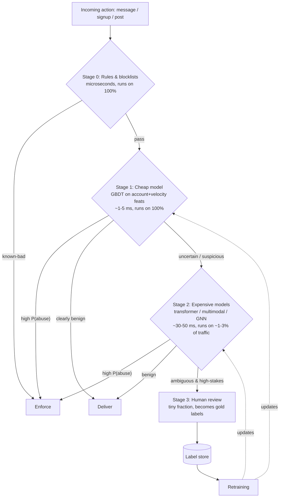

# Case Study: Spam & Abuse Detection

> **Q9** · Tag: **[Core]** · Family: Classification, Detection & Trust/Safety
>
> **Prompt:** *"Detect spam messages / fake accounts."*
>
> **Teaches:** Heavy class imbalance, adversarial drift (attackers adapt), and the precision/recall tradeoff under changing costs.

This is adversarial classification under extreme class imbalance — the archetype behind spam, fraud, and content moderation alike. Master it and you've substantially pre-solved Q10 Content Moderation (coming soon), [Q11 Fraud Detection](./11-real-time-fraud-detection.md), and structurally any "detect the bad thing among a flood of good things" prompt (see §20).

This document is written to do three things at once: **teach you the domain**, **drill you on the interview**, and **stand alone as a reference** for anyone studying ML system design. Read it once end-to-end, then use the cheat sheet near the bottom as your pre-interview warm-up.

---

## 0. How to read this document

Every section is anchored to a step of the **Part 0 framework** (clarify → frame → metrics → data → features → model → training → serving → monitoring). The whole point of a framework is that you stop *inventing* structure under pressure and start *executing* it. When the interviewer says "design spam detection," your job is not to be clever — it's to walk this spine calmly and go deep in the two or three places that matter most.

The four things the curriculum tells you to **nail** for this question map to sections like this:

| "Nail this" | Where it lives in this doc |
|---|---|
| Precision–recall tradeoff tied to cost of false-positive vs false-negative | §3 Metrics |
| Adversarial evolution → why frequent retraining + fast features | §5 Features, §7 Training, §9 Monitoring |
| Cascade of cheap-then-expensive models | §6 Model |
| Feedback loop from user reports | §4 Data, §9 Monitoring |

If you can speak fluently to those four, you pass the *content* bar. The framework carries you through the rest.

---

## The 60-second answer

If you had to compress the whole design into one breath:

> This is **adversarial classification under extreme class imbalance** — spam is maybe 1% of traffic, so accuracy and ROC-AUC are traps; I'd report **PR-AUC** and **Precision @ fixed Recall**, because a false positive (blocking a real user) and a false negative (letting spam through) are **asymmetric, context-dependent costs** — I'd handle that with a **graduated action space** (allow → challenge/CAPTCHA → block → human review) rather than one global threshold. Labels are the hard part: I'd blend noisy, weaponizable user reports with scarce gold-standard human reviews, near-perfect-precision **honeypots**, and delayed retrospective bans, while guarding against label noise and adversarial poisoning. For serving, I'd run a **cheap-then-expensive cascade** — rules/blocklists on 100% of traffic, a fast GBDT on account/velocity/graph features for everything that survives, escalating only the uncertain ~1-3% to expensive transformers/GNNs, with a tiny human-reviewed slice becoming gold labels — because that one pattern solves latency, cost, and human-rationing simultaneously. Because the adversary actively reacts to the model, I'd retrain **daily or continuously** rather than on a stationary schedule, always with a temporal (never random) split and post-hoc calibration. And I'd monitor data vs. concept drift, prevalence, and appeal rates continuously, closing the loop with **exploration holdouts** so the feedback loop doesn't become a self-reinforcing echo chamber, all with instant rollback ready since the worst failure here is blocking millions of legitimate users, not letting some spam through.

Every clause of that paragraph is unpacked below.

---

## 1. The mental model (build intuition before architecture)

Before any boxes-and-arrows, install the right mental model. Three analogies carry almost everything you need.

**Analogy 1 — The immune system.** A spam system is your platform's immune system. It has an *innate* layer (fast, dumb, always-on defenses: rate limits, blocklists — like your skin and stomach acid) and an *adaptive* layer (models that learn the shape of new threats — like antibodies). It has *memory* (feedback loops that remember an attacker's signature). And it has an autoimmune failure mode: attack your own healthy cells and you get **false positives** — blocking real users. A healthy immune system is not the one that kills every pathogen; it's the one that kills pathogens *without* attacking the body. Hold that thought — it's the whole precision/recall story in one image.

**Analogy 2 — The arms race / whack-a-mole.** This is the single most important thing that separates spam from, say, cat-vs-dog classification. In cat-vs-dog, cats do not read your model and start disguising themselves as dogs. In spam, **the adversary is intelligent and reacts to you.** The moment your model gets good at catching pattern X, spammers stop using pattern X. Your data distribution doesn't just *drift* — it drifts *because of you*. This means: (a) offline accuracy is a snapshot of a moving target, (b) a model that ships once and sits still decays fast, and (c) features that are cheap for the attacker to change (exact words, URLs) are weak long-term; features that are expensive for the attacker to fake (behavior, graph structure) are strong. Say this out loud in the interview — it's senior signal.

**Analogy 3 — Airport security (the cascade).** You don't give everyone a full-body search. Everyone walks through the metal detector (cheap, fast, catches the obvious). A subset gets the pat-down (more expensive). A tiny fraction gets pulled aside for full manual inspection (a human). This tiered escalation — cheap on everyone, expensive only on the suspicious — is exactly the **model cascade** in §6, and it's the answer to "how do you afford to run this at a million messages per second?"

Keep all three in your pocket. Reach for them whenever the interviewer pushes; they make abstract tradeoffs concrete.

---

## 2. Step 1 — Clarify & scope

**The trap here is silence.** Weak candidates hear "detect spam" and immediately start drawing a transformer. Strong candidates spend the first 5 minutes turning a vague prompt into a written spec. Interviewers grade this heavily because in real life, a mis-scoped problem wastes quarters, not minutes.

### Questions to actually ask the interviewer

- **What surface?** Email? Private DMs? Public comments? Marketplace listings? New-account signups? The surface changes everything (a public comment is readable; an end-to-end-encrypted DM is not — see §14 curveballs).
- **What kinds of abuse?** "Spam" is a bucket. Commercial spam, phishing, scams/fraud, malware links, fake engagement (bot likes), and harassment are *different problems with different costs.* Phishing false-negatives can be catastrophic; a promotional-spam false-negative is a minor annoyance. Pin this down.
- **Content-level or account-level?** The prompt literally says "spam messages / **fake accounts**." These are two complementary layers: catch bad *content*, and catch bad *actors*. A good answer treats them as a defense-in-depth stack, not an either/or.
- **What's the action space?** This matters more than people expect, because it decides how many thresholds you need. Typical actions, from soft to hard: do nothing → down-rank/reduce reach → add a warning label → rate-limit the sender → challenge (CAPTCHA / phone verification) → quarantine (send to spam folder) → hard block → ban the account → send to human review. A rich action space lets you be *graduated* instead of binary, which softens the false-positive problem enormously.
- **Synchronous or asynchronous?** Must we decide *before* the message is delivered (tight latency, inline blocking)? Or can we scan after delivery and retract (looser latency, async sweep)? Usually you need both paths.
- **Scale and constraints?** QPS, users, messages/day, latency budget, and any privacy/regulatory constraints (GDPR, encryption).

### Nail the requirements crisply

**Functional:** Given an action (a message send, an account signup, a post), decide in near-real-time whether it is abusive and which enforcement action to take, and continuously learn from new abuse as it appears.

**Non-functional (use concrete numbers — it signals seniority):**
- **Scale:** assume ~10B messages/day ≈ **~116K/sec average, ~350K/sec peak**. (Derivation in §10.)
- **Latency:** inline decisions must fit a tight budget — say **< 100 ms end-to-end** for the blocking path, of which the model gets maybe 10–30 ms.
- **Freshness:** because of the arms race, the system must incorporate new signal in **hours, not weeks**.
- **Availability & fail-open vs fail-closed:** if the scorer is down, do we let everything through (fail-open, favors availability) or block (fail-closed, favors safety)? Usually fail-open for messaging (don't break the product) with rules still active — state the choice and its risk.
- **Privacy:** message content may be sensitive or end-to-end encrypted. This can *remove content features entirely* — a huge constraint worth flagging early.

> **Coaching note:** You will not get through all of this in an interview, and you shouldn't try. Ask 3–4 sharp clarifying questions, state your assumptions explicitly ("I'll assume public-ish content, billions/day, and an action space richer than just block/allow"), and move on. The *habit* of scoping is what's being graded.

---

## 3. Step 2 — Frame as an ML problem

**Input → output, precisely.**

- **Input:** an *event* (a message, a signup, a post) plus its *context* — the content itself, the sender's history and reputation, the relationship between sender and recipient, and real-time behavioral signals.
- **Output:** a **calibrated probability of abuse**, ideally *per abuse type* (spam, phishing, scam, malware…), because each type maps to a different action and a different cost. So this is really **multi-label classification** (an item can be both a scam and contain malware), not a single binary head.

**Is ML even the right tool?** Partly. State clearly: **this is never ML-alone.** A large fraction of abuse is caught by cheap deterministic rules (known-bad URL, blocklisted IP, obvious rate violation). ML earns its keep on the **long tail** and on **novel, evolving** attacks that rules can't anticipate. And humans sit at the top for the highest-stakes, most-ambiguous cases. The system is **rules + ML + humans**, layered. Saying "ML everywhere" is a junior tell.

**Which learning paradigms?** You'll actually use several in combination:
- **Supervised classification** for known abuse types (the workhorse).
- **Unsupervised / anomaly detection** for *zero-day* attacks — a brand-new attack has no labels yet, so a supervised model is blind to it by definition. Behavioral outlier detection buys you time until labels arrive.
- **Graph-based methods** for *coordinated* abuse — bot farms, sockpuppet rings — where the signal is in the *structure* (many new accounts sharing one device/IP), not in any single message.

Naming all three, and saying *why* you need each, is a strong differentiator.

---

## 4. Step 3 — Metrics *(nail #1 lives here)*

This is the section most likely to make or break the interview, so slow down here.

### Why "accuracy" is a trap

If 1% of messages are spam, a model that predicts "not spam" for everything is **99% accurate** and utterly useless. Under extreme imbalance, accuracy measures how good you are at the majority class you don't care about. **Never say accuracy for this problem.** If you do, expect the interviewer to pounce.

Same reason to be careful with **ROC-AUC**: under heavy imbalance it's misleadingly optimistic, because the huge number of true negatives makes the false-positive rate look tiny even when you're generating a lot of false positives in absolute terms. Prefer **PR-AUC (precision–recall AUC)**, which focuses on the positive (spam) class and is far more honest under imbalance.

### The offline metrics you actually quote

- **Precision** = of the things we flagged as spam, what fraction really were. Low precision → you're blocking real users.
- **Recall** = of all actual spam, what fraction we caught. Low recall → spam gets through.
- **PR-AUC** as the summary number.
- Because you operate at an *operating point*, the most useful framing is **Precision @ fixed Recall** (or Recall @ fixed Precision). "At 95% precision, what recall can I get?" is the language of someone who's shipped.

### The asymmetric cost — the heart of the answer

Here is the immune-system analogy paying off. The two errors are **not** equally bad, and their relative cost **changes by context**:

- **False positive** (block a legit user): erodes trust, generates angry appeals, can be catastrophic for a business account whose invoice or password-reset got eaten. This is *autoimmune damage.*
- **False negative** (let spam through): annoying, and at scale it adds up; but for *phishing/scams* a single false negative can cost a user their savings.

So the "right" threshold is a function of **cost ratio**, and that ratio differs by abuse type and by *who the user is*. This is why you don't ship one global threshold — you ship a **graduated policy over the action space**:

- **Very high P(abuse)** → auto-enforce (block/quarantine). You need very high *precision* here, because you're acting without a human.
- **Medium P(abuse)** → *cheap, reversible* friction: a CAPTCHA, a phone-verification challenge, reduced reach. The beauty of soft actions is that a false positive costs the real user 10 seconds, not their account — so you can afford lower precision here and catch more.
- **Low-but-nonzero** → allow, but log and maybe sample into human review.

> **This is the killer insight for §3:** a rich action space *decouples* your precision requirement from your recall ambition. You don't have to choose "block real users" vs "let spam through" if you have a middle gear (challenge) where mistakes are cheap. Interviewers love this because it reframes the precision/recall tug-of-war as a product-design lever, not just a threshold slider.

### Online metrics (what you watch in production)

Offline numbers are proxies. Online, you care about:
- **Prevalence:** fraction of *delivered* content that is spam, estimated from a **human-audited random sample** (your ground-truth thermometer).
- **User-report rate:** reports per thousand messages — a cheap early-warning signal that spam is getting through.
- **False-positive / appeal rate** and **appeal-reversal rate:** how often you blocked someone who fought back and won. This is your autoimmune monitor.
- **Downstream health:** user retention, engagement, complaints.

### Guardrail metrics

Metrics you never let regress even if the primary metric improves: **legitimate-message block rate**, **latency**, **coverage** (fraction of traffic actually scored), and per-segment versions of all of the above.

### The offline–online gap (where senior signal lives)

Say this explicitly: **your labeled test set is a photograph of a moving river.** It's built from *past* attacks. Because the adversary evolves, a model that looks brilliant offline can bleed prevalence online within days as attackers adapt. The gap between "great PR-AUC on last month's data" and "prevalence creeping up this week" *is* the adversarial problem. Naming this gap, and tying your monitoring/retraining design to closing it, is exactly the seniority the rubric is probing for.

**Always segment.** Aggregate metrics hide failures. Break every metric down by abuse type, by user tenure (new vs established accounts), and by language/region. A model can look healthy overall while quietly torching new users in one country.

---

## 5. Step 4 — Data & labels *(feedback loop, nail #4, starts here)*

The curriculum says labels are "often the hardest part — talk about it." For spam this is *the* differentiating discussion, because good labels are scarce, delayed, noisy, and *actively poisoned by your adversary.*

### Where do labels come from?

There is no single clean source. You blend several, each with a distinct precision/volume/latency profile:

1. **User reports** ("Report spam" button). *High volume, cheap, but noisy and biased.* Users only report what they *see* (survivorship bias — the cleverest spam doesn't get reported), and users mislabel (reporting something they merely dislike). Worse, reports are **weaponizable**: a coordinated group can mass-report a legitimate user to get them auto-banned. Never treat a raw report as ground truth — treat it as a *weak, biased signal.*
2. **Human moderators / trained reviewers.** *Low volume, expensive, high quality.* These are your **gold labels** for training and for measuring prevalence. You will never have enough of them (see §10 — humans can review a tiny fraction of a percent of traffic), which is *why* selection matters (this connects directly to active learning — see the tie-in below).
3. **Honeypots.** Seed the platform with decoy accounts/addresses that *only* a spammer scraping-and-blasting would ever contact. Anything that hits a honeypot is spam **by construction** — near-perfect-precision, fully automated labels. This is a beautiful, cheap, adversary-resistant label source; mention it.
4. **Weak / heuristic labels.** Known-bad URL domains, blocklisted IPs, malware-signature hits — programmatic labels you trust highly.
5. **Retrospective / delayed labels.** An account that gets *confirmed* fraudulent weeks later, or a campaign later taken down, retroactively labels all its past activity. Clean, but **delayed** — which is a problem all its own (below).

### The three label problems you must name

- **Label delay.** Like fraud chargebacks arriving weeks after the transaction, abuse confirmation often lags. That means your *most recent* data — the data that matters most in an arms race — is the *least* labeled. This complicates training and forces you toward semi-supervised methods and fast proxy labels (honeypots, challenge-failures).
- **Label noise.** User reports are noisy; even reviewers disagree on edge cases. You mitigate with consensus (multiple reviewers), gold-set calibration of reviewers, and treating report-based labels as low-confidence.
- **Adversarial label poisoning.** Attackers try to corrupt your training data — mass-reporting legit users, or behaving "cleanly" to slip poisoned examples into the positive/negative sets. Defenses: trust-weight label sources, keep a **clean, trusted gold set** that never mixes with crowd signals, and run anomaly detection on the label stream itself.

### Sampling strategy

You cannot (and shouldn't) train on all the ham — it's billions of near-identical benign messages. **Downsample the negatives, keep all the positives**, and then *correct the resulting probability shift* so your scores stay calibrated (this ties directly to §3 — a downsampled model outputs inflated positive probabilities unless you re-calibrate). Use **stratified/hard-negative sampling** so you keep the *informative* negatives (the ones that look spammy but aren't) rather than a random pile of obvious ham.

### The feedback loop (first half of nail #4)

Draw the loop explicitly: **user reports + human decisions + confirmed-bad accounts → label store → retraining → new model → new enforcement → new user reports.** This is the flywheel that keeps the immune system's memory current. The rest of the loop (its *dangers*) lives in §9 — hold that thought.

> **A pattern worth naming out loud (say this in the room):** deciding *which* of the millions of uncertain cases to send to your scarce human reviewers is an **active-learning** problem — pick by uncertainty, diversity, and prototypicality; dedup near-identical items so you don't pay to label the same spam campaign 10,000 times. This connects directly to labeling-pipeline design ([Q27](./27-data-labeling-active-learning.md)), and naming it here shows you connect abuse detection to data-centric ML, where most candidates only talk architecture.

---

## 6. Step 5 — Features *(fast features = nail #2, part 1)*

Group features into families and, crucially, rank them by **how expensive they are for the attacker to change.** That ranking is the strategic heart of feature design in an adversarial system.

**Content features** *(cheap for the attacker to change → weak alone).* Text n-grams and embeddings, presence of URLs (and the *reputation* of those domains, redirect chains, URL-shortener use), phone numbers, currency/crypto mentions, language, and — for image spam — **OCR'd text inside images** and image embeddings. Powerful when they hit, but brittle: change the words, beat the feature.

**Sender / account features** *(medium cost).* Account age, verification status, historical violation count, send-rate history, profile completeness, follower/following ratios, reputation score. Harder to fake because they take time to build.

**Behavioral / velocity features** *(expensive → strong).* Messages per minute/hour, number of *distinct* recipients, burstiness, time-of-day pattern, session shape. Spammers must blast to be profitable, and blasting *looks like blasting* no matter what words they use. **This is why fast, real-time features matter** (nail #2): the velocity of the last 60 seconds is often more predictive than the content, and it's the signal the attacker can least afford to abandon.

**Graph / network features** *(most expensive → strongest against coordinated abuse).* Shared IPs/devices across accounts, connected-component structure of who-contacts-whom, fan-out patterns, common-neighbor structure. A bot farm can vary every message's text, but it's *structurally* visible: 5,000 accounts created in an hour from one ASN, all messaging strangers, all sharing three device fingerprints.

**Relationship features.** Does the recipient already know the sender? **First-contact** messages from strangers are far riskier than replies within an existing conversation — a cheap, strong prior.

> **Design principle to voice:** lean your *durable* defense on the expensive-to-fake features (behavior, graph, relationship) and treat content features as *fast-moving supplementary* signal. Content features win the battle this week; behavioral/graph features win the war.

### Leakage & point-in-time correctness — *say it before they ask*

The framework tells you to raise leakage unprompted, and this problem has a nasty, easy-to-miss trap. A feature like **"this account was later banned"** is a *label in disguise* — if you compute features from the *current* state of the world instead of the state **at the moment the message was sent**, you leak the future into training and get gorgeous offline numbers that collapse in production. The fix is **point-in-time-correct feature joins**: every training example must see only what was knowable at event time. This is precisely what a **feature store** exists to guarantee (Q23, coming soon), and connecting the two shows platform maturity.

### Feature freshness

Because of drift, you need **online, real-time features** (rolling velocity, current IP reputation) served with single-digit-millisecond latency, computed identically at training and serving time to avoid **train/serve skew**. The online/offline consistency problem is, again, the feature store's whole reason to exist.

---

## 7. Step 6 — Model & the cascade *(nail #3)*

**Always start with a baseline, then justify each step up in cost.** Skipping the baseline is one of the most common ways to fail a senior loop.

### The baseline

- **Rules first.** Blocklists, rate limits, known-bad-URL filters. Zero ML, microseconds, and they catch a shocking fraction of abuse. Your innate immune system.
- **A gradient-boosted tree (XGBoost/LightGBM) on hand-crafted account + velocity + relationship features.** GBDTs are fast, cheap, robust on tabular signals, interpretable (feature importances help you debug and help you argue appeals), and genuinely a production workhorse for abuse. Do **not** apologize for this being "simple" — it's often 80% of the value at 1% of the cost.

### Stepping up in complexity (justify against the latency/cost budget each time)

- **Text transformers / content embeddings** for nuanced, multilingual, or obfuscated content that n-grams miss.
- **Multimodal models** for image+text spam (the phishing screenshot, the scam meme).
- **Graph neural networks** for coordinated account abuse, where the signal is relational.

Each of these is *more accurate on its slice* and *far more expensive.* Which motivates the whole design pattern:

### The cascade (nail #3) — cheap-then-expensive

You cannot run a transformer on 350,000 messages/second and hit a 100 ms budget at sane cost. So you tier compute, spending it only where uncertainty is highest — **airport security** made literal:



**Why this works, in interview language:**
- **Stage 0 (rules):** runs on everything, microseconds, kills the obvious and the already-known.
- **Stage 1 (cheap model):** runs on everything that survives Stage 0, single-digit ms. Confidently allows the clearly-benign, confidently blocks the clearly-bad, and — critically — **passes only the uncertain middle** to Stage 2.
- **Stage 2 (expensive models):** runs on the ~1–3% that Stage 1 flagged as uncertain. Now you can afford the transformer, because you're paying for it on a sliver of traffic.
- **Stage 3 (humans):** the tiny, highest-stakes residual. Their verdicts become **gold labels** (closing the loop back to §5).

The cascade is simultaneously your **latency answer**, your **cost answer**, and your **human-rationing answer.** One pattern, three problems solved — say exactly that.

### Two philosophies, side by side

Run **supervised classifiers** (catch what you've seen) *alongside* **anomaly detectors** (flag what you *haven't*). A supervised model is structurally blind to a zero-day attack — there are no positive examples yet. An unsupervised behavioral outlier detector can flag "this is weird" before you have a single label, buying time until your labeling loop catches up. Defense in depth in the model layer, not just the rule layer.

---

## 8. Step 7 — Training *(frequent retraining = nail #2, part 2)*

- **Retraining cadence is FAST — and here's *why*, not just *that*.** In a stationary problem you retrain when data volume justifies it. In an adversarial one you retrain because the adversary has already moved. Expect **daily** retraining for the fast models, with the option of **continuous/online updates** for the most volatile features (fresh URL reputations, emerging campaign signatures). This is the direct answer to "why does frequent retraining matter here" — it's not hygiene, it's survival in the arms race.
- **Handling imbalance in the loss:** class weighting or **focal loss** (down-weights the easy, abundant negatives so the model focuses on the hard positives), plus the negative-downsampling from §5. Then **re-calibrate** (Platt scaling / isotonic regression) so that a score of 0.9 *means* 90% — non-negotiable, because your entire graduated-action policy from §3 depends on the probabilities being trustworthy.
- **Temporal discipline:** train on the past, validate on the *future* (see §9). Never a random split.
- **Reproducibility:** version **data + labels + code + environment** (DVC/MLflow are common choices). This matters *more* here than almost anywhere, because you retrain constantly and *will* occasionally ship a model that starts blocking real users — and when that happens you need to identify and **roll back to the exact prior artifact in minutes.** Reproducibility is your incident-response insurance.
- **Poisoning-aware training:** trusted gold sets kept separate from crowd labels, trust-weighting by source, and anomaly monitoring on the label stream itself.

---

## 9. Step 8 — Evaluation & serving

### Offline evaluation — the temporal-split rule

**Never random-split abuse data.** A random split lets tomorrow's spam campaign appear in both train and test, so the model "memorizes" the campaign and reports fantasy metrics. **Split by time**: train on weeks 1–3, test on week 4. This is the only evaluation that respects the arms race and honestly estimates the offline–online gap.

### The staged rollout ladder

1. **Shadow mode.** Run the new model in parallel on live traffic, log its decisions, but **don't act on them.** Compare against the incumbent with zero user risk. Essential here because a bad model's blast radius is *millions of blocked legit users.*
2. **Canary / A/B.** Roll out to a small traffic slice. Watch the *guardrails* (legit-block rate, appeal rate, latency) as closely as the wins (prevalence, recall).
3. **Full rollout**, with the rollback lever armed.

### Serving

- **Real-time / inline** path for the blocking decision, inside the latency budget (§2). Cheap model synchronous; expensive model only on the flagged slice.
- **Async / batch** path for **retrospective sweeps**: when you learn a *new* attack signature, re-scan recently delivered content and retract what now looks bad ("backfill enforcement"). The inline path protects the future; the batch path cleans up the past.
- **Versioning & instant rollback.** In this domain, err toward making rollback *trivial and fast* — because your worst incident is usually not "spam got through for an hour" but "we blocked ten million real users for an hour."

> **Latency budget decomposition (say the sum, not just the parts):** feature fetch (a few ms from the online store) + cheap-model inference (1–5 ms) + policy/action (sub-ms). The expensive model's 30–50 ms is affordable *only because it runs on 1–3% of traffic* — tie it back to the cascade.

---

## 10. Step 8/9 bridge — Back-of-the-envelope

Senior loops reward a quick capacity sketch. Do it out loud.

- **Traffic:** 10B messages/day ÷ 86,400 s ≈ **116K/sec average**; assume ~3× peak → **~350K/sec**.
- **Spam prevalence:** ~1% → **~100M spam/day**.
- **Stage 1 (cheap model on 100%):** must sustain 350K/sec. A GBDT at ~1 ms and heavy parallelism handles this on a modest CPU fleet — cheap models are cheap *by design.*
- **Stage 2 (expensive model on ~2% flagged):** ≈ **7K/sec**. With batching at ~30 ms/inference on GPU, a bounded GPU fleet covers it. The 50× traffic reduction from the cascade is what makes the transformer affordable.
- **Human review (the scarce resource):** say you can staff ~500 reviewers × ~1,000 decisions/day ≈ **500K human decisions/day**. Against 10B messages, that's **~0.005% of traffic** — five in one hundred thousand. **This number is the whole argument for the cascade and for active-learning selection**: humans are a rounding error of your traffic, so you must ration them ruthlessly toward the highest-value, most-uncertain, most-representative cases. Deliver this line and the interviewer sees you connect capacity math to design decisions.

---

## 11. Step 9 — Monitoring, feedback loops & iteration *(second half of nail #4)*

This step closes the ML lifecycle, and for an adversarial system it's not an afterthought — it's the part that keeps you alive.

### Drift: two flavors, detect each separately

- **Data drift** — the *inputs* shift. Attackers switch tactics, so feature distributions move (new URL patterns, new posting times). Monitor input feature distributions and score distributions; a sudden shift often *is* the leading edge of an attack campaign.
- **Concept drift** — the *meaning* shifts. The same feature value now implies something different (a phrase that used to be benign is now a scam template). Harder to see; you catch it when precision/recall degrade despite stable-looking inputs. In this domain concept drift isn't occasional — it's the *baseline condition*, manufactured by the adversary.

### What to monitor

Monitor **inputs**, **predictions**, and **(delayed) outcomes** as three separate streams — because outcomes lag, a drop in outcome-quality shows up late, so you also watch inputs/predictions for early warning. Concretely: prevalence (from human-audited samples), user-report rate, appeal/reversal rate, legit-block rate, score-distribution shape, and **all of them segmented** by abuse type, user tenure, and region.

### The feedback loop — and its two traps (this is the senior payoff for nail #4)

The healthy loop: **reports + reviewer verdicts + confirmed-bad accounts → labels → retrain → deploy → new signal.** But name the two ways it bites:

1. **The counterfactual / survivorship trap.** If you *block* everything you're confident is spam, you never observe what would have happened — you have no ground truth on your own blocks, and your training data becomes a self-fulfilling echo of past decisions. The fix is **exploration / holdouts**: occasionally let a small, sampled fraction of would-be-blocked items through (or route them to humans) *specifically to measure whether you were right.* Without this, your model slowly optimizes for its own past opinions rather than reality. This is the exact analog of the exploration problem in recsys — and citing that parallel shows pattern transfer across the curriculum.
2. **The adversarial-feedback trap.** *Your enforcement is a signal to the attacker.* Block a pattern and they mutate it. So monitoring must watch not just "did prevalence drop" but "how did the adversary *respond*" — a drop followed by a rebound in a new shape means you won the battle and started the next one. Weaponized user-reporting (§5) is the same trap on the label side.

### Retraining triggers

Three, layered: **scheduled** (e.g., daily), **drift-triggered** (a monitor crosses a threshold), and **incident-triggered** (an on-call engineer responding to a live campaign ships an emergency model or rule). And the reproducibility trail from §8 is what lets an on-call human *diagnose a flagged model and roll it back* under pressure — DVC/MLflow discipline is the thing that turns a 3 a.m. page into a five-minute fix.

---

## 12. Full architecture (one picture to redraw on the whiteboard)

```
                         ┌─────────────────────────────────────────────┐
   incoming action  ─────▶  STAGE 0: Rules / blocklists / rate limits    │  µs, 100% of traffic
                         └───────────────┬─────────────────────────────┘
                                         │ survivors
                         ┌───────────────▼─────────────────────────────┐
   ┌── online feature ──▶│  STAGE 1: cheap GBDT (account+velocity+graph) │  ~ms, 100% of traffic
   │   store (real-time  └───────┬───────────────┬─────────────────────┘
   │   velocity, IP rep) allow ◀─┘   uncertain   └─▶ block
   │                                  │
   │                    ┌─────────────▼─────────────────────────────────┐
   │                    │  STAGE 2: transformer / multimodal / GNN        │  ~30-50ms, ~2% traffic
   │                    └───────┬───────────────┬─────────────────────────┘
   │                     allow ◀┘   ambiguous   └─▶ block
   │                                  │  high-stakes
   │                    ┌─────────────▼─────────┐
   │                    │  STAGE 3: human review │  ~0.005% traffic → GOLD labels
   │                    └─────────────┬─────────┘
   │                                  │
   │   ┌──────────────┐   labels   ┌──▼───────────┐   train   ┌──────────────┐
   └───┤ point-in-time│◀───────────┤ label store  │──────────▶│  training +   │
       │ feature store│  (reports, │ (weak+gold+  │           │  calibration  │
       └──────┬───────┘   honeypots,│  delayed)    │           └──────┬───────┘
              │            retro)   └──────────────┘                  │ deploy
              │                                                       │ (shadow→canary→A/B)
              └───────────────── monitoring: drift / prevalence / appeals ◀─┘
                                 (with exploration holdouts + rollback)
```

Redraw *this*, not a mess of arrows, and narrate it stage by stage. Clarity of the picture is itself a grade.

---

## 13. Interview delivery guide — choreography (how to spend ~45 minutes)

- **0–5 min — Scope.** Ask 3–4 sharp questions (surface, abuse types, action space, sync/async), state assumptions, write the spec. *Do not touch a model yet.*
- **5–8 min — Frame + metrics.** ML framing (calibrated multi-label P(abuse)), then plant your flag on **PR-AUC + asymmetric cost + graduated actions + offline–online gap.** This is your highest-value real estate; don't rush it.
- **8–15 min — Data & labels.** The blended label sources, delay/noise/poisoning, and the active-learning selection tie-in. Go deep — most candidates are thin here, so it's cheap differentiation.
- **15–25 min — Features + model + the cascade.** Rank features by attacker-cost; baseline-first; draw the cascade and give the three-problems-one-pattern line.
- **25–33 min — Training + serving.** Frequent retraining *and why*, calibration, temporal split, shadow→canary→A/B, instant rollback.
- **33–42 min — Monitoring + feedback loops.** Data vs concept drift, the two feedback traps, exploration holdouts, retraining triggers. Close the loop back to labels.
- **42–45 min — Curveball.** Take whichever follow-up they throw and answer with principle-then-move.

If you're running short, protect **metrics (§3)** and **the cascade (§6)** above all — those two are the load-bearing walls of this question.

---

## 14. Curveballs — the follow-ups they'll throw

The curriculum says to mock these until automatic. For each, name the *principle*, then the *move.*

- **"Now it's end-to-end encrypted — you can't read the content."** Principle: content features vanish; the durable signals were never content anyway. Move: lean entirely on **metadata + behavior + graph + relationship** features (velocity, fan-out, shared fingerprints, first-contact), plus **client-side ML** (scan on the sender/receiver device before/after encryption) and **user reports** (a reported message can be revealed with consent). This is exactly why §6 told you to root your durable defense in expensive-to-fake features — you already built for this.
- **"Latency budget drops to 50 ms."** Move: push more work into rules and a tinier Stage-1 model; **precompute** account/IP reputation offline so serving is a lookup, not a computation; shrink the fraction escalated to Stage 2; quantize/distill the cheap model. Trade a little recall on the margin for the budget, and recover it on the async sweep.
- **"Attackers are using LLMs to generate infinitely varied spam text."** Principle: they've made the *cheap* feature (content) free to vary — so it becomes worthless, exactly as predicted. Move: the *action pattern is invariant* even when the words aren't. A scam still needs to reach many strangers fast from newish accounts. Double down on **velocity, graph, and relationship** features; content signatures were always the throwaway layer.
- **"Labels are delayed three weeks."** Move: bridge the gap with **fast proxy labels** (honeypots, challenge-failures, confirmed-bad-URL hits) that arrive immediately; use **semi-supervised / self-training** on recent unlabeled data; and weight recent data by *confidence* rather than pretending it's fully labeled. Same shape as the fraud-chargeback problem ([Q11](./11-real-time-fraud-detection.md)) — say so.
- **"A major business customer's legitimate campaign got blocked."** Move: **reputation & allowlists** for verified business accounts, a **fast-path appeals** process that feeds reversals straight back as labels, and *graduated* enforcement (challenge, don't hard-block, when the sender has standing). Frame it as the autoimmune failure mode from §1 — the cure is not "catch less spam," it's "don't attack trusted cells."
- **"We think there's a coordinated bot farm."** Move: this is a *graph* problem, not a per-message one. Cluster on shared IP/device/ASN and creation-time bursts; act on the **connected component**, not the individual account, so you take down the ring in one motion instead of playing whack-a-mole account by account.

---

## 15. Common failure modes (the ways candidates lose this question)

- Drawing a transformer in minute two with **no rules/GBDT baseline.**
- Saying **accuracy** or **ROC-AUC** for a 1%-positive problem.
- Treating the distribution as **static** — forgetting it's an *adversary*, not just drift.
- Using **one global threshold** and ignoring the asymmetric, context-dependent cost of false positives vs false negatives.
- Hand-waving **where labels come from**, and ignoring label delay, noise, and poisoning.
- **Feature leakage** via "was-later-banned"-style features and no point-in-time correctness.
- No **exploration/holdout**, so the feedback loop quietly becomes an echo chamber.
- Ignoring **privacy/encryption** until the interviewer forces it.
- Forgetting **humans are ~0.005% of traffic** and casually "sending edge cases to review" as if that scales.

---

## 16. Flashcards

Cover the right column; recall it from the left.

| Cue | What you must be able to say |
|---|---|
| Why not accuracy? | At ~1% positive rate, "predict not-spam always" is 99% accurate and useless — accuracy measures the majority class you don't care about. |
| Why not ROC-AUC either? | Under heavy imbalance, the huge true-negative count hides a lot of false positives in absolute terms; use **PR-AUC** instead. |
| Precision vs Recall here | Precision: of what you flagged, how much was really spam. Recall: of all real spam, how much you caught. Report **Precision @ fixed Recall**. |
| The asymmetric cost | False positive (block a real user) = autoimmune damage, erodes trust. False negative (spam through) = usually minor, but catastrophic for phishing/scams. Cost ratio varies by abuse type and by user. |
| Graduated action space | High P(abuse) → auto-block; medium → cheap reversible friction (CAPTCHA/challenge); low → allow + log. Decouples the precision bar from the recall ambition. |
| The arms-race analogy | Unlike cat-vs-dog, the adversary reads your model and adapts — the distribution drifts *because of you*, not just with time. |
| The immune-system analogy | Innate layer (rules/rate limits) + adaptive layer (ML) + memory (feedback loop); false positives are the autoimmune failure mode. |
| The airport-security analogy | Cheap check on everyone, escalate only the suspicious to expensive checks — maps directly to the model cascade. |
| Where labels come from | User reports (noisy, biased, weaponizable) + human reviewers (gold, scarce) + honeypots (near-perfect precision, free) + weak/heuristic labels + retrospective/delayed labels. |
| The three label problems | **Delay** (confirmations lag, so the newest data is least labeled), **noise** (reviewers disagree, reports are biased), **poisoning** (attackers corrupt the label stream). |
| Honeypot | A decoy account/address only a scraping spammer would contact; anything that hits it is spam by construction — free, high-precision, automated labels. |
| Features ranked by attacker cost | Content (cheap, weak) < account (medium) < behavior/velocity (expensive, strong) < graph/network (most expensive, strongest). Root durable defense in the expensive-to-fake ones. |
| The leakage trap | A "was later banned" feature is a label in disguise; fix with point-in-time-correct feature joins, which a feature store exists to guarantee. |
| The cascade, one line | Rules (µs, 100%) → cheap GBDT (ms, 100%) → expensive transformer/GNN (30–50 ms, ~1–3%) → human review (~0.005%) — one pattern solves latency, cost, and human-rationing at once. |
| Why retrain fast | Not hygiene — survival. The adversary has already moved by the time a normal retraining cadence would catch up; expect daily or continuous updates. |
| Why re-calibrate after downsampling | Negative downsampling inflates positive probabilities; re-calibrate (Platt scaling / isotonic regression) so a 0.9 score really means 90%, since the graduated-action policy depends on trustworthy probabilities. |
| Why never random-split | A random split lets a spam campaign appear in both train and test, so the model "memorizes" it and reports fantasy metrics. Always split by time. |
| The two feedback-loop traps | Counterfactual/survivorship trap (you never see outcomes for what you blocked — fix with exploration holdouts) and adversarial-feedback trap (your enforcement teaches the attacker to mutate). |
| Fail-open vs fail-closed | If the scorer is down: fail-open lets everything through (favors availability, usual choice for messaging with rules still active) vs fail-closed blocks everything (favors safety). State the tradeoff explicitly. |

---

## 17. TL;DR cheat sheet (your pre-interview 60 seconds)

- **It's adversarial classification under extreme imbalance.** The adversary reacts to you — that changes everything.
- **Metrics:** never accuracy/ROC-AUC → **PR-AUC**, **Precision@Recall**. **FP (block real user) vs FN (spam through)** costs are **asymmetric and context-dependent** → a **graduated action space** (allow / down-rank / challenge / block / review) decouples precision needs from recall ambition. Watch the **offline–online gap**; segment everything.
- **Labels are the hard part:** reports (noisy, biased, weaponizable) + reviewers (gold, scarce) + **honeypots** (free high-precision) + weak + delayed/retrospective. Beware **delay, noise, poisoning**. Select what to label with **active learning**; dedup.
- **Features by attacker-cost:** content (cheap, weak) < account < **behavior/velocity** < **graph** (expensive, strong). Root durable defense in the expensive ones. **Point-in-time correctness** to avoid leakage; real-time features for freshness.
- **Model = cascade:** rules → cheap GBDT (100%) → expensive transformer/GNN (~2%) → humans (~0.005%). One pattern solves latency + cost + human-rationing. Add **anomaly detection** for zero-days.
- **Training:** retrain **fast** (arms race), calibrate, temporal split, DVC/MLflow for instant rollback.
- **Serving:** inline blocking + async backfill sweeps; shadow → canary → A/B; rollback is your top safety lever.
- **Monitoring:** **data vs concept drift**; **feedback loop** needs **exploration holdouts** (or it becomes an echo chamber) and awareness that **enforcement teaches the attacker.**
- **Three analogies:** immune system (FP = autoimmune damage), arms race (adversary reacts), airport security (the cascade).

---

## 18. Glossary

- **PR-AUC (Precision–Recall Area Under the Curve):** the area under the precision-recall curve; a summary metric for the positive class that stays honest under heavy class imbalance, unlike ROC-AUC.
- **ROC-AUC:** area under the receiver-operating-characteristic curve; probability a random positive scores above a random negative — misleadingly optimistic under extreme imbalance.
- **Precision @ fixed Recall:** the precision a system achieves once you've pinned recall at a target level (or vice versa) — the practical way to talk about an operating point.
- **Calibration:** whether a predicted probability matches real-world frequency (a 0.9 score should come true ~90% of the time); required whenever a downstream policy acts on the score directly.
- **GBDT (Gradient-Boosted Decision Tree):** an ensemble of decision trees trained sequentially, each correcting the previous ones' errors; fast, robust, and interpretable on tabular features — the production workhorse baseline here.
- **XGBoost / LightGBM:** the two most widely used GBDT libraries in production ML.
- **GNN (Graph Neural Network):** a model architecture that learns over graph-structured data (nodes and edges), used here to catch coordinated abuse visible only in account/device/IP relationships.
- **Cascade (model cascade):** a tiered serving architecture that runs a cheap model on all traffic and escalates only the uncertain fraction to progressively more expensive models — the airport-security pattern.
- **Adversarial drift:** distribution shift caused by an intelligent adversary reacting to your model's decisions, as opposed to drift caused by the world changing on its own.
- **Data drift:** the distribution of input features shifts over time.
- **Concept drift:** the relationship between a feature value and the label shifts, even if the feature distribution looks stable.
- **Honeypot:** a decoy account, address, or listing seeded specifically to attract abuse; any contact with it is abuse by construction, yielding free, high-precision labels.
- **Point-in-time correctness:** the property that a training feature reflects only information knowable as of the label's timestamp, preventing future information from leaking into training.
- **Feature store:** infrastructure that serves point-in-time-correct features consistently to both training (offline) and serving (online), preventing train/serve skew.
- **Train/serve skew:** a mismatch between how a feature is computed at training time versus at serving time, which silently degrades production performance.
- **Focal loss:** a loss function that down-weights easy, abundant examples so training focuses on hard positives — a common way to handle severe class imbalance.
- **Platt scaling:** a calibration technique that fits a logistic regression on top of a model's raw scores to convert them into well-calibrated probabilities.
- **Isotonic regression:** a non-parametric calibration technique that fits a monotonic step function to map raw scores to calibrated probabilities; more flexible than Platt scaling but needs more data.
- **Shadow mode:** running a new model on live traffic and logging its decisions without acting on them, to compare against the incumbent with zero user risk.
- **Canary release:** rolling out a new model to a small slice of traffic before a full rollout, to catch regressions early.
- **Exploration / holdout:** deliberately letting a small, sampled fraction of would-be-blocked items through (or to humans) to measure whether the model's confident decisions were actually correct, preventing the feedback loop from becoming a self-fulfilling echo chamber.
- **P(abuse):** a calibrated probability that a given event (message, signup, post) is abusive; the model's core output in this design.
- **Multi-label classification:** a classification setup where a single item can belong to more than one class at once (e.g., a message can be both a scam and contain malware).
- **QPS (Queries Per Second):** a standard measure of system request throughput.
- **ASN (Autonomous System Number):** an identifier for a block of internet address space under one network operator's control; shared ASNs across many new accounts are a strong coordinated-abuse signal.
- **CAPTCHA:** a challenge designed to be easy for humans and hard for automated scripts, used as a cheap, reversible friction action against suspected bots.
- **GDPR (General Data Protection Regulation):** EU privacy regulation that constrains what user data and content can be stored, processed, or used as features.
- **OCR (Optical Character Recognition):** extracting text from images, used here to recover text hidden inside image-based spam so content features still apply.
- **DVC (Data Version Control):** a tool for versioning datasets, features, and ML pipelines alongside code, so a training run can be exactly reproduced.
- **MLflow:** a platform for tracking experiments, packaging models, and managing a model registry, used here to make rollbacks to a prior model version fast and auditable.

---

## 19. Further reading & tools

**Papers**

- [Lin et al. — "Focal Loss for Dense Object Detection" (2017)](https://scholar.google.com/scholar?q=Focal+Loss+for+Dense+Object+Detection) — the origin of focal loss, referenced in §8 for training under severe imbalance.
- [Platt — "Probabilistic Outputs for Support Vector Machines and Comparisons to Regularized Likelihood Methods" (1999)](https://scholar.google.com/scholar?q=Probabilistic+Outputs+for+Support+Vector+Machines+and+Comparisons+to+Regularized+Likelihood+Methods) — the source of Platt scaling, one of the two calibration techniques named in §8.
- [Zadrozny & Elkan — "Transforming Classifier Scores into Accurate Multiclass Probability Estimates" (2002)](https://scholar.google.com/scholar?q=Transforming+Classifier+Scores+into+Accurate+Multiclass+Probability+Estimates) — a standard reference for isotonic-regression calibration, the other technique named in §8.

**Tools**

- [DVC](https://dvc.org) — data, model, and pipeline versioning for reproducible training runs; named in §8 and §11 as the discipline behind fast, confident rollbacks.
- [MLflow](https://mlflow.org) — experiment tracking and a model registry; the other half of the "DVC/MLflow" reproducibility stack referenced throughout.
- [XGBoost](https://xgboost.ai) — one of the two GBDT libraries named in §7 as the production-workhorse baseline for the cheap Stage-1 model.
- [LightGBM](https://lightgbm.readthedocs.io/) — the other common production GBDT choice named alongside XGBoost in §7.

---

## 20. What this archetype unlocks (pattern transfer)

Master this and you've largely pre-solved:

- **[Q11](./11-real-time-fraud-detection.md) Fraud detection** — same extreme imbalance, same asymmetric cost, same delayed labels (chargebacks ≈ retrospective bans), same graph/velocity features, same real-time low-latency scoring. Fraud is spam with money attached.
- **Q10 Content moderation (coming soon)** — same cascade (auto-action the confident, human-review the rest), same "human decisions become labels," same evolving-policy drift, plus multimodal fusion.
- **Any "needle in a haystack" detector** — the metric discipline (PR-AUC, cost-aware thresholds), the cheap-then-expensive cascade, and the exploration-aware feedback loop are the reusable core.

The transferable trio to carry into all three: **(1) imbalance-aware metrics with asymmetric cost, (2) the escalating cascade, (3) the feedback loop that must include exploration.** That's the archetype — the rest is domain seasoning.

---

*Part of the [ML System Design Case Studies](../README.md) series.*
