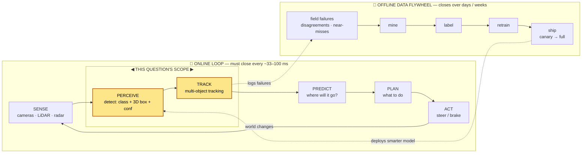
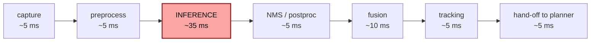
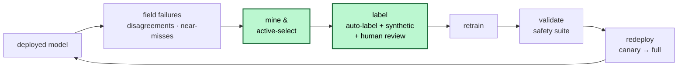

# Case Study: Object Detection for Autonomous Driving & Robotics

> **Q12** · Tag: **[Domain]** · Family: Computer Vision Systems
>
> **Prompt:** *"Design the perception/detection stack for a self-driving car (or a warehouse robot)."*
>
> **Teaches:** Real-time detection under hard safety constraints, sensor fusion, and edge deployment.

Difficulty: Hard. This is a *safety-critical, real-time, multi-sensor, edge* system — it stresses more of the framework at once than almost any other question in this series.

---

## 0. How to use this document

If you're new to ML system design, read this once end-to-end, then use it as a workbook. The structure mirrors the way you should actually *answer* in the room:

- **§1–2** are the meta-skill: what the interviewer is secretly grading, and the shape of a good answer. Internalize these first — they transfer to *every* question, not just this one.
- **§3** walks the 9-step framework applied to this exact problem. This is the spine of your spoken answer.
- **§4** goes two levels deeper on the four things you *must* nail. A generalist stops at §3; a senior/staff CV engineer lives in §4.
- **§5–6** are for turning knowledge into performance: a full worked whiteboard pass you can read like a transcript, and how to survive curveballs.
- **§7–11** are quick-reference: failure modes, flashcards, cheat sheet, glossary, further reading.

Throughout, you'll see two kinds of callouts:

> **🔧 Anchor it** — a prompt to connect this point to a real example, ideally your own; a generic one is used here as a placeholder.

> **⚠️ Trap:** the specific mistake most candidates make here. Interviewers are listening for exactly these.

---

## 1. What this question is *really* testing

The interviewer does not care whether you can name the latest detector. They are checking five things, roughly in order of how much "senior signal" each carries:

1. **Do you scope before you build?** Self-driving car and warehouse robot are wildly different problems. Jumping straight to "I'd use YOLO" tells them you can't be trusted with an ambiguous problem.
2. **Do you reason about *cost asymmetry* under safety?** A missed pedestrian is not the same as a false alarm. If you optimize a single accuracy number, you fail.
3. **Do you understand that the model is the easy part?** The data engine, the sensor fusion, the edge constraints, and the feedback loop are where real systems live and die.
4. **Can you make latency *physical*?** Latency here isn't a UX nicety; it converts directly into meters of stopping distance. Show that you feel that.
5. **Do you know that ML shouldn't be the *sole* guarantor of safety?** The strongest answer places the neural net *inside* a defense-in-depth architecture, not *as* the safety guarantee.

Keep these five in your peripheral vision the whole time. Every design choice you make should visibly serve one of them.

---

## 2. The 60-second mental model

Before any detail, plant a picture. Perception is one stage of a real-time loop that repeats ~10–30 times per second:

Two ideas to state out loud in your first minute:

- **"Perception is a stage in a hard-real-time loop, and it also feeds a slower offline flywheel."** Naming both loops immediately signals you think in systems, not models.
- **"There's a fast online loop that must never miss, and a slow offline loop that makes the fast loop smarter over time."** That framing organizes the entire rest of your answer.

> **Analogy:** think of a driver. The **online loop** is your reflexes right now — you can't afford to think, you just react in a fixed time budget. The **offline flywheel** is you getting better over years of driving: every near-miss quietly updates your instincts. A good perception system needs both, and they're engineered very differently.

---

## 3. Walking the framework

This is the 9-step skeleton from Part 0 of the curriculum, applied. In a real interview you'd spend ~5 minutes on steps 1–3 and let the interviewer pull you toward the parts they care about. Talk out loud; write the skeleton on the board so you never lose your place.

### Step 1 — Clarify & scope

Do **not** skip this. The whole rest of the answer branches on it. Ask, then *write the answers on the board as a spec*:

**Which platform?** Self-driving car (fast, open world, ISO 26262 / SOTIF, huge tail) or warehouse robot / AMR (slow, semi-structured, humans + forklifts, ISO 3691-4)?

> **🔧 Anchor it:** If you have real experience with one of these platforms, scope to it and say so explicitly — depth on one beats shallow coverage of both. Otherwise, pick based on technical merit and say why: *"I'll design the warehouse-robot / AMR case since it's a well-scoped, safety-critical system that generalizes — I'll flag where the self-driving version diverges: mainly speed, the open-world tail, and the regulatory bar."*

**Where does "perception" start and stop?** This is the highest-value clarifying question. Detection only? Detection + multi-object tracking? Also semantic segmentation / free-space / lane lines? Perception usually ends before *prediction* and *planning* — pin that boundary so you're not on the hook for the whole autonomy stack.

**What's the sensor suite?** Mono/stereo cameras (how many, what FOV)? LiDAR (yes/no, how many beams)? Radar? Are they time-synchronized and calibrated? (If they say "you choose," that's an invitation to talk fusion — good.)

**Non-functional requirements — pin numbers:**

| Dimension | Warehouse AMR (typical) | Self-driving car (typical) |
|---|---|---|
| Operating speed | 1–2 m/s | up to ~30 m/s (highway) |
| Perception latency budget | tens of ms, generous | ~50–100 ms, brutal |
| Frame rate | 10–15 Hz | 10–30 Hz |
| Compute | one edge GPU (e.g., Jetson-class) | automotive SoC (e.g., Orin-class), power/thermal capped |
| Connectivity | intermittent Wi-Fi | none guaranteed while driving |
| Worst-case cost | injure a warehouse worker | kill a road user |

> **⚠️ Trap:** giving one latency number. Latency is a *budget* that gets *decomposed* (see §4.1) and you care about the **p99**, not the mean. The one frame that's slow might be the one with the child in it.

**End the step with a written spec**, e.g.:
> *"20 Hz. Multi-object 3D detection + tracking of people, forklifts, pallets, and generic obstacles. Camera + LiDAR + radar, calibrated & synced. On-board Orin-class SoC, no cloud in the loop. p99 perception latency < 70 ms. Recall on people is the metric we defend above all else."*

That paragraph, written before you touch a model, is most of your senior signal already banked.

### Step 2 — Frame as an ML problem

Define input → output **precisely**:

- **Input (per timestep):** a synchronized bundle — *N* camera frames + a LiDAR point cloud + radar returns, plus calibration (intrinsics/extrinsics) and ego-motion.
- **Output (per timestep):** a set of objects, each with `{class, 3D bounding box (x,y,z,l,w,h,heading), confidence, velocity, track_id, uncertainty}`. 3D because the planner needs metric position and heading, not pixels.

**Is ML even the right tool?** This is a genuinely strong thing to raise here:

> **The killer framing:** *"The safety **floor** doesn't have to be ML. A certified safety-rated laser scanner that stops the robot whenever anything enters a protective field is deterministic, verifiable, and doesn't hallucinate. ML earns its place on top of that floor — it's what lets the robot **classify, predict intent, and navigate smoothly** instead of emergency-stopping every time a shadow moves. So I'm not betting a life on a neural net's recall; I'm using ML for **performance**, with a simpler certified layer for **safety.**"*

Say this and you've demonstrated the #5 point from §1 unprompted. Most candidates never get there.

**Pick the paradigm:** supervised object detection (+ tracking as a downstream, often non-learned or lightly-learned stage). Note the sub-choices you'll justify later: 2D vs 3D, one-stage vs two-stage, and *where* fusion happens.

### Step 3 — Metrics

Split cleanly into offline, online/safety, and guardrails, and **explicitly name the offline–online gap** — that's where senior signal lives (Framework step 3).

**Offline (proxy) metrics:**
- **mAP** (mean Average Precision), but the whole point is that *aggregate mAP lies*. You must **disaggregate**: mAP **per class**, **per distance bucket** (0–10 m, 10–30 m, 30 m+), **per object size**, **per weather/lighting**. A model can post great overall mAP while quietly failing on distant pedestrians — the one slice that matters most.
- For 3D, benchmarks use richer scores — e.g., KITTI's 3D AP, or **nuScenes NDS** which folds in translation/scale/orientation/velocity errors, not just box overlap. Name-dropping these shows domain literacy.
- **Recall on vulnerable classes** (people, cyclists) at range — track this as its *own headline number*, because a false negative here is the catastrophic case.

**Online / safety (north-star) metrics:**
- Interventions or disengagements per hour/mile; collisions and near-misses; **phantom-stop rate** (unnecessary emergency stops).
- **Latency p99**, treated as a *safety* metric, not a perf metric.

**Guardrail metrics** (must not regress even if the headline improves):
- False-positive / phantom-brake rate (too many FPs is *itself* dangerous and destroys trust).
- Per-class recall floors — you never trade a 0.3% mAP gain for *any* drop in pedestrian recall.

> **⚠️ Trap:** proposing "accuracy" or even undifferentiated mAP. In a world that is 99%+ "no object here," and where one class matters 100× more than another, a single averaged number is worse than useless — it hides the failure that gets someone hurt.

> **The offline–online gap, said out loud:** *"mAP on a benchmark and disengagements-per-mile in the field diverge because the benchmark under-samples the long tail and doesn't capture temporal/track-level behavior. I close the gap by weighting evaluation toward safety-critical slices and by validating in closed-loop simulation before any road/floor time."*

### Step 4 — Data

For this problem, data *is* the moat. Cover:

- **Sources:** the fleet itself (every robot/car is a sensor), plus targeted collection campaigns, plus **synthetic data** for scenarios you can't safely or cheaply collect in the real world.
- **Labels — the hard part, so dwell on it:** 3D boxes are expensive to annotate (a human clicking boxes in a point cloud is slow). Strategies to cut cost: **auto-labeling with a large offline "teacher"** model, then human *review* instead of human *from-scratch*; and **synthetic data that comes pre-labeled for free**.

> **🔧 Anchor it (synthetic):** BlenderProc is a real open-source tool for generating synthetic, pixel-perfect labeled data — RGB, depth, segmentation, and 3D box annotations — from procedurally rendered scenes. It's useful here for covering the rare-but-critical tail (a person lying on the floor, a forklift at a weird angle, unusual lighting): you can generate thousands of labeled examples in a day instead of waiting months to encounter one in the field. If you have a real example from your own work, use it here — a specific number beats a generic claim.

- **Class imbalance & the tail:** the world is overwhelmingly empty road/floor. Foreground/background imbalance is extreme (relevant to focal loss, §6), and *rare classes* are exactly the safety-critical ones. This is the §4.3 deep dive.
- **Freshness & drift:** new site, new season, new forklift model, construction. Data collection is never "done."
- **The domain gap:** synthetic-to-real and site-to-site gaps must be measured and closed (domain randomization, fine-tuning, adaptation).
- **Privacy:** faces/plates in fleet footage → blurring / on-device handling / retention policy. Mention it before they ask.

### Step 5 — Features & representation

The "features" here are really **sensor representations and the space you fuse them in.**

- **Per-sensor characteristics** — this is the crux of the fusion deep dive (§4.2), but summarize now:

| Sensor | Gives you | Weak at |
|---|---|---|
| **Camera** | rich semantics (what is it), color/texture, cheap, dense | no direct depth; bad in glare/low-light/fog |
| **LiDAR** | precise 3D geometry, works in the dark | sparse at range; costly; degraded by rain/snow/dust; no color |
| **Radar** | velocity via Doppler, long range, all-weather | low spatial/angular resolution |

- **The common space:** modern stacks increasingly fuse into a **bird's-eye-view (BEV)** grid — a top-down metric representation where camera, LiDAR, and radar features can be placed in the same coordinate frame and reasoned about together.
- **Calibration & sync as first-class features:** extrinsics/intrinsics, hardware time-sync, and **ego-motion compensation** (the vehicle moves during a LiDAR sweep). If these are wrong, fusion is worse than no fusion. Mentioning this is a strong senior tell.

> **⚠️ Trap (leakage, this domain's version):** temporal leakage. If you build training clips that let the model peek at future frames, your offline numbers will be gorgeous and your online system will be blind. Respect the arrow of time in both features and evaluation.

### Step 6 — Model

**Start with a baseline, then justify every step up against the latency/safety budget.** Never open with the fanciest thing.

**2D detection baselines (if scope is camera-only or a first pass):**
- **One-stage** (YOLO family, SSD, RetinaNet, anchor-free FCOS/CenterNet): "look once," predict boxes densely in a single pass. *Fast* → the default when latency is king.
- **Two-stage** (Faster R-CNN): propose regions, then classify. *More accurate, slower.* Justify only if the budget allows.

> **Analogy:** one-stage vs two-stage is *"glance and call it"* vs *"circle the suspicious spots, then look closely at each."* The second is more careful but you can't afford it 20 times a second on an edge chip.

- **RetinaNet's focal loss** deserves a name-drop: it directly tackles the extreme foreground/background imbalance of dense detection by down-weighting easy negatives. This ties detection to the class-imbalance theme that runs through the whole curriculum.

**3D detection (what the planner actually needs):**
- **LiDAR-based:** VoxelNet → SECOND → **PointPillars** (fast, pillar encoding, a real-time favorite) → **CenterPoint** (anchor-free, strong). PointPillars is a great "credible real-time baseline" to name.
- **Camera-based 3D / BEV:** Lift-Splat-Shoot, BEVDet, BEVFormer — rising, cheaper (no LiDAR) but geometry is estimated, not measured.
- **Fusion models:** PointPainting, TransFusion, **BEVFusion** — combine modalities in a shared BEV space.

**How to present the model section (the senior move):**
> *"Baseline: a single-stage 2D detector per camera to prove the pipeline. Then I move to a 3D detector because the planner needs metric boxes — PointPillars/CenterPoint on LiDAR as the real-time workhorse. Then I fuse camera semantics + LiDAR geometry in BEV to fix each sensor's blind spots. Every one of those steps I'd only take if it pays for itself against the p99 latency budget and improves the safety-critical slices — not aggregate mAP."*

**Redundancy as design, not afterthought:** run detectors that fail *differently* (a LiDAR-only path and a camera-only path) so their errors are uncorrelated. A miss in one is caught by the other. (This is the Swiss-cheese idea from §4.1.)

**Tracking (usually in scope):** tracking-by-detection — associate detections across frames (SORT / DeepSORT / ByteTrack) with a Kalman-filter motion model. Tracking buys you **temporal redundancy**: a single dropped frame doesn't erase an object because the track persists. Say this explicitly — it's a safety argument, not just a feature.

### Step 7 — Training

- **Pipeline & cadence:** continuous retraining fed by the flywheel (§4.4); each release gated by the offline safety suite before it can ship.
- **Distributed / efficient training:** these models and datasets are large. Talk concretely about throughput.

> **🔧 Anchor it (training efficiency):** Mixed precision, multi-GPU data parallelism, and data-pruning techniques like InfoBatch (which prunes redundant or easy samples during training to cut cost without hurting accuracy) are the standard toolkit here. On perception-scale data, training efficiency is what makes a fast flywheel affordable. If you have a real example from your own work, use it here — a specific number beats a generic claim.

- **Reproducibility (non-negotiable in safety):** every shipped model must be reconstructible — *which data, which labels, which code, which config.* When a model is implicated in an incident you must be able to reproduce and diagnose it.

> **🔧 Anchor it (MLOps):** DVC and MLflow are real, widely used tools for this: DVC versions data and pipelines, MLflow tracks experiments and model lineage — together they let any deployed checkpoint map back to its exact dataset, code, and config. In a safety system that lineage isn't nice-to-have — it's how you do a rollback and a root-cause after a field failure. If you have a real example from your own work, use it here — a specific number beats a generic claim.

- **Augmentation & sim:** heavy augmentation + synthetic data to cover weather, lighting, and rare geometry; measure and close the sim-to-real gap rather than assuming it away.

### Step 8 — Evaluation & serving

**Evaluation ladder (offline → progressively riskier real exposure):**
1. **Offline** on the disaggregated safety suite (per-class, per-distance, per-condition) with hard per-class recall floors.
2. **Closed-loop simulation** — replay logged scenarios and hand-built edge cases; does the *whole loop* behave? (This is where AV specifically leans hard, because you can't A/B a crash.)
3. **Shadow mode** — run the new model in the field making *no actuation decisions*, just logging where it disagrees with production. Free real-world eval at zero risk.
4. **Canary / limited deployment** — a few robots, one site, geofenced.
5. **Full rollout**, with instant rollback wired up.

**Serving (all on the edge):**
- **Why edge, not cloud:** you cannot put a network round-trip inside a loop that must close in tens of ms, and connectivity can vanish. Perception runs on-device, full stop.
- **Latency budget decomposition** (see §4.1): capture → preprocess → inference → NMS/postprocess → fusion → tracking → hand-off. Optimize the whole chain, watch **p99**.
- **Model optimization for the chip:** quantization (INT8; QAT if PTQ costs too much accuracy), pruning, distillation, and compilation (TensorRT/ONNX, operator fusion). The objective is a three-way Pareto: **accuracy × latency × power/thermal.**
- **Versioning & rollback:** every robot knows exactly which model it runs; a bad release can be pulled instantly.

### Step 9 — Monitoring & iteration

Close the lifecycle. Monitor three things *separately* because they fail at different speeds:
- **Inputs** (data drift): new site, season, lighting, sensor degradation/occlusion (a muddy lens!). Detect distribution shift on the sensor streams themselves.
- **Predictions:** detection-rate and confidence distributions, sudden per-class changes, track-stability.
- **Outcomes** (concept drift): interventions, near-misses, phantom stops — the delayed, expensive ground truth.

Wire **alerting → hard-example mining → relabel → retrain → re-validate** as an automated pipeline (that's the flywheel). And keep the reproducibility trail (DVC/MLflow) so any flagged model can be diagnosed and rolled back. This is the §4.4 deep dive.

---

## 4. The four deep dives you must nail

§3 is the map. These four are the territory the interviewer will drill into. Going two levels deeper here is what separates you from a generalist.

### 4.1 Latency & the safety budget

**Make latency physical.** At 30 m/s, 100 ms of latency = **3 meters** of travel *before you've even decided to react*. Latency isn't UX; it's stopping distance. Say a number like that early — it reframes the whole conversation.

**Decompose the budget.** "Under 70 ms" is a *sum*:

> *Illustrative numbers, summing to ~70 ms. The point isn't the exact split — it's that "under 70 ms" is a **budget you decompose**, so you can see that **inference dominates** (optimize it first) and that fusion and NMS are sneaky costs. You defend the **p99** of this whole chain, not the mean.*

Now you can reason about *where* to spend effort. NMS and fusion are sneaky costs. And you optimize the **p99**, not the mean — the tail latency spike lands on some random frame, and Murphy's law says it's the frame with the pedestrian.

**Now the cost asymmetry.** Two error types, wildly different costs:
- **False negative (missed detection):** catastrophic. This is the one you defend against with everything you have.
- **False positive (phantom object):** causes phantom braking — itself dangerous (rear-end risk) and trust-destroying.

You do **not** pick a single threshold and hope. You:
1. Tune the operating point deliberately toward recall on safety-critical classes.
2. Add **redundancy** so no *single* miss is fatal: multiple sensors, uncorrelated model paths, and temporal tracking that carries an object across a dropped frame.
3. Keep the **deterministic safety floor** (§2 framing) underneath, so the ML's recall isn't the last line of defense.

> **Analogy — the Swiss cheese model:** every layer (camera detector, LiDAR detector, tracker, certified safety scanner) has holes. Safety comes from stacking layers whose holes don't line up. A miss has to punch through *every* slice at once to cause harm.

> **🔧 Anchor it (safety framing):** If you've worked on a system with a hard reliability bar — a pick-and-place cell, a payments pipeline, anything where a miss is unacceptable rather than merely costly — that's the story to drop here: the same muscle applies. You obsess over the tail of the reliability distribution and design redundancy so a single model error can't propagate to an unsafe action. If you have a real example from your own work, use it here — a specific number beats a generic claim.

### 4.2 Sensor fusion — 2D vs 3D, and *where* to fuse

**Why fuse at all?** Each sensor covers another's blind spot (see the table in §5).

> **Analogy — human senses:** vision is rich but useless in the dark; echolocation gives range in the dark but no color. A camera-only car is a human squinting into headlight glare; a LiDAR-only car is someone navigating a pitch-black room by touch. Fusion is having eyes *and* ears — and knowing which to trust when.

**2D vs 3D:** 2D boxes live in pixels; the planner needs *metric* 3D (where is it in meters, which way is it heading, how fast). So the output is 3D even if some detectors run in 2D internally.

**The key senior distinction — *levels* of fusion:**

| Level | What's combined | Pros | Cons |
|---|---|---|---|
| **Early / raw** | raw sensor data before feature extraction | max information; can exploit fine cross-modal cues | fragile to calibration/sync errors; heavy compute |
| **Mid / feature** | learned features in a shared space (e.g., BEV) | strong performance; the modern default | needs good calibration; more complex to train |
| **Late / object** | each sensor detects independently, then decisions are merged | modular, robust, degrades gracefully if one sensor fails | throws away cross-modal cues; can't recover a joint-only detection |

The mature answer isn't "pick one" — it's *"mid-level BEV fusion for performance, with a late-fusion / independent-path fallback for graceful degradation when a sensor drops out."*

> **⚠️ Trap:** hand-waving fusion as "just concatenate the features." The real difficulty is **calibration, time-sync, and ego-motion compensation.** Fusion with bad extrinsics is *worse* than a single good sensor. Name this.

> **🔧 Anchor it (fusion):** If you've built a system that fuses 2D semantics with 3D geometry — for example, camera detection paired with depth or point-cloud data for grasping, mapping, or localization — that's exactly the same split a driving stack needs, and you'll have felt firsthand where fusion breaks (extrinsic drift, unsynced streams). If you have a real example from your own work, use it here — a specific number beats a generic claim.

### 4.3 The long tail — mining and labeling rare classes

**Why it dominates.** You'll hit 95% of mAP on common cases quickly. The remaining tail — a couch fallen off a truck, a person in a dinosaur costume, a forklift carrying an odd load, heavy backlight — is small in frequency but is *where injuries happen.*

> **Analogy:** studying for an exam only on the common questions. You'll ace the practice set and get destroyed by the three weird questions — which in a safety system are the entire exam.

**The pipeline (this is literally an active-learning story — lead with it):**
1. **Mine** hard examples from the fleet: frames where the model is uncertain, where the redundant paths *disagree*, or where a disengagement/near-miss occurred.
2. **Select what to label** with active learning: **uncertainty** (model is unsure) + **diversity** (don't label 500 near-identical frames) + **prototypicality** (is this representative or a one-off?). Use **semantic dedup** so you never pay to label near-duplicates.
3. **Label** efficiently: auto-label with a big offline teacher, then have humans *review* rather than draw from scratch; **generate synthetic** examples for tail scenarios you can't wait to encounter.
4. **Close the loop:** every field failure becomes a labeled training example. The system's own mistakes are its best curriculum.

> **🔧 Anchor it:** Active learning — selecting what to label by uncertainty, diversity, and prototypicality, with semantic dedup to avoid paying for near-duplicates — paired with BlenderProc-style synthetic generation for tail cases you can't safely collect, is one of the highest-leverage things to go deep on in this question. Most candidates over-index on architecture; the tail is fundamentally a **data** problem, and data curation is where senior signal lives. If you have a real example from your own work, use it here — a specific number beats a generic claim.

### 4.4 Edge compute & the data flywheel

**Edge, non-negotiable:** the model runs on the vehicle/robot (Orin/Jetson-class), power- and thermal-capped, with no cloud in the loop. So the model must be *made to fit*:

- **Quantization** (INT8; quantization-aware training when post-training quant costs too much accuracy)
- **Pruning** (prefer structured — it actually speeds up on real hardware)
- **Distillation** (a big accurate teacher trains a small fast student)
- **Compilation** (TensorRT/ONNX, operator fusion) to squeeze the specific chip

> **Analogy — distillation:** a master chef (huge model) can't work every station at once, so they train an apprentice (small model) not just on the recipes but on the *intuition*. The apprentice is fast enough to run on the line — the edge chip.

The objective is a **three-way Pareto — accuracy × latency × power** — not accuracy alone.

**The data flywheel (the "field failures return to training" point — say you do this):**

> *The green stages — mining/active-selection and labeling — are the **data-centric** core of the loop. Read it as a clock: the model's own mistakes drive the next lap, and each lap makes it smarter.*

Every trip around the loop makes the online model smarter. This is the single most important *systems* idea in the whole answer — the thing that turns a static model into a living system.

> **🔧 Anchor it:** The three pieces that make a flywheel like this both fast and safe are active-learning selection (to avoid labeling everything), synthetic augmentation for the tail, and DVC/MLflow-style lineage that lets any deployed checkpoint be reproduced and rolled back. If you have a real example from your own work, use it here — a specific number beats a generic claim.

---

## Interview delivery guide — a full whiteboard pass (read this like a transcript)

*This is what a strong ~30-minute answer sounds like, compressed. Notice how much happens before any model is named.*

> **[0:00–5:00 — scope]** "Two very different problems live under this prompt. I'll design for a warehouse AMR since it's a well-scoped, safety-critical case that generalizes; a self-driving car follows the same shape with higher stakes and more sensors — I'll flag where it diverges: mainly speed, the open-world tail, and the regulatory bar. Quick clarifiers: perception = detection + tracking, ending before prediction? *[yes]* Sensor suite — I'll assume calibrated, synced camera + LiDAR + radar. NFRs: 20 Hz, p99 perception under 70 ms, on-board Orin-class, no cloud in the loop, worst case is injuring a worker. I'll write that as my spec. One design principle up front: the *safety floor* is a certified safety scanner, deterministic and verifiable — ML sits on top for performance, not as the sole safety guarantee."
>
> **[5:00–8:00 — ML framing + metrics]** "Input is a synced multi-sensor bundle plus calibration and ego-motion; output is 3D boxes with class, confidence, velocity, track id, and uncertainty. Metrics: offline I use mAP but *disaggregated* — per class, per distance, per condition — with pedestrian recall as its own headline and a hard floor. Online: interventions and near-misses per hour, phantom-stop rate, and p99 latency treated as a safety metric. The offline–online gap comes from the benchmark under-sampling the tail, so I weight eval toward safety-critical slices and validate in closed-loop sim."
>
> **[8:00–14:00 — data]** "Data is the moat. Fleet collection + targeted campaigns + synthetic. Labeling 3D is the bottleneck — auto-label with a big teacher and have humans *review*, and generate the rare tail synthetically with pixel-perfect labels. The tail is the real risk: mine hard frames — uncertainty, path disagreement, near-misses — and select with active learning (uncertainty + diversity + prototypicality, semantic dedup so you don't pay for near-duplicates). That active-learning selection is the highest-leverage piece of this whole answer."
>
> **[14:00–20:00 — model + fusion]** "Baseline: single-stage 2D per camera to stand the pipeline up. Then 3D because the planner needs metric boxes — PointPillars/CenterPoint on LiDAR as the real-time workhorse. Then mid-level BEV fusion to combine camera semantics with LiDAR geometry, with an independent late-fusion path so the system degrades gracefully if a sensor drops. Tracking-by-detection on top gives temporal redundancy — a dropped frame doesn't erase an object. Every step up in complexity is justified against the p99 budget and the safety slices, not aggregate mAP."
>
> **[20:00–25:00 — training, serving, edge]** "Efficient training — mixed precision, multi-GPU, data pruning — to keep the flywheel affordable, and DVC/MLflow lineage so every shipped checkpoint is reproducible and roll-back-able. Serving is all on-device: decompose the latency budget, quantize to INT8, distill, compile with TensorRT, and optimize the accuracy×latency×power Pareto. Ship via offline suite → closed-loop sim → shadow → canary → full, with instant rollback."
>
> **[25:00–30:00 — monitoring + close the loop]** "Monitor inputs, predictions, and outcomes separately since they drift at different rates — a muddy lens is data drift, a new site is concept drift. Alerts feed hard-example mining, which feeds active selection, which feeds retraining and validated redeploy. That closed loop — failures back to training — is the whole system: a static model becomes one that gets safer every week."

If you can deliver that out loud, filling all nine steps, you're interview-ready for this archetype.

---

## 6. Curveball follow-ups & how to handle them

Interviewers test *depth* by perturbing the problem. Prepare the reflexes:

- **"Now it must run on the edge / half the compute."** → distillation + INT8 quantization + structured pruning + TensorRT; re-decompose the latency budget; accept a measured mAP drop *only on non-safety-critical slices*, never on pedestrian recall.
- **"Latency budget just dropped to 50 ms."** → drop to a single-stage / pillar-based detector, lower input resolution *carefully* (watch distant-small-object recall), cut fusion to a lighter path, lean harder on tracking to bridge frames.
- **"A sensor fails mid-drive (LiDAR dies)."** → graceful degradation: the late-fusion independent camera+radar path keeps you alive at reduced capability; trigger a safe-state / minimal-risk maneuver; alert. This is *why* you designed uncorrelated paths.
- **"Labels are delayed 3 weeks."** (chargeback-style delay, e.g., incidents surface late) → you can't wait for outcome labels to retrain; use *proxy* signals (model disagreement, uncertainty, near-miss triggers) for mining now, and reconcile with delayed ground truth later. Ties to fraud detection ([Q11](./11-real-time-fraud-detection.md)).
- **"How do you catch a class you've *never* labeled?"** (open-set / anomaly) → uncertainty + a generic "unknown obstacle" detector + the deterministic safety floor that stops for *any* geometry regardless of class. You don't need to *name* the couch to *avoid* it.
- **"How do you know a new model is actually better before shipping?"** → the eval ladder (offline safety suite → closed-loop sim → shadow → canary), guardrail metrics, per-class recall floors. Ties straight to the A/B / experimentation question ([Q26](./26-experimentation-platform.md)).
- **"It works in warehouse A but fails in warehouse B."** → domain shift; measure the gap, mine B's tail, fine-tune / adapt, add B to the flywheel. Reproducibility lets you compare A-model vs B-model cleanly.

> **How to handle a follow-up you don't know:** don't freeze or bluff. Say your reasoning out loud, state assumptions, reason from the framework: *"I haven't built exactly that, but here's how I'd reason about it..."* Interviewers grade *process*. A structured "I don't know, but here's my approach" beats a confident wrong answer every time.

---

## 7. Common failure modes (self-check)

- ❌ Jumping to "I'd use YOLO" before scoping. → ✅ 5 minutes on scope + a written spec.
- ❌ Optimizing a single accuracy/mAP number. → ✅ Disaggregate; defend pedestrian recall.
- ❌ Treating latency as one number. → ✅ Decompose it; own the p99.
- ❌ Hand-waving fusion as "concatenate features." → ✅ Levels of fusion + calibration/sync/ego-motion.
- ❌ Ignoring how labels are obtained. → ✅ Auto-label + synthetic + active selection, dwelt on.
- ❌ Presenting a static model. → ✅ Monitoring + the data flywheel + retraining triggers.
- ❌ Making the neural net the sole safety guarantee. → ✅ Defense in depth with a certified floor.
- ❌ Forgetting it runs on the edge. → ✅ Compression + the accuracy×latency×power Pareto.

Candidates who talk concretely about data curation and MLOps/reproducibility tend to stand out — most default to talking only about architecture.

---

## 8. Flashcards

Cover the right column; recall it from the left.

| Cue | What you must be able to say |
|---|---|
| Why isn't ML the sole safety guarantee? | A deterministic, certified layer (e.g., a certified safety scanner) is the verifiable floor; ML sits on top for performance — classification, intent, smooth navigation — not as the last line of defense. |
| Make latency physical | At 30 m/s, 100 ms of latency = 3 meters of travel before the system has even decided to react. Latency is stopping distance, not a UX nicety. |
| Why decompose the latency budget? | "Under 70 ms" is a sum (capture → preprocess → inference → NMS → fusion → tracking → hand-off); inference usually dominates and fusion/NMS are sneaky costs. Defend the **p99**, not the mean. |
| Cost asymmetry in detection | False negative (missed object) is catastrophic; false positive (phantom object) causes dangerous, trust-destroying phantom braking. Tune toward recall on safety-critical classes and add redundancy. |
| Swiss cheese model | Every layer (camera, LiDAR detector, tracker, certified scanner) has holes; stack layers whose holes don't line up so one miss can't punch through all of them. |
| Early vs mid vs late fusion | Early = raw data before feature extraction (max info, fragile to calibration); mid = learned features in a shared space like BEV (the modern default); late = independent per-sensor detections merged (robust, degrades gracefully, loses cross-modal cues). |
| Why fuse in BEV? | Bird's-Eye-View is a shared top-down metric coordinate frame where camera, LiDAR, and radar features can be combined and reasoned about together. |
| What actually breaks fusion? | Bad calibration (extrinsics/intrinsics), time-sync errors, and missing ego-motion compensation — fusion with bad calibration is worse than a single good sensor. |
| Why is aggregate mAP dangerous? | It hides failures on safety-critical slices (distant pedestrians, rare classes); disaggregate by class, distance, and condition with a hard recall floor on vulnerable road users. |
| Offline vs online metrics here | Offline: disaggregated mAP/NDS, per-class recall. Online: interventions/near-misses per mile, phantom-stop rate, p99 latency as a safety metric. |
| One-stage vs two-stage detectors | One-stage (YOLO, SSD, RetinaNet, FCOS/CenterNet) predicts densely in a single pass — fast. Two-stage (Faster R-CNN) proposes regions then classifies — slower, more accurate. |
| What does focal loss fix? | The extreme foreground/background imbalance in dense detection, by down-weighting easy negatives. |
| LiDAR 3D detector progression | VoxelNet → SECOND → PointPillars (fast, pillar encoding, real-time favorite) → CenterPoint (anchor-free, strong). |
| Camera-only 3D/BEV detectors | Lift-Splat-Shoot, BEVDet, BEVFormer — cheaper (no LiDAR) but geometry is estimated, not measured. |
| Fusion 3D detectors | PointPainting, TransFusion, BEVFusion — combine modalities in a shared BEV space. |
| Why does tracking matter for safety? | Tracking-by-detection gives temporal redundancy — a single dropped frame doesn't erase an object because the track persists. |
| The long-tail pipeline | Mine hard examples (uncertainty, path disagreement, near-misses) → active-select (uncertainty + diversity + prototypicality + semantic dedup) → label (auto-label + synthetic + human review) → close the loop into training. |
| Edge deployment toolkit | Quantization (INT8/QAT), structured pruning, distillation, compilation (TensorRT/ONNX); optimize the 3-way Pareto of accuracy × latency × power. |
| Evaluation ladder before full rollout | Offline safety suite → closed-loop simulation → shadow mode → canary/limited deployment → full rollout with instant rollback. |

---

## 9. Cheat sheet (last-minute review)

- **Scope first.** Car vs robot; detection vs detection+tracking; sensor suite; NFRs as *numbers*.
- **ML is the performance layer; a deterministic certified layer is the safety floor.**
- **Latency is meters, not milliseconds.** Decompose the budget; defend the **p99**.
- **Cost asymmetry:** FN (missed object) ≫ FP (phantom brake), but too many FPs is *also* dangerous. Redundancy + temporal tracking + safety floor so no single miss is fatal.
- **Metrics:** disaggregated mAP + pedestrian-recall floor; online = interventions/near-misses/phantom-stops + p99. Name the offline–online gap.
- **Fusion:** camera (semantics) + LiDAR (geometry) + radar (velocity), fused in BEV; know **early/mid/late** trade-offs; the hard part is **calibration + sync + ego-motion**.
- **Model:** baseline single-stage 2D → 3D (PointPillars/CenterPoint) → BEV fusion. Justify each step against the budget.
- **Long tail = data problem:** mine → active-select (uncertainty/diversity/prototypicality/dedup) → auto-label + synthetic → close the loop.
- **Edge:** quantize / prune / distill / compile; Pareto = accuracy × latency × power.
- **Flywheel:** field failures → mining → curation → retrain → validate → redeploy. Reproducibility (DVC/MLflow) makes rollback and diagnosis possible.
- **Ship ladder:** offline suite → closed-loop sim → shadow → canary → full.

---

## 10. Glossary

- **mAP** — mean Average Precision; the standard detection quality metric. Disaggregate it or it lies.
- **NDS** — nuScenes Detection Score; 3D metric folding in translation/scale/orientation/velocity errors.
- **IoU** — Intersection over Union; box-overlap measure underlying AP.
- **NMS** — Non-Max Suppression; post-processing that collapses duplicate boxes (a hidden latency cost).
- **BEV** — Bird's-Eye-View; top-down metric grid used as a common fusion space.
- **VRU** — Vulnerable Road User (pedestrian, cyclist); the recall you defend above all.
- **Early/Mid/Late fusion** — combining sensors at raw / feature / object-decision level.
- **Ego-motion compensation** — correcting for the platform's own movement during a sensor scan.
- **One-stage vs two-stage detector** — dense single-pass prediction vs propose-then-classify.
- **Focal loss** — loss that down-weights easy negatives to handle foreground/background imbalance.
- **PointPillars / CenterPoint** — fast, real-time-friendly 3D LiDAR detectors.
- **PTQ / QAT** — Post-Training Quantization / Quantization-Aware Training.
- **Distillation** — training a small fast "student" from a large accurate "teacher."
- **Shadow mode** — running a model in the field with no control authority, just logging.
- **Canary** — limited/geofenced rollout before full deployment.
- **Data drift vs concept drift** — the *inputs* change vs the *input→output relationship* changes.
- **Active learning** — selecting the most informative samples to label (uncertainty/diversity/prototypicality).
- **Data flywheel** — the closed loop where field failures become training data.
- **ISO 26262 / SOTIF (ISO 21448)** — automotive functional safety / safety of the intended functionality (the "the design itself has gaps" standard — the ML long-tail problem, formalized).
- **ISO 3691-4** — safety standard for driverless industrial trucks (warehouse AMRs).

---

## 11. Further reading & tools

**Papers — 2D detectors**

- [Redmon et al. — "You Only Look Once: Unified, Real-Time Object Detection" (YOLO)](https://scholar.google.com/scholar?q=You+Only+Look+Once%3A+Unified%2C+Real-Time+Object+Detection) — the original single-pass detector; many later YOLO versions build on this idea.
- [Liu et al. — "SSD: Single Shot MultiBox Detector"](https://scholar.google.com/scholar?q=SSD%3A+Single+Shot+MultiBox+Detector)
- [Lin et al. — "Focal Loss for Dense Object Detection" (RetinaNet)](https://scholar.google.com/scholar?q=Focal+Loss+for+Dense+Object+Detection)
- [Tian et al. — "FCOS: Fully Convolutional One-Stage Object Detection"](https://scholar.google.com/scholar?q=FCOS%3A+Fully+Convolutional+One-Stage+Object+Detection)
- [Zhou et al. — "Objects as Points" (CenterNet)](https://scholar.google.com/scholar?q=Objects+as+Points)
- [Ren et al. — "Faster R-CNN: Towards Real-Time Object Detection with Region Proposal Networks"](https://scholar.google.com/scholar?q=Faster+R-CNN%3A+Towards+Real-Time+Object+Detection+with+Region+Proposal+Networks)

**Papers — 3D LiDAR detectors**

- [Zhou & Tuzel — "VoxelNet: End-to-End Learning for Point Cloud Based 3D Object Detection"](https://scholar.google.com/scholar?q=VoxelNet%3A+End-to-End+Learning+for+Point+Cloud+Based+3D+Object+Detection)
- [Yan et al. — "SECOND: Sparsely Embedded Convolutional Detection"](https://scholar.google.com/scholar?q=SECOND%3A+Sparsely+Embedded+Convolutional+Detection)
- [Lang et al. — "PointPillars: Fast Encoders for Object Detection from Point Clouds"](https://scholar.google.com/scholar?q=PointPillars%3A+Fast+Encoders+for+Object+Detection+from+Point+Clouds)
- [Yin et al. — "Center-based 3D Object Detection and Tracking" (CenterPoint)](https://scholar.google.com/scholar?q=Center-based+3D+Object+Detection+and+Tracking)

**Papers — camera-only BEV & sensor fusion**

- [Philion & Fidler — "Lift, Splat, Shoot: Encoding Images from Arbitrary Camera Rigs by Implicitly Unprojecting to 3D"](https://scholar.google.com/scholar?q=Lift%2C+Splat%2C+Shoot%3A+Encoding+Images+from+Arbitrary+Camera+Rigs+by+Implicitly+Unprojecting+to+3D)
- [Huang et al. — "BEVDet: High-performance Multi-camera 3D Object Detection in Bird-Eye-View"](https://scholar.google.com/scholar?q=BEVDet%3A+High-performance+Multi-camera+3D+Object+Detection+in+Bird-Eye-View)
- [Li et al. — "BEVFormer: Learning Bird's-Eye-View Representation from Multi-Camera Images via Spatiotemporal Transformers"](https://scholar.google.com/scholar?q=BEVFormer%3A+Learning+Bird%27s-Eye-View+Representation+from+Multi-Camera+Images+via+Spatiotemporal+Transformers)
- [Vora et al. — "PointPainting: Sequential Fusion for 3D Object Detection"](https://scholar.google.com/scholar?q=PointPainting%3A+Sequential+Fusion+for+3D+Object+Detection)
- [Bai et al. — "TransFusion: Robust LiDAR-Camera Fusion for 3D Object Detection with Transformers"](https://scholar.google.com/scholar?q=TransFusion%3A+Robust+LiDAR-Camera+Fusion+for+3D+Object+Detection+with+Transformers)
- [Liu et al. — "BEVFusion: Multi-Task Multi-Sensor Fusion with Unified Bird's-Eye View Representation"](https://scholar.google.com/scholar?q=BEVFusion%3A+Multi-Task+Multi-Sensor+Fusion+with+Unified+Bird%27s-Eye+View+Representation)

**Papers — tracking, datasets & training efficiency**

- [Bewley et al. — "Simple Online and Realtime Tracking" (SORT)](https://scholar.google.com/scholar?q=Simple+Online+and+Realtime+Tracking)
- [Wojke et al. — "Simple Online and Realtime Tracking with a Deep Association Metric" (DeepSORT)](https://scholar.google.com/scholar?q=Simple+Online+and+Realtime+Tracking+with+a+Deep+Association+Metric)
- [Zhang et al. — "ByteTrack: Multi-Object Tracking by Associating Every Detection Box"](https://scholar.google.com/scholar?q=ByteTrack%3A+Multi-Object+Tracking+by+Associating+Every+Detection+Box)
- [Caesar et al. — "nuScenes: A Multimodal Dataset for Autonomous Driving"](https://scholar.google.com/scholar?q=nuScenes%3A+A+multimodal+dataset+for+autonomous+driving)
- [Geiger et al. — "Are We Ready for Autonomous Driving? The KITTI Vision Benchmark Suite"](https://scholar.google.com/scholar?q=Are+we+ready+for+Autonomous+Driving%3F+The+KITTI+Vision+Benchmark+Suite)
- [Qin et al. — "InfoBatch: Lossless Training Speed Up by Unbiased Dynamic Data Pruning"](https://scholar.google.com/scholar?q=InfoBatch%3A+Lossless+Training+Speed+Up+by+Unbiased+Dynamic+Data+Pruning)

**Tools**

- [BlenderProc](https://github.com/DLR-RM/BlenderProc) — procedural synthetic-data generation with pixel-perfect labels (RGB, depth, segmentation, 3D boxes).
- [TensorRT](https://developer.nvidia.com/tensorrt) — NVIDIA's inference optimizer/runtime for deploying quantized, fused models on edge GPUs.
- [ONNX](https://onnx.ai) — an open format for representing models so they can move between training frameworks and inference runtimes.
- [DVC](https://dvc.org) — version control for data and ML pipelines.
- [MLflow](https://mlflow.org) — experiment tracking and model lineage/registry.

**Standards**

- [ISO 26262](https://en.wikipedia.org/wiki/ISO_26262) — automotive functional safety.
- ISO 21448 (SOTIF, originally published as ISO/PAS 21448) — safety of the intended functionality; the standard most directly relevant to the long-tail/ML problem.
- ISO 3691-4 — safety requirements for driverless industrial trucks (warehouse AMRs).

---

*Part of the [ML System Design Case Studies](../README.md) series.*
