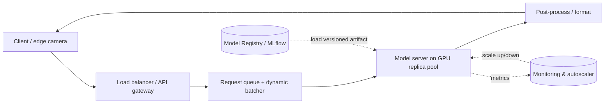
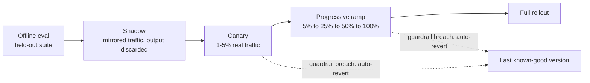

# Case Study: Model Serving / Inference System — Triton, Kubernetes

> **Q25** · Tag: **[Domain]** · Family: ML Infrastructure & Platform
>
> **Prompt:** *"Design a scalable, low-latency inference service."*
>
> **Teaches:** Dynamic batching and the latency/throughput tradeoff, GPU utilization and model optimization (quantization, distillation, compilation), autoscaling to bursty traffic, and safe rollout (shadow/canary) with versioning/instant rollback.

---

## The 60-second answer

The model is a given, black-box artifact — this question is about the *service* wrapped around it. Start by extracting a written spec: one model or a multi-tenant platform, model modality (fixed-compute CV model vs. variable-compute LLM/diffusion), a **p99** latency SLO, QPS and its burstiness, online vs. batch, hardware/cost envelope, and rollout cadence. Reframe the ML problem as an RPC service with a request path (client → gateway → **dynamic batcher** → GPU model server → post-process) and decompose the latency budget across it — tail latency, not the mean, is what breaks SLAs, because a fan-out system's p99 is driven by its slowest dependency. The core lever is **dynamic batching**: a GPU is a throughput machine, so you trade a small queueing wait (`max_batch_delay`) for much higher GPU utilization (`max_batch_size`), flushing on whichever bound hits first — LLMs need the generative cousin, **continuous (in-flight) batching** with a paged KV-cache, since output length varies per request. Make the model itself cheaper with quantization, distillation, pruning, and compilation (TensorRT/ONNX Runtime/`torch.compile`), and pack hardware efficiently with MIG/multi-model packing. Autoscale on GPU utilization or queue depth — never CPU — and solve the multi-minute GPU cold-start problem with warm pools and predictive, diurnal-aware scaling rather than pure reactive scaling. Route the batch/offline path (huge batches, spot GPUs, no SLO) separately from the online path so a nightly backfill never starves live traffic. Ship new versions through a progressive-delivery ladder — offline eval → **shadow** (mirrored traffic, output discarded) → **canary** (a small real-traffic slice) → ramp → 100% — backed by a versioned model registry, with the previous version kept warm so rollback is a traffic-pointer flip, not a redeploy. Close the loop with operational (RED/USE) and quality (drift, delayed ground truth) monitoring that automatically triggers rollback and retraining.

---

## How to read this document

This is a **teaching document**, not a cheat sheet. It walks the full design the way you'd walk it on a whiteboard, but stops constantly to explain *why* each decision is made, with analogies you can actually remember under pressure. If you read it once slowly and then do two timed whiteboard passes from the [one-page cheat sheet](#15-one-page-cheat-sheet-tldr), you will be able to handle this question and its cousins (serving diffusion models, serving LLMs, an embedding service for visual search, an edge perception stack).

There are three "voices" in here:
- **Plain prose** = the concept.
- **> Analogy blocks** = the mental model to hold onto.
- **🎯 Interview move** = exactly what to say or draw when the clock is running.

A note before we start: **this is an infrastructure question, and infra questions bend the standard framework.** More on that next.

---

## 0. Why this question exists, and what the interviewer is really grading

The prompt — *"Design a scalable, low-latency inference service"* — is deceptively open. The interviewer is **not** checking whether you can invent a model. The model is given. They are checking whether you understand the part of ML that most candidates hand-wave: **what happens after `model.fit()`, when a trained artifact has to answer millions of real users under a latency SLA without setting money on fire.**

Concretely, they want to see four muscles:

1. **Systems reasoning under a budget.** Can you take a latency number (say 100 ms) and *decompose* it, then defend every millisecond?
2. **The throughput ↔ latency tension.** Do you understand that the two things that sound like the same goal ("make it fast") are actually in tension, and can you name the knob that trades between them (batching)?
3. **GPU economics.** GPUs are the single biggest line item. Do you know how to keep them busy and how to make the model itself cheaper to run?
4. **Operational safety.** When you ship a new model version to a live service, how do you avoid taking down production, and how fast can you undo it?

> **Analogy — you're designing a restaurant kitchen, not inventing a recipe.**
> The recipe (the model) is fixed. Your job is the kitchen: how many stoves (GPUs), how you batch orders (dynamic batching), how you bring in extra cooks during the dinner rush (autoscaling), how you swap in a new menu without poisoning anyone (canary rollout), and how you keep food cost down (GPU utilization + model optimization). A candidate who keeps re-litigating the recipe is answering the wrong question.

---

## 1. Adapting the framework: this is an infra question

Your Part-0 framework has 9 steps and is **model-centric** (data → features → model → training → serving → monitoring). For a serving/platform question, you have to **rebalance** it, and *saying that out loud is itself senior signal*:

| Framework step | Weight for THIS question | Why |
|---|---|---|
| 1. Clarify & scope | **Heavy** | The whole design is dictated by the SLO/QPS/hardware numbers you extract here. |
| 2. Frame the problem | Light | The "ML problem" is given; you reframe it as a *systems* problem (an RPC service with a p99 budget). |
| 3. Metrics | **Heavy → becomes SLOs** | Offline accuracy is out of scope; you care about latency percentiles, throughput, availability, cost/query. |
| 4. Data / 5. Features / 6. Model / 7. Training | Mostly out of scope | The model is a black-box artifact you're handed. Touch briefly, don't dwell. |
| 8. Evaluation & serving | **This IS the question** | Batching, GPU util, autoscaling, batch vs. real-time, rollout/rollback. Spend 60% of your time here. |
| 9. Monitoring & iteration | **Heavy** | Operational + quality monitoring; automated rollback; the retraining loop hook. |

🎯 **Interview move:** In your first minute, say *"This is a platform/infrastructure problem, so I'm going to lean hard on scoping, then spend most of my time on the serving path and its reliability, and treat the model itself as a black box unless you want me to open it."* This frames you as someone who has actually shipped things.

---

## 2. Step 1 — Clarify & scope (do NOT skip; this is where you win)

The single most common failure on this question is jumping to "I'll use Kubernetes and Triton" before you know what you're serving. **Every downstream decision falls out of the numbers you gather here.** Ask, and pin down, the following. Below each I note *why the answer changes the design* — that's what you verbalize.

**Functional requirements**
- **What model(s) are we serving?** One model, or a *platform* for many teams' models? → A single model is a service; "many teams' models" is a **multi-tenant platform** (a much bigger design). Clarify which; interviewers often want the platform.
- **What's the model modality / shape?** A CV classifier/detector (fixed compute per request, one forward pass) vs. an **LLM or diffusion model** (variable compute, autoregressive or multi-step). → This *fundamentally changes batching and autoscaling.* We'll design for a CV embedding/detector model as the running example and then contrast LLM/diffusion.
- **Input/output contract.** Image bytes in, 512-d embedding out? Text in, token stream out? → Determines payload size, pre/post-processing cost, whether you can stream.

**Non-functional requirements (the numbers you must extract)**
- **Latency SLO — and which percentile.** "Low latency" is meaningless; get *"p99 ≤ 100 ms"*. p50 vs p99 vs p99.9 matters enormously (see [§4](#4-metrics-that-become-slos)).
- **Throughput / QPS.** 100 QPS, 10k QPS, 1M QPS? And is it *steady* or **bursty/spiky**? Bursty is the whole reason autoscaling is on the rubric.
- **Online vs. offline.** Does every request need an answer *now* (synchronous), or are some jobs "score these 1B items by tomorrow" (batch)? → Two different serving paths.
- **Hardware & cost envelope.** GPU or CPU? Cloud or **edge/on-device**? Is there a $/query target? → Edge (robots, cameras, phones) forces compression and changes everything.
- **Availability target.** 99.9%? 99.99%? → Drives redundancy and multi-region.
- **Freshness of the model.** How often do we push new versions — daily, hourly? → Drives how automated and safe rollout must be.

> **Analogy — scoping is choosing the vehicle before the route.** "Design a fast vehicle" is unanswerable. A Formula-1 car (ultra-low latency, single passenger = batch size 1) and a freight train (massive throughput, latency-insensitive = huge batch) are both "fast," and they share almost no parts. The SLO/QPS pair tells you which one you're building.

🎯 **Interview move:** Write the extracted spec in a box on the board and *keep referring back to it.* Example running spec we'll use:

```
SPEC (running example)
  Model:      image embedding model, ~90M params, one forward pass/request
  Output:     512-d float vector (for visual search / dedup)
  Latency:    p99 ≤ 80 ms  (online path)
  Throughput: 8,000 QPS peak, 1,500 QPS trough  → BURSTY (5x)
  Also:       nightly batch job to (re)embed a 1B-item catalog
  Hardware:   cloud GPUs; cost matters; some clients are edge cameras
  Availability: 99.95%
  Model freshness: new version ~weekly
```

Everything below is designed against this box.

---

## 3. Step 2 — Reframe as a systems problem

The "ML problem" is trivial here: `input → model → prediction`. Reframe it as a **service** with a contract and a request lifecycle. Draw the request path first; it anchors the whole conversation.



### 3.1 Protocol choice: REST vs. gRPC

Every arrow in that diagram is a network call, and the protocol behind each one has real latency and ergonomics consequences — naming this explicitly, rather than waving at "an API," is a small but real signal.

**REST over HTTP/1.1 with JSON** is the default at the public edge — the client-facing hop. Browsers, third-party integrators, and a bored engineer with `curl` can all call it with zero special tooling, and payloads are human-readable, which matters when you're debugging an incident live. The cost is per-call overhead: JSON serialization/parsing, and text payloads that are meaningfully larger than binary (a 512-d float embedding as JSON runs 5-10x the bytes of its packed binary form) — plus HTTP/1.1 doesn't truly multiplex, so a slow call can hold up others behind it on the same connection.

**gRPC over HTTP/2 with Protocol Buffers** is the default for the internal hops — gateway → batcher → model server, or model server → feature store — where call volume is highest and the overhead above actually compounds. Protobuf is compact binary with a strongly-typed `.proto` schema (client and server can't silently drift on a field's type), and HTTP/2 gives real multiplexed streams over one connection plus native bidirectional streaming. That last part is concretely useful: a token-streaming LLM response or a live video-frame pipeline maps naturally onto a gRPC stream, and awkwardly onto request/response REST (which usually fakes streaming with server-sent events or long-polling).

The tradeoff you accept with gRPC: it isn't natively browser-friendly (you need a gRPC-web proxy in front of it), and it's harder to poke at ad hoc — no `curl`, you need `grpcurl` or generated client stubs, which slows down a 2 a.m. incident.

> **Analogy — the front desk vs. the kitchen intercom.** The front desk (public API) talks to anyone who walks in, in plain language, because it doesn't know who's calling — a tourist, a delivery driver, a regular. The kitchen intercom (internal service calls) uses short, pre-agreed codewords between people who already know the system, because it gets used thousands of times a shift and every syllable saved adds up. REST is the front desk; gRPC is the intercom.

🎯 **Interview move:** *"I'd put REST at the public edge, where debuggability and universal client support matter more than shaving milliseconds, and gRPC on the internal hops, where the call volume is highest and binary framing plus HTTP/2 multiplexing actually move the p99 needle."* Naming *which hop* gets which protocol — not picking one for the whole system — is the senior answer.

The **latency budget** lives along this path. This is the first thing to decompose, because "p99 ≤ 80 ms" is a budget you have to *spend*:

| Segment | Typical cost | Notes / where to cut |
|---|---|---|
| Network in + out | 5–20 ms | Region proximity, keep-alive, payload size (compress images client-side). |
| Auth / gateway | 1–5 ms | Cheap; don't over-engineer. |
| **Queue wait (batching)** | **0–T ms** | **This is a knob you control** (the batch window T). Bigger T = higher throughput, more wait. |
| Pre-processing | 2–15 ms | Resize/normalize images. Move to GPU or do it in the model graph if it's a bottleneck. |
| **Model forward pass** | **10–40 ms** | The core. Cut via batching (throughput) and optimization/quantization (per-item). |
| Post-processing | 1–10 ms | NMS for detectors, formatting embeddings, etc. |

> **Analogy — a latency budget is a travel-time budget.** You have 80 minutes to get to the airport. If security (queue) takes 30, you can't also spend 40 driving. Decomposing forces the honest conversation: *"the model itself is 35 ms, so I only have ~45 ms for everything else, which means my batch window can be at most ~10 ms."* Interviewers love this because it's how real on-call engineers think.

🎯 **Interview move:** Draw this table. Then say the golden sentence: *"Tail latency, not average, is what breaks SLAs, so I'm budgeting against p99."* Next section explains why.

---

## 4. Metrics that become SLOs

Accuracy is *not* your metric here (assume the model was validated upstream). Your metrics are operational:

- **Latency percentiles: p50, p99, p99.9** — always report tails, never just the mean.
- **Throughput:** QPS the system sustains within SLO.
- **Availability / error rate:** successful responses ÷ total.
- **GPU utilization & saturation:** are the expensive machines actually busy? (A serving system at 15% GPU util is burning money.)
- **Cost per 1k inferences ($):** the number staff-level interviewers probe. Ties utilization + optimization + autoscaling into one figure.

### Why the tail dominates (a point that signals seniority)

> **Analogy — the slowest checkout lane.** If one request fans out to 10 backend calls and you need all 10 to answer, your latency is the *slowest* of the 10, not the average. Even if each backend is fast 99% of the time, the chance that *all 10* are fast is 0.99¹⁰ ≈ 90% — so ~10% of requests hit someone's tail. This is **tail-latency amplification**. In a fan-out system, a great p50 with an ugly p99 is a broken system.

Practical consequence: you optimize p99 by attacking the *causes* of tails — batching stalls, cold GPUs, garbage-collection pauses, queueing under bursts, a slow neighbor on a shared GPU. Keep this in your back pocket for the "now p99 is bad, why?" curveball.

---

## 5. THE core deep dive — Dynamic batching and the latency/throughput tradeoff

If you nail one thing, nail this. It's the heart of the question and the concept most candidates fumble.

### 5.1 Why batch at all?

A GPU is a **massively parallel throughput machine**, not a low-latency serial one. Running one input through it barely uses it; running 32 inputs at once takes *almost the same wall-clock time* as running one, up to a point.

> **Analogy — the airport shuttle bus.** The bus (GPU) seats 40. Driving it with one passenger costs nearly the same fuel and time as driving it full. So you *wait a moment* to fill seats, then everyone rides efficiently. Batch-of-1 is a 40-seat bus carrying one person: wildly wasteful.

The technical reason: at small batch sizes you're **memory-bandwidth-bound and kernel-launch-overhead-bound** — the GPU's compute units sit starved, waiting for data. As batch size grows you become **compute-bound** — the GPU is finally saturated. So batching converts idle silicon into free throughput.

### 5.2 The tradeoff (the knob)

To *form* a batch, you must wait for enough requests to show up. That wait is added latency. So:

- **Wait longer / bigger batches →** higher throughput, better GPU utilization, **worse tail latency**.
- **Wait less / smaller batches →** lower latency, **worse utilization** (money wasted).

**Dynamic (a.k.a. adaptive) batching** manages this with two knobs:
- **`max_batch_size` (B):** the biggest batch you'll assemble.
- **`max_batch_delay` / window (T):** the longest you'll wait to fill one, e.g. 5 ms.

The batcher **flushes when *either* B fills or T expires.** Under heavy load, batches fill instantly (B binds, great throughput). Under light load, you don't stall forever (T binds, latency stays bounded).

> **Analogy continued — the bus with a schedule.** The shuttle leaves when it's *full* OR when *5 minutes have passed*, whichever comes first. Rush hour → always full, always efficient. Empty midnight → the lone passenger still leaves in ≤5 min. That "full OR timeout" rule *is* dynamic batching.

🎯 **Interview move — tie B and T to your budget.** *"My model forward pass is ~35 ms and my p99 budget is 80 ms, so after network/preprocess I can afford maybe a 10 ms batch window. I'll set T ≈ 8 ms, B ≈ 32, and I'll load-test to find the batch size where GPU util saturates so I'm not paying latency for throughput I can't use."* That sentence alone often clears the bar.

### 5.3 Continuous / in-flight batching (the LLM & generative twist)

The batching above assumes **every request does one fixed forward pass** — true for your CV model. For **autoregressive LLMs**, requests generate a variable number of tokens, finishing at wildly different times. With naïve *static* batching, the whole batch waits for the longest sequence, and finished sequences leave their GPU slots idle — huge waste.

**Continuous batching** (a.k.a. in-flight batching; think vLLM / Orca) fixes this: at *each decoding step* it evicts finished sequences and admits new ones, keeping the GPU packed. Paired with a **paged KV-cache** (managing the attention cache like OS virtual memory to avoid fragmentation), it's the reason modern LLM serving throughput is what it is.

🎯 **Interview move:** *"If instead of this embedding model it were an LLM, static batching breaks because output length varies, so I'd switch to continuous batching with a paged KV cache."* Naming this shows you know generative serving isn't just "CV serving but bigger." (This is also the natural bridge to Q20, diffusion serving (coming soon), where the multi-step denoising loop is the analogous cost driver.)

### 5.4 Caching layers — skipping the work entirely

Batching makes redundant GPU *idle time* productive; caching goes a step further and skips the model call altogether when you already know the answer. A vague "I'd cache it" is a common but weak answer — naming the distinct layers, and when each one actually helps, is the differentiator.

**Inference (response) cache.** Keyed on the exact input (or a hash of it), it stores the model's output and serves that back on a repeat, bypassing the model entirely. This is a real win when traffic is genuinely repetitive — re-embedding the same catalog image, re-scoring an FAQ question someone already asked today — and close to useless when inputs are unique per request, like a live personalized ranking pass where every user's feature vector differs from the last. Before reaching for it, ask: *what fraction of my traffic is actually a repeat of something already seen?* If that number is low, this cache buys nothing.

**Feature cache.** A fast key-value store (Redis, Memcached) sitting in front of the feature store, so a request doesn't block on a database read for user/item/context features. Unlike the inference cache, this one fires on nearly *every* request — almost every model needs a feature lookup before it can score anything — which usually makes it the single highest-value cache in the system, and the first one to reach for when feature-fetch latency dominates the budget (see [Q3](./03-ad-ctr-prediction.md)'s ad-CTR case study, where feature fetch is called out as often the dominant serving cost).

**Model-weight cache.** The model server keeping weights resident in GPU memory or on local NVMe across restarts, so a redeploy or a freshly autoscaled replica doesn't re-pull gigabytes from cold blob storage. This is the same idea already named as a cold-start mitigation in §7.2 ("fast model loading") — it's a caching decision, just an infrastructure one rather than a per-request one.

**The failure mode all three share: invalidation.** Ship a new model version, and every cached prediction from the old version is now silently stale until it expires or gets evicted. Two fixes, in increasing order of safety and complexity: a **short TTL** (accept some bounded staleness and move on) or **event-driven invalidation** keyed on model version (flush or bypass the cache the moment the serving version changes) — the second is safer but only works if the cache key includes a version tag, which is easy to forget until an incident teaches you the hard way.

> **Analogy — three different shortcuts, three different receipts.** The inference cache is a barista handing back a drink someone already paid for and never picked up — only works if someone ordered that exact drink recently. The feature cache is the barista's memorized regulars' orders — used on almost every customer. The model-weight cache is just keeping the espresso machine warm instead of unplugging it between customers. Change the recipe (ship a new model) and every cup already poured is now the wrong drink — that's invalidation.

🎯 **Interview move:** *"I'd distinguish three caches here — an inference cache for genuinely repeat inputs, a feature cache that fires on nearly every request, and a model-weight cache that's really a cold-start mitigation — and I'd version-tag the inference cache's keys so a rollout doesn't quietly keep serving stale predictions from the model I just replaced."*

---

## 6. Deep dive — GPU utilization & model optimization

Two distinct goals people conflate:
- **Latency optimization:** make *one* request faster (helps p99).
- **Throughput optimization:** serve *more* requests per GPU-second (helps $/query).

Batching is a throughput lever. The techniques below mostly make the *model itself* cheaper, helping both.

### 6.1 Make the model cheaper to run

- **Quantization** — run weights/activations in lower precision: FP16/BF16 (near-free, ~2× speedup, negligible quality loss), INT8 (bigger win, needs calibration), FP8/INT4 (aggressive, for LLMs/edge).
  > **Analogy:** saving a photo as a compressed JPEG — much smaller and faster to move, with quality loss you usually can't see.
- **Distillation** — train a small **student** model to mimic a large **teacher**, then serve the student.
  > **Analogy:** a master chef (teacher) trains an apprentice (student) who cooks the signature dish 5× faster at 95% of the quality.
- **Pruning / sparsity** — remove low-importance weights.
- **Compilation & kernel fusion** — TensorRT, ONNX Runtime, `torch.compile`, XLA fuse operations and pick optimal GPU kernels, cutting launch overhead and memory traffic. Often a **2–4× free speedup** with no accuracy change.
- **Attention/op-level wins** for transformers — FlashAttention, KV-cache reuse.

💡 **Make it concrete:** If you have a real example from your own work, use it here — a specific number beats a generic claim. (For example: "I quantized a detector to INT8 for an edge deployment and hit a 2× latency win with under 1% accuracy loss." The mental model is the same whether you're optimizing $/query on a GPU fleet or watts on a device.) Most candidates have never quantized anything, so a concrete story here is a genuine differentiator.

### 6.2 Pack the hardware efficiently

- **Right-size the batch** so the GPU saturates (find it with a load test; don't guess).
- **MIG (Multi-Instance GPU)** — partition one big GPU into isolated slices for several small models, so a tiny model doesn't hog an A100.
- **Multi-model packing** — co-locate several small models on one GPU when none needs the whole thing.
- **Separate the pre/post-processing** — CPU-bound resizing shouldn't block the GPU; run it on CPU workers or fold it into the model graph.

> **Analogy — the underused industrial kitchen.** A GPU is a kitchen built to cook 100 dishes at once. Cooking one dish at a time (batch 1, low util) is how restaurants go bankrupt. MIG is renting out unused stations; quantization is a recipe that cooks in half the time; distillation is training a faster line cook. All of it drives food cost ($/query) down.

---

## 7. Deep dive — Autoscaling for bursty traffic

Your spec says traffic swings 5× (1,500 → 8,000 QPS). Provisioning for peak wastes money at the trough; provisioning for the trough drops requests at peak. **Autoscaling** rides the curve — but GPU autoscaling has two gotchas most candidates miss.

### 7.1 Scale on the *right* signal

**Do not scale on CPU utilization** — it's meaningless for a GPU service (the GPU can be melting while CPU is idle). Scale on signals that reflect real load:
- **GPU utilization / saturation**, or
- **request-queue depth / batch wait time**, or
- **latency SLO headroom** (start adding replicas when p99 approaches the budget), or
- **QPS per replica**.

🎯 **Interview move:** *"I'd autoscale on queue depth or GPU utilization, not CPU — CPU tells you nothing about a GPU inference server."* Small line, strong signal.

### 7.2 The cold-start problem (the part people forget)

Loading a multi-GB model onto a fresh GPU replica takes **seconds to minutes** (pull image, allocate GPU, load weights, warm the CUDA context/compile). So **reactive scaling is too slow for a spike** — by the time the new replica is ready, the burst has already breached SLO or dropped requests.

Mitigations (name several):
- **Warm pools / min replicas:** keep a floor of always-ready replicas so you never scale from zero on the hot path.
- **Predictive / scheduled scaling:** pre-scale before known peaks (traffic is often diurnal/seasonal; scale up before the 9am rush).
- **Provisioning headroom:** run at ~60–70% target util so a burst has slack while new replicas spin up.
- **Fast model loading:** cache weights on local NVMe, pre-baked container images, lazy-load only what's needed.
- **Scale-to-zero** only for cold, rarely-hit models where a cold-start penalty is acceptable (internal tools), never for a user-facing SLO path.

> **Analogy — calling in extra cooks.** When the dinner rush hits, you call in more cooks — but they take 20 minutes to arrive (cold start). If you wait until the tickets pile up, you're already sunk. So you (a) keep a few extra cooks on standby (warm pool), (b) call them in *before* Friday night based on last week's pattern (predictive), and (c) never staff so lean that one bus of tourists ruins the night (headroom).

---

## 8. Deep dive — Batch vs. real-time paths

Your spec has both: an 80 ms **online** path *and* a nightly **batch** job to embed 1B catalog items. A senior answer serves these with **different architectures using the same model artifact.**

| | **Online / real-time** | **Batch / offline** |
|---|---|---|
| Trigger | Synchronous request | Scheduled / on-demand job |
| Latency SLO | Tight (ms) | None (throughput only) |
| Batch size | Small, dynamic (B≈32) | Huge (thousands) |
| Hardware | Always-warm GPUs, on-demand | Spot/preemptible GPUs, cheap |
| Autoscaling | Reactive + predictive | Just parallelize the shards |
| Failure mode | Drop → user sees error | Retry the shard, no user impact |

🎯 **Interview move:** *"I would never backfill 1 billion embeddings through the online endpoint — that would blow up the queue and starve live users. The catalog embed is an offline batch job: giant batches on cheap spot GPUs, no latency SLO, results written to the vector store. Same weights, different serving mode."* This directly connects to [Q7](./07-visual-search-image-to-image.md) (visual search) and Q8 (semantic retrieval, coming soon): the *offline* job builds the index; the *online* service embeds the live query.

> **Analogy — a photo lab.** The one-hour express counter (online) serves a walk-in customer fast, one order at a time. The overnight bulk-developing machine (batch) processes 10,000 rolls cheaply while everyone sleeps. Same chemistry, two throughput/latency regimes. Streaming/micro-batch is the "same-day" tier in between.

There's also a **near-real-time / streaming** middle ground (micro-batches over a stream, e.g., scoring an event feed) — mention it if the interviewer pushes on continuous inputs.

---

## 9. Deep dive — Safe rollout & instant rollback

You ship a new model version ~weekly. Shipping a bad one silently can degrade every downstream system. So rollout is a **progressive delivery** pipeline with a **kill switch**. This is pure MLOps discipline.

### 9.1 The version backbone: a model registry

Every model is an **immutable, versioned artifact** in a registry (e.g., [MLflow](https://mlflow.org)), with metadata: training data version, code commit, metrics, hardware, lineage. Pairing the registry with data/artifact versioning (e.g., [DVC](https://dvc.org)) makes any served version fully reproducible — you can trace a bad prediction back to exact weights, code, and training data. That lineage is what makes a fast, confident rollback possible.

💡 **Make it concrete:** If you have a real example from your own work, use it here — a specific number beats a generic claim.

### 9.2 The rollout ladder (say these in order)



1. **Offline eval** — the new version must beat/match the old on a held-out suite before it's a candidate. Gate zero.
2. **Shadow (mirror) deployment** — send a **copy** of live traffic to the new model; **its outputs are discarded, users only ever see the old model.** Compare predictions, latency, and resource use against production, at real traffic, at zero user risk.
   > **Analogy:** a trainee air-traffic controller who calls out every instruction into a dead mic. You compare their calls to the real controller's — but no plane ever follows the trainee. Pure risk-free evaluation under real conditions.
3. **Canary** — route a **small slice of real traffic** (1–5%) to the new model; **these users get the new model's real answers.** Watch guardrail metrics (latency, error rate, and business/quality signals) on that slice.
   > **Analogy:** the canary in the coal mine — a small, expendable sample that shows distress before the whole mine is affected.
4. **Progressive ramp** — 5% → 25% → 50% → 100%, pausing at each step to check guardrails.
5. **Full rollout.**

**Shadow vs. canary is the single most confused pair in this question — nail the distinction:**
> **Shadow = new model runs, users never see its output (validation).**
> **Canary = a few real users actually get the new model's output (limited exposure).**

### 9.3 Instant rollback

Keep the previous version **warm and loaded** behind the router. Rollback = **flip a traffic pointer**, not redeploy. Automate it: if a canary guardrail breaches (latency spikes, error rate climbs, prediction distribution shifts), the system **auto-reverts** to the last known-good version and pages a human. Rollback must be seconds, not a redeploy cycle.

> **Analogy — the light switch, not the rewiring job.** Rollback should be flipping a switch back, not re-running an electrician. If your "rollback" involves a redeploy, you've already lost the incident.

---

## 10. Step 9 — Monitoring & iteration (close the loop)

Two layers, both required:

**Operational health (the RED/USE view):**
- **R**ate (QPS), **E**rrors, **D**uration (latency percentiles) per version.
- **U**tilization, **S**aturation (queue depth), **E**rrors of the GPUs.
- Alert on SLO burn and drive the autoscaler + auto-rollback from these.

**Model quality (ties to Q28, ML monitoring / drift detection, coming soon):**
- **Input drift** — is the incoming data distribution shifting from training? (New camera type, new lighting.)
- **Prediction drift** — is the output distribution moving? (Confidence collapsing, embedding norms drifting.)
- **Delayed ground truth** — when labels eventually arrive, track real accuracy and feed failures back to the labeling queue (the active-learning loop from [Q27](./27-data-labeling-active-learning.md)).

🎯 **Interview move — close the loop:** *"Monitoring isn't just dashboards; it's the trigger. Drift or accuracy decay fires a retraining signal, hard field failures go back into the label queue via active selection, the retrained model re-enters the rollout ladder. That's the ML lifecycle closing, not a static service."* This lands the "don't treat the system as static" point the framework warns about, and bridges to Q27 and Q28 (coming soon). The two structural habits that make this whole answer feel senior rather than memorized: treating monitored failures as **data-centric curation input**, not just a dashboard number, and treating **reproducibility** (registry + data/code lineage) as the thing that makes "how it ships and stays healthy" concrete instead of hand-waved.

---

## 11. Interview delivery guide (a timed 45-minute pass)

The section numbers below are this file's own — pace against them.

- **Minutes 0–5 — Scope (§2).** Extract the spec: one model or a platform, modality, p99 SLO, QPS and burstiness, online vs. batch, hardware/cost, availability, freshness. Write the spec box on the board and say the framing line from §1: *"This is a platform/infrastructure problem, so I'll lean hard on scoping, then spend most of my time on the serving path, and treat the model itself as a black box."*
- **Minutes 5–10 — Reframe & request path (§3).** Draw the request-path diagram. Decompose the latency budget across it. Land the line: *"Tail latency, not average, is what breaks SLAs."*
- **Minutes 10–12 — SLOs (§4).** State the operational metrics: p50/p99/p99.9, throughput, availability, GPU utilization, $/1k inferences.
- **Minutes 12–22 — Dynamic batching (§5), the core deep dive.** This is where most of your score comes from. Explain why batching exists (GPU throughput machine), the B/T tradeoff, tie your numbers to the spec's latency budget, and mention continuous batching if the interviewer nudges toward LLMs.
- **Minutes 22–30 — GPU optimization & autoscaling (§6–7).** Quantization/distillation/compilation for cost; autoscale on queue depth or GPU utilization (never CPU); name the cold-start problem and its mitigations.
- **Minutes 30–35 — Batch vs. real-time (§8) and rollout/rollback (§9).** State the two-path split, then walk the rollout ladder (offline eval → shadow → canary → ramp) and instant rollback via a traffic-pointer flip.
- **Minutes 35–40 — Monitoring & closing the loop (§10).** RED/USE plus drift and delayed ground truth, and how it feeds back into retraining and rollout.
- **Minutes 40–45 — Curveballs & wrap-up (§12).** Field one or two constraint flips; if time remains, proactively mention cost per query and multi-tenancy, since those are the two things senior interviewers probe for if you don't bring them up yourself.

Meta-tips:
- **Volunteer the framework rebalancing in your first minute** (§1) — naming that this is an infra question, not a modeling question, is itself senior signal and sets expectations for how you'll spend your time.
- **Never let "batching" become a throwaway word.** It's the one concept this entire question hinges on; if you're short on time, cut breadth elsewhere and keep depth here.
- **Say "p99" out loud early and often.** Interviewers listen for whether you default to tails or to averages.
- **If you have a real story, drop it in naturally rather than saving it for the end** — a specific number (a latency reduction, a $/query improvement) lands better woven into the relevant deep dive than bolted on afterward.
- **Don't over-invest in the model itself.** Candidates who drift back into "let's talk about the architecture" are answering yesterday's question; redirect to the serving path.

---

## 12. Curveballs and how to answer them

Interviewers pressure-test with constraint flips. Prepared responses:

- **"Now it has to run on the edge / on-device."** → Compression becomes mandatory (quantize to INT8/INT4, distill, prune, compile for the target accelerator); batching mostly disappears (batch size 1); autoscaling is replaced by on-device resource budgeting; rollout becomes staged OTA updates with the old version retained for rollback.
- **"Cut p99 from 80 ms to 30 ms."** → Re-decompose the budget. Shrink the batch window T (less throughput — call out the tradeoff), quantize/compile the model, move preprocessing off the critical path, co-locate the client closer (region/edge), consider a distilled model for the latency-critical tier.
- **"Traffic just spiked 20×."** → Warm pool + predictive scaling absorb the start; **load-shed / graceful degrade** (drop lowest-priority requests, or fall back to a cheaper/cached model) rather than let p99 explode for everyone; then scale out. Name the *degradation strategy*, not just "scale up."
- **"It's an LLM now, not your CV model."** → Continuous/in-flight batching, paged KV cache, token-streaming responses, and autoscaling on tokens/sec rather than QPS (variable output length breaks per-request scaling).
- **"How do you serve 50 different teams' models cheaply?"** → Multi-tenant platform: MIG/multi-model packing for small models, scale-to-zero for cold ones, a shared registry + standardized rollout ladder, per-tenant quotas and isolation.
- **"p99 is bad but p50 is fine — why?"** → Tail causes: cold-start replicas, batching stalls at low load, a noisy neighbor on a shared GPU, GC/queueing under bursts, one slow shard in a fan-out. Walk the request path and bisect.

---

## 13. Common failure modes (don't do these)

- Jumping to tools ("I'll use Triton on K8s") **before** extracting the SLO/QPS/hardware numbers.
- Never decomposing the latency budget.
- Conflating **latency** optimization with **throughput** optimization.
- Autoscaling on **CPU** for a GPU service.
- Ignoring **cold start** — assuming scaling is instant.
- Confusing **shadow** and **canary**.
- Treating an LLM/diffusion model like a CV model (missing continuous batching / KV cache / multi-step cost).
- Never mentioning **cost / $ per query** — senior loops always want it.
- Treating the service as **static** — no monitoring, no rollback trigger, no retraining loop.

---

## 14. Flashcards

Cover the right column; recall it from the left.

| Cue | What you must be able to say |
|---|---|
| Why does batching help at all? | A GPU is a throughput machine — running batch-of-1 leaves it memory-bandwidth-bound and idle; batching converts idle silicon into throughput by making it compute-bound. |
| The batching tradeoff | Bigger batch / longer wait → higher throughput, better GPU utilization, worse tail latency. Smaller batch / shorter wait → lower latency, worse utilization. |
| Dynamic batching, the two knobs | `max_batch_size` (B) and `max_batch_delay` (T) — the batcher flushes when *either* fills first. |
| Continuous (in-flight) batching | For autoregressive LLMs, evicts finished sequences and admits new ones at each decoding step instead of waiting for the whole static batch to finish — keeps the GPU packed despite variable output length. |
| Paged KV-cache | Manages the attention cache like OS virtual memory to avoid fragmentation; pairs with continuous batching in modern LLM serving (e.g., vLLM). |
| Why tail latency, not average | Tail-latency amplification: in a fan-out system needing all N backend calls to succeed, the chance all N are fast shrinks fast even if each is fast 99% of the time — a great p50 can hide a broken p99. |
| REST vs. gRPC — when | REST/JSON at the public edge (debuggable, universal tooling, no native streaming). gRPC/Protobuf on internal hops (binary, HTTP/2 multiplexing, native streaming) — the default for gateway→batcher→model-server traffic and for token-streaming LLM responses. |
| Three cache layers | Inference cache (skip the model on a repeat input — only helps if traffic repeats), feature cache (Redis/Memcached in front of the feature store — fires on nearly every request), model-weight cache (keep weights warm in GPU memory/NVMe — a cold-start mitigation). All three need version-tagged invalidation when the model changes. |
| Latency vs. throughput optimization | Latency optimization makes *one* request faster (helps p99); throughput optimization serves *more* requests per GPU-second (helps $/query). Batching is a throughput lever. |
| Quantization | Run weights/activations at lower precision (FP16/BF16, INT8, FP8/INT4) for a large speedup with little to no quality loss — like saving a photo as a compressed JPEG. |
| Distillation | Train a small student model to mimic a large teacher, then serve the cheaper student. |
| Compilation / kernel fusion | Tools like TensorRT, ONNX Runtime, or `torch.compile` fuse ops and pick optimal kernels — often a free 2-4x speedup with no accuracy change. |
| What signal should autoscaling use? | GPU utilization, queue depth, or latency-SLO headroom — never CPU utilization, which is meaningless for a GPU-bound service. |
| The cold-start problem | Loading a multi-GB model onto a fresh GPU replica takes seconds to minutes, so reactive scaling alone is too slow for a spike. |
| Cold-start mitigations | Warm pools / min replicas, predictive/scheduled scaling, provisioning headroom, fast model loading, scale-to-zero only for non-SLO paths. |
| Batch vs. real-time paths | Same model weights, two serving regimes: online (tight SLO, small dynamic batches, always-warm GPUs) vs. offline (no SLO, huge batches, cheap spot GPUs). Never backfill through the online endpoint. |
| Shadow vs. canary | Shadow: the new model runs on mirrored traffic but its output is discarded — users never see it (pure validation). Canary: a small slice of real users actually receives the new model's output (limited exposure). |
| The rollout ladder | Offline eval → shadow → canary (1-5%) → progressive ramp (5→25→50→100%) → full rollout, gated by guardrail metrics at each step. |
| Instant rollback | Keep the previous version warm behind the router; rollback is flipping a traffic pointer, not a redeploy — automate it off guardrail breaches. |
| RED / USE monitoring | RED: Rate, Errors, Duration (per version). USE: Utilization, Saturation, Errors (of the GPUs). Both feed the autoscaler and auto-rollback. |
| Closing the monitoring loop | Drift or accuracy decay should trigger retraining, not just an alert; field failures should route back into the labeling queue, and the retrained model re-enters the rollout ladder. |

---

## 15. One-page cheat sheet (TL;DR)

Memorize this order; it's your whiteboard spine for a 45-minute pass.

1. **Scope (5 min):** one model or a platform? modality (CV vs LLM/diffusion)? **p99 SLO, QPS, bursty?**, online vs batch, hardware/edge, cost, availability, model freshness. *Write the spec box.*
2. **Reframe** as a service; draw the **request path**; pick a **protocol per hop** (REST at the public edge, gRPC internally); **decompose the latency budget**.
3. **SLOs, not accuracy:** p50/p99/p99.9, throughput, availability, GPU util, **$/1k inferences**. Say *"tail latency is what breaks SLAs."*
4. **Dynamic batching** — the throughput↔latency knob. `max_batch_size` + `max_batch_delay`, flush on B-or-T. Tie T to the budget. (LLM → **continuous batching + paged KV cache**.) **Caching** is the complementary lever — inference cache (repeat inputs), feature cache (nearly every request), model-weight cache (cold-start mitigation) — all needing version-tagged invalidation.
5. **GPU utilization / optimization** — quantization, distillation, pruning, **compilation** (TensorRT/torch.compile), MIG/packing. Latency vs throughput levers.
6. **Autoscaling for burst** — scale on **queue depth / GPU util (not CPU)**; solve **cold start** with warm pools + predictive scaling + headroom.
7. **Batch vs real-time paths** — same weights, two regimes; never backfill through the online endpoint.
8. **Safe rollout** — registry (MLflow) → offline eval → **shadow** → **canary** → ramp → 100%; **instant, automated rollback** (warm previous version, flip a pointer).
9. **Monitoring** — operational (RED/USE) + quality (drift, delayed labels) → **triggers** autoscale, rollback, and retraining. Close the loop.

---

## Glossary

- **Autoscaling** — automatically adding or removing serving replicas in response to load, ideally driven by GPU-relevant signals (utilization, queue depth) rather than CPU.
- **Canary (release)** — routing a small slice of real production traffic (1-5%) to a new model version so real users' outcomes validate it before a wider rollout.
- **Cold start (GPU cold start)** — the multi-second-to-minute delay to load a large model onto a freshly spun-up GPU replica (pulling the image, allocating the GPU, loading weights, warming the CUDA context), which makes purely reactive autoscaling too slow for a sudden spike.
- **Compilation / kernel fusion** — using a compiler (e.g., TensorRT, ONNX Runtime, `torch.compile`, XLA) to fuse operations and select optimal GPU kernels, often yielding a free 2-4x speedup with no accuracy loss.
- **Continuous (in-flight) batching** — an LLM-serving technique that evicts finished sequences and admits new ones at every decoding step, instead of waiting for an entire static batch to finish, so variable-length generation doesn't leave GPU slots idle.
- **Diffusion model** — a generative model that produces outputs through multiple iterative denoising steps, giving it a serving cost profile closer to an LLM's (variable, multi-step) than to a single-forward-pass CV model's.
- **Distillation** — training a smaller "student" model to mimic a larger "teacher" model, then serving the cheaper student.
- **Dynamic (adaptive) batching** — assembling a batch of incoming requests up to a size limit (`max_batch_size`) or a time limit (`max_batch_delay`), flushing on whichever bound is hit first, to trade a small added latency for much higher GPU throughput.
- **Feature cache** — a fast key-value store (e.g., Redis, Memcached) placed in front of the feature store so a request's feature lookup doesn't block on a database read; typically the highest-traffic cache in a serving system since almost every request needs one.
- **gRPC** — a high-performance RPC framework built on HTTP/2 and Protocol Buffers; the usual choice for internal, high-volume service-to-service calls (gateway → batcher → model server) where binary framing, multiplexed streams, and native bidirectional streaming outweigh REST's debuggability.
- **Guardrail metric** — a metric (latency, error rate, a quality signal) that must not regress during a rollout, checked at every stage of the canary/ramp process.
- **Inference (response) cache** — a cache keyed on the exact model input that stores and replays its output, skipping the model call entirely on a repeat; valuable only when traffic is genuinely repetitive, and needs a model-version tag in its key so a rollout doesn't serve stale predictions from the previous version.
- **KV-cache / paged KV-cache** — the cache of attention key/value tensors an autoregressive model reuses across decoding steps; "paged" means managing it in fixed-size blocks like OS virtual memory to avoid fragmentation under continuous batching.
- **Latency percentiles (p50 / p99 / p99.9)** — the median and tail latencies of a request-latency distribution; systems are budgeted and reported against tails, not just the mean, because tails are what breach an SLO.
- **MIG (Multi-Instance GPU)** — an NVIDIA feature that partitions a single physical GPU into several isolated slices, so a small model doesn't need to monopolize a whole GPU.
- **Model registry** — a versioned store of trained model artifacts plus their metadata (training data version, code commit, metrics, lineage), which underpins safe rollout and rollback.
- **Model-weight cache** — keeping a model's weights resident in GPU memory or on local NVMe across restarts, so a redeploy or new replica doesn't re-pull gigabytes from cold storage; the same idea as the "fast model loading" cold-start mitigation, viewed as a caching decision.
- **Multi-tenant platform** — a single serving system shared by many teams' models, as opposed to a dedicated service for one model; it needs isolation, per-tenant quotas, and a shared rollout/registry mechanism.
- **OTA (Over-The-Air) update** — pushing a new model version to edge/on-device deployments remotely, without physical access to the device.
- **Progressive delivery (rollout ladder)** — shipping a new model version through increasing exposure stages — offline eval, shadow, canary, progressive ramp, full rollout — each gated by guardrail checks.
- **Protocol Buffers (protobuf)** — Google's compact binary serialization format with a strongly-typed `.proto` schema; what gRPC uses on the wire instead of JSON, shrinking payloads and enforcing a contract between client and server.
- **Pruning / sparsity** — removing low-importance weights from a trained model to shrink and speed it up.
- **Quantization** — running a model's weights/activations at lower numerical precision (FP16/BF16, INT8, FP8/INT4) to cut memory and compute cost, typically with little to no accuracy loss.
- **Queue depth** — the number of requests waiting to be batched/served; a signal used for autoscaling since it reflects real load on a GPU service better than CPU usage does.
- **RED monitoring (Rate, Errors, Duration)** — an operational monitoring framework tracking request rate, error rate, and latency (duration), per model version.
- **REST (Representational State Transfer)** — an HTTP-based API style using plain methods (GET/POST/etc.) and typically JSON payloads; the usual choice for public/client-facing APIs because of universal tooling and human-readable debugging.
- **Rollback (instant rollback)** — reverting to the previous model version by flipping a traffic pointer to an already-warm deployment, rather than redeploying, so it takes seconds.
- **RPC (Remote Procedure Call)** — the "reframe as a systems problem" model for this question: a request travels a defined path (client → gateway → batcher → model server → post-process) with a latency budget, like any other network service call.
- **Shadow deployment** — sending a mirrored copy of live traffic to a new model version whose output is discarded (never shown to users), validating it against production traffic at zero user risk.
- **SLA (Service-Level Agreement)** — a contractual commitment about system behavior (e.g., latency, availability) made to customers or stakeholders.
- **SLO (Service-Level Objective)** — an internal target for a metric (most often a latency percentile) that the system is engineered and monitored against.
- **Spot / preemptible GPU** — cheaper, interruptible cloud GPU capacity suitable for latency-insensitive batch jobs but not for an online SLO path.
- **Tail latency** — the latency experienced by the slowest fraction of requests (e.g., p99, p99.9) rather than the average; the number that actually breaches an SLO.
- **Tail-latency amplification** — the effect in a fan-out system (one request depending on several backend calls all succeeding) where the chance that *all* calls land in their individually rare slow tail rises quickly, making the overall p99 far worse than any single dependency's p99.
- **USE monitoring (Utilization, Saturation, Errors)** — an operational monitoring framework, applied here to GPUs, tracking how busy, how backed-up, and how failure-prone the hardware is.
- **Warm pool** — a floor of already-running, model-loaded replicas kept ready so a traffic spike never has to wait through a cold start on the hot path.
- **Load shedding / graceful degradation** — dropping or downgrading lower-priority requests under extreme load (rather than letting latency blow out for everyone) as part of a controlled response to a traffic spike.

---

## 16. Further reading & tools

**Protocols:**
- [gRPC](https://grpc.io) — the RPC framework behind most internal service-to-service serving traffic; HTTP/2 + Protocol Buffers.
- [Protocol Buffers](https://protobuf.dev) — the binary serialization format gRPC uses on the wire.

**Serving frameworks & orchestration:**
- [Triton Inference Server](https://github.com/triton-inference-server/server) — NVIDIA's model server; dynamic batching, multi-framework support, GPU concurrency.
- [Kubernetes](https://kubernetes.io) — the usual orchestration layer for autoscaling and rolling out replica pools.
- [vLLM](https://github.com/vllm-project/vllm) — high-throughput LLM serving; the reference implementation of continuous batching and paged KV-cache attention.

**Model optimization & compilation:**
- [TensorRT](https://developer.nvidia.com/tensorrt) — NVIDIA's inference compiler/runtime for kernel fusion and quantization.
- [ONNX](https://onnx.ai) — an interchange format and runtime for portable, compiled model graphs.
- FlashAttention paper — [search on Google Scholar](https://scholar.google.com/scholar?q=FlashAttention) for the original paper and follow-ups on IO-aware attention kernels.

**Versioning & reproducibility:**
- [MLflow](https://mlflow.org) — model registry and experiment tracking; versioned, lineage-tracked artifacts.
- [DVC](https://dvc.org) — data and pipeline versioning that pairs with a model registry for full reproducibility.

---

*Part of the [ML System Design Case Studies](../README.md) series. Connects to: [Q7](./07-visual-search-image-to-image.md) (visual search) and Q8 (semantic retrieval, coming soon) for the batch-embed-the-corpus vs. online-embed-the-query split · Q20 (diffusion serving, coming soon) for multi-step generative cost · [Q27](./27-data-labeling-active-learning.md) (data labeling / active learning), the queue that monitored failures feed back into · Q24 (distributed training, coming soon) and Q28 (monitoring/drift, coming soon), which together with this one form the "how models ship and stay alive" trilogy.*
