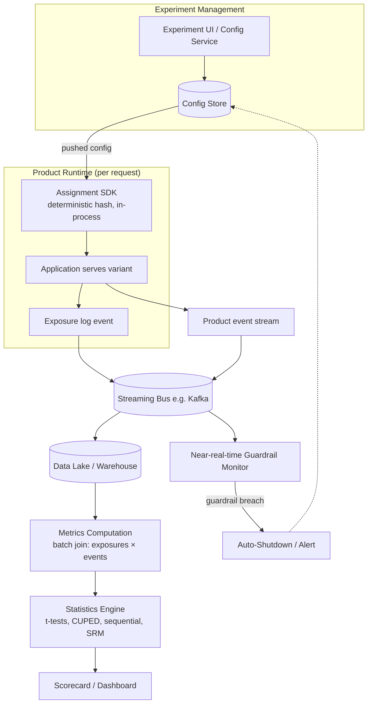

# Case Study: Experimentation (A/B Testing) Platform

> **Q26** · Tag: **[Core]** · Family: ML Infrastructure & Platform
>
> **Prompt:** *"Design the experimentation platform that decides whether a model ships."*
>
> **Teaches:** Online metric design, statistics, and guardrails — the *"how do you actually know it's better?"* muscle. This is the question that closes the loop on every other question in this series: everything else produces a model; **this** is the machine that decides whether that model is allowed to touch real users. You will get some version of this, or a follow-up that assumes you understand it, in almost every senior loop.

---

## 0. How to read this document

This is written to do three things at once:

1. **Teach you the domain** from first principles, so you understand experimentation deeply enough to *reason*, not recite.
2. **Give you an interview playbook** — a 30-minute structure, the exact phrases that signal seniority, and the traps that sink candidates.
3. **Serve as a reference** you (and the repo) can return to.

Read it once end-to-end. Then, before an interview, re-read Sections **10 (traps)**, **12 (cheat sheet)**, and **13 (interview delivery guide)**.

A note on mindset before we start. Most candidates treat "design an A/B platform" as a plumbing question — assignment service, logging, a dashboard. That earns a *mid-level* score. The senior signal is entirely about **trust**: the platform's only real product is *a number a VP will bet the company on*. Every design decision — how you randomize, how you compute variance, when you allow someone to peek — exists to protect the credibility of that number. If you keep asking yourself *"how could this number be lying to me?"*, you will naturally hit every senior talking point.

---

## The 60-second answer

If you had to compress the whole design into one breath:

> This is a **causal-inference system**, not a prediction system — an A/B test is a randomized controlled trial, and randomization is what converts "these two numbers differ" into "the treatment *caused* the difference," because offline metrics like AUC are only proxies that routinely disagree with online reality (the offline–online gap: proxy misalignment, distribution shift, system effects, novelty). The engineering core is **assignment**: a **deterministic hash** (`bucket = hash(salt + unit_id) % N`) gives sticky, uniform, no-database-lookup bucketing, and **layers/domains** with per-layer salts let thousands of experiments run concurrently — orthogonal across layers, mutually exclusive within one — while the randomization *unit* (user/session/request) and interference handling (cluster randomization for social contagion, switchback/geo designs for marketplace shared-supply) protect against SUTVA violations. On top of that sits a metric hierarchy — an **OEC** (short-term proxy for long-term value), diagnostic **driver metrics**, and **guardrails** that can block a launch even when the OEC wins — decided by a statistics toolkit: power/sample-size (∝ 1/MDE²), confidence intervals, **multiple-comparison correction**, **sequential testing** to allow legitimate early stopping without inflating false positives, and **CUPED** to cut variance using pre-experiment covariates. Before any result is trusted, a **Sample Ratio Mismatch (SRM)** check on the observed vs. configured traffic split has to pass, or the number is thrown out. Architecturally, an in-process assignment SDK (no network hop) serves variants, exposure and event logs stream into a warehouse where a metrics/statistics pipeline computes the scorecard, and a real-time guardrail monitor can auto-shutdown a bad experiment. This whole machine is what a model actually walks through to ship: offline eval → shadow/dark launch → canary → A/B test → staged ramp (1%→5%→25%→50%) → ship or rollback — turning "the offline metric improved" into a trustworthy, causally-grounded ship/no-ship decision.

Every clause of that paragraph is unpacked below.

---

## 1. The mental model (read this first)

### The drug-trial analogy

An A/B test **is a randomized controlled trial (RCT)**, the same instrument used to approve pharmaceuticals. Hold this analogy in your head for the entire interview:

| Drug trial | A/B test |
|---|---|
| Patients | Users (or sessions, or requests) |
| The new drug | The new model / feature ("treatment") |
| Placebo | The existing system ("control") |
| Random assignment to drug vs. placebo | Random bucketing of users into treatment vs. control |
| "Does the drug improve survival?" | "Does the model improve the north-star metric?" |
| Side effects that can halt a trial | Guardrail metrics that can halt a rollout |
| p-value / confidence interval | ...the exact same statistics |

Why does randomization matter so much? Because of the **fundamental problem of causal inference**: you can never observe the *same* user both with and without the new model at the same instant. You only ever see one reality. Randomization is the trick that gets around this — if you split a large population *randomly*, the two groups are statistically identical in every way (age, intent, device, mood, time zone, everything, even things you never measured) **except** the one thing you changed. So any difference in outcomes must be *caused* by that change. That is the whole game. Randomization is what converts "these two numbers are different" into "our change *caused* this difference."

### Why we can't just trust offline metrics (the offline–online gap)

This is the single most important idea to state out loud, and it ties directly back to **Framework Step 3** in your Part 0 skeleton.

> **Analogy:** Offline evaluation is a *practice exam*. The A/B test is the *real exam*. You can ace practice problems (higher AUC, better NDCG on a held-out set) and still bomb the real thing.

Why the gap exists — memorize these four reasons, they come up constantly:

1. **Proxy misalignment.** Your offline metric (say, AUC of a click model) is a *proxy* for what the business wants (revenue, retention, satisfaction). A model can improve the proxy while hurting the true goal — e.g., a recommender that boosts clicks by promoting clickbait, tanking long-term retention.
2. **Distribution shift & feedback loops.** Offline, you evaluate on *logged* data generated by the *old* model. Once deployed, the new model changes what users see, which changes their behavior, which changes the data — a loop your offline test never saw.
3. **System effects.** Latency, serving bugs, and integration issues don't show up in a notebook. A "better" model that adds 200ms of latency can *lose* net because users bounce.
4. **Novelty & primacy.** Users react to *change itself*. A new UI gets a curiosity bump (novelty) or a familiarity penalty (primacy) that fades — offline data can't capture this.

The experimentation platform exists precisely to measure ground truth in the only place it lives: **live traffic, causally isolated.**

---

## 2. Adapting the Part 0 framework to a *platform* question

Your Part 0 skeleton was written for "design a model that predicts X." This question is different — it's **infrastructure**, and it doesn't predict anything. A weak candidate tries to force the modeling skeleton onto it and flounders ("...uh, the label is... whether it ships?"). A strong candidate *explicitly re-frames*:

> *"This is a platform question rather than a modeling question, so I'll adapt the framework: I'll spend most of my time on requirements, the metric/statistics design, the randomization and assignment system, and the architecture — and I'll treat 'the model' step as 'the statistical engine.' The intellectual core here is causal inference and trust, not model architecture."*

Saying that sentence *is itself senior signal.* It shows you understand the framework is a tool, not a script. Here's the mapping we'll actually use:

| Part 0 step | For an experimentation platform |
|---|---|
| 1. Clarify & scope | Functional + non-functional requirements, scale, who uses it |
| 2. Frame the problem | It's **causal inference**, not prediction. Randomization is the mechanism. |
| 3. Metrics | **The heart of the question.** OEC, driver metrics, guardrails, the offline–online gap. |
| 4. Data | Exposure logs + event telemetry; the join that produces metrics |
| 5. "Features" | N/A → replaced by **randomization & assignment design** |
| 6. "Model" | Replaced by the **statistics engine** (hypothesis tests, power, CUPED, sequential) |
| 7. Training | N/A → replaced by **experiment lifecycle** (design → ramp → decision) |
| 8. Serving | Low-latency **assignment service** + metrics computation pipeline |
| 9. Monitoring | **Trust checks** (SRM, guardrails, auto-shutdown) + the org-level health of the platform |

---

## 3. Step 1 — Clarify & scope

Spend your first 3–5 minutes here. Never skip to architecture.

### Functional requirements — what the platform must *do*

- **Define/configure an experiment:** variants, traffic allocation, targeting (e.g. only iOS users in the US), start/end, which metrics to track.
- **Assign** each unit to a variant *consistently and randomly*.
- **Serve** that assignment to product code at very low latency.
- **Log** exposures (who saw what) and **collect** all downstream events.
- **Compute** metrics per variant.
- **Analyze:** deltas, statistical significance, confidence intervals, guardrail status.
- **Present** results in a scorecard, with a clear ship/no-ship read.
- **Protect users:** ramp-up, guardrail monitoring, automated shutdown.
- **Support many concurrent experiments** — possibly thousands — without them corrupting each other.

### Non-functional requirements — the properties that matter

- **Trustworthiness (the #1 NFR).** Say this explicitly: *"The platform's core deliverable is a trustworthy number. If teams stop believing the scorecard, the platform is worthless regardless of uptime."* Everything else serves this.
- **Low-latency assignment.** Assignment sits on the critical request path of the product. Budget: single-digit milliseconds, ideally **zero network calls** (compute in-process).
- **Consistency / stickiness.** A given user must get the *same* variant every time for the life of the experiment — otherwise their experience flickers and you can't attribute their behavior.
- **Scale & throughput** (see below).
- **Isolation between experiments** so running 1,000 tests at once doesn't turn results into noise.
- **Self-service.** PMs, data scientists, and engineers should launch tests without a platform engineer in the loop.

### Scale — put numbers on it (interviewers love this)

Work an example out loud so your design choices have a "why":

- Say **100M DAU**, and each user triggers ~**20 experiment checks** per session (feed, ranking, UI, pricing...).
- → **~2 billion assignment evaluations/day** → ~**23K QPS average**, and peaks can be **5–10×** that.
- **Conclusion you should reach:** at this volume, a network round-trip per assignment is insane. **Assignment must be a local, deterministic hash computation inside an SDK** — config is pushed to the client/service, and bucketing is pure CPU. This one realization drives the whole assignment architecture. State it proudly.
- Event volume: every product interaction is logged → **hundreds of billions of events/day** flowing into a streaming bus and data lake. This is a big-data pipeline, not a database query.

---

## 4. Step 2 — Frame it as causal inference

Say the quiet part out loud: **this is not a prediction problem; it's a causal-inference problem.** The "learning paradigm" is hypothesis testing under randomization.

- **Unit of analysis:** what we randomize (user / session / request / device / geo / cluster). Choosing this is a real design decision (Section 6).
- **Treatment:** the new model or feature.
- **Control:** the current production system.
- **Estimand (the thing we're estimating):** the **Average Treatment Effect (ATE)** — the difference in the north-star metric caused by the treatment.
- **The assumption we're leaning on:** **SUTVA** (Stable Unit Treatment Value Assumption) — one unit's treatment doesn't affect another unit's outcome. When SUTVA breaks (network effects, marketplaces), naive A/B testing gives *biased* answers. Flag this early; you'll return to it in Section 6. Interviewers *love* candidates who name SUTVA before being pushed.

---

## 5. Step 3 — Metrics: the heart of the question

If you nail one section, nail this one. "How do you know it's better?" is a metrics question first and a statistics question second.

### The metric hierarchy

Design metrics in three tiers and **name them explicitly**:

1. **The OEC (Overall Evaluation Criterion) / north-star.** The one metric (or a small, principled combination) the decision hinges on. The art here is that it must be **(a) measurable within the experiment's short window** yet **(b) predictive of long-term value.**
   - *Analogy:* You want to measure "customer happiness" but you only have two weeks. So you find a **short-term proxy that correlates with the long-term goal** — e.g., not "did they subscribe for 3 years" but "sessions per user in week one," which past data shows predicts retention. Designing the OEC is a *research project in its own right*; senior candidates acknowledge this rather than blurting "revenue."
2. **Driver / local metrics.** More sensitive, more diagnostic metrics that *explain* the OEC — click-through rate, dwell time, add-to-cart. They move faster and help you understand *why* the OEC moved.
3. **Guardrail metrics.** The "do no harm" tripwires. **A change can improve the OEC and still be blocked by a guardrail.** Classic guardrails: **latency (p95/p99), crash/error rate, revenue, page-load time, unsubscribe/complaint rate, support tickets.**
   - *Analogy:* Guardrails are **circuit breakers**. Even if the lights are brighter (OEC up), if the wiring overheats (latency up, crashes up), the breaker trips.

### Two properties of a good metric

- **Sensitivity (a.k.a. statistical power to move):** does it visibly change when there's a real effect? Revenue is often *insensitive* (huge variance, most users spend nothing) — so you may steer by an engagement OEC and keep revenue as a guardrail.
- **Directionality / alignment:** improving it must genuinely mean "better." Beware metrics that are trivially gameable (raw clicks → clickbait).

### Ratio metrics — a senior trap to mention

Many metrics are **ratios** where the denominator is itself random — e.g., **click-through rate = clicks / page-views**, but you randomized by *user*, and users have different numbers of page-views. You **cannot** treat this like a simple average; the naive variance is wrong. The fix is the **delta method** (or bootstrapping) to get the correct variance of a ratio when the randomization unit and the metric's denominator differ. You don't need to derive it — just *knowing this problem exists and naming the delta method* is strong senior signal.

---

## 6. Randomization & assignment — the engineering core

This is where the "**randomization/assignment and avoiding interference**" bullet from your prompt lives. Two sub-problems: *how* to assign, and *what* to assign.

### 6a. Deterministic hashing (how the assignment actually works)

You need assignment that is **random across users** but **deterministic for a given user** (sticky), with **no database lookup**. The elegant solution:

```
bucket   = hash(experiment_salt + unit_id) % 10000      # e.g. 10,000 buckets
variant  = variant_for_bucket(bucket, allocation)        # ranges of buckets → variants
```

- **Deterministic:** same `unit_id` + same experiment → same bucket → same variant, forever. No storage needed; it's recomputed on the fly. This gives **stickiness for free**.
- **Uniform:** a good hash (e.g. MurmurHash) spreads users evenly, so bucket ranges = traffic percentages. Buckets `0–499` → control, `500–999` → treatment gives you a 5%/5% split of a 10% ramp.
- **Independent across experiments:** the **per-experiment `salt`** ensures the hash re-shuffles for each experiment, so a user who's in "treatment" for experiment A is *not* correlated with their bucket for experiment B. Without the salt, the same users would always land together and your experiments would be confounded.

> **Why not just `random()` per request?** Because it's not sticky — the user would flip between variants on every page load, ruining both their experience and your ability to attribute their behavior to a variant. Determinism is the point.

### 6b. Overlapping experiments — running thousands at once (layers/domains)

Naive math kills you: if you carve traffic into non-overlapping slices, 100 experiments each needing 10% of traffic is impossible. The industry solution (pioneered publicly by Google's "overlapping experiment infrastructure") is **layers**:

- Partition experiment space into **layers** (a.k.a. domains). Each layer independently randomizes *all* traffic using its own salt.
- Experiments **in the same layer are mutually exclusive** — used when two changes touch the *same* surface and would interact (e.g., two competing ranking changes).
- Experiments **in different layers are orthogonal** — each sees the *full* traffic, independently randomized, so a user can be in a UI-layer experiment *and* a ranking-layer experiment *and* a pricing-layer experiment simultaneously.

> **Analogy:** Think of layers as **transparent sheets stacked on an overhead projector.** Each sheet colors the whole population independently. Because the salts differ, the colorings are uncorrelated — so effects don't leak between sheets. Only when two changes *fight over the same pixel* do you force them onto the same sheet (mutual exclusion).

This is the mechanism that lets a big company run *thousands* of concurrent experiments. Mentioning layers unprompted is a strong staff-level flourish.

### 6c. Choosing the randomization unit (and interference / SUTVA)

**What** you randomize is a genuine design decision with real tradeoffs:

- **User-level** — the default. Consistent experience; correct for most personalization/feed/UI changes.
- **Session-level** — more statistical power (more units), but the *same user* can get different variants across sessions → bad for anything a user would notice as "changing."
- **Request-level** — maximum power, only valid for changes a user can't perceive across requests (e.g., a backend latency optimization).
- **Device / cookie-level** — when you can't identify users (logged-out).

> **The tradeoff to say out loud:** coarser units (user) → *consistent experience but less power*; finer units (request) → *more power but risk of inconsistent experience and contaminated measurement*. Match the grain to the change.

**Now the hard part — interference (SUTVA violations).** This is the bullet the interviewer will push on. Naive A/B testing assumes your treatment on Alice doesn't affect Bob's outcome. Two big cases where that's false:

1. **Network effects (social products).** You give Alice a new "share" button (treatment). She shares more, which affects Bob — who's in *control*. Now control is *contaminated* by treatment, and you **underestimate** the true effect (control got "infected" with the benefit).
   - **Fix: cluster (graph) randomization.** Randomize *communities* of tightly connected users together, so most interactions happen *within* a variant, not across. You trade statistical power (fewer effective units) for validity.

2. **Marketplace two-sidedness (Uber, Airbnb, DoorDash, eBay).** Treatment and control **share a finite pool of supply.** If treated riders book more aggressively, they consume drivers that control riders would have used — so control looks *worse* not because it's worse, but because it was *starved*. This is **cannibalization**, and it makes the naive A/B result meaningless.
   - **Fixes:**
     - **Geo / region experiments:** randomize whole *cities* — one city all-treatment, another all-control. Supply pools are (mostly) separated by geography. Costs power (few "units" = few cities) and cities differ, so you often pair with matching or synthetic controls.
     - **Switchback experiments:** flip the *entire market* between treatment and control over alternating **time windows** (e.g., 30-minute blocks). The whole city is treatment 9:00–9:30, control 9:30–10:00, etc. Randomizing over *time slices* rather than users sidesteps the shared-supply problem. Standard for pricing/dispatch in ride-hailing.
     - **Budget-split / two-sided designs** for finer cases.

> **The senior sentence:** *"Because this is a two-sided marketplace, a user-randomized A/B test violates SUTVA — treatment and control compete for the same supply, so I'd move to switchback or geo experiments and accept the loss of statistical power as the price of an unbiased estimate."* Deliver that and you've cleared the interference bar.

---

## 7. The statistics you must be able to speak to

You don't need to derive theorems. You need to *fluently reason* about five things: significance, power/sample size, confidence intervals, multiple comparisons, and peeking. Plus two "senior" extras: variance reduction and health checks.

### 7a. Hypothesis testing, in plain language

- **Null hypothesis (H₀):** "there's no difference; treatment = control."
- **Alternative (H₁):** "there's a difference."
- We compute a test statistic (e.g. a two-sample **t-test**/z-test on the metric) and a **p-value** = *"if H₀ were true, how likely is a result at least this extreme, by chance alone?"*
- If p < **α** (significance level, usually **0.05**), we **reject H₀** and call it significant.

Two ways to be wrong — know them cold:

|  | Reality: no effect | Reality: real effect |
|---|---|---|
| **We say "significant"** | ❌ **Type I error** (false positive), rate = α | ✅ Correct |
| **We say "not significant"** | ✅ Correct | ❌ **Type II error** (false negative), rate = β |

- *Analogy:* α is a **smoke detector's sensitivity.** Crank it up → more false alarms (Type I). Turn it down → you miss real fires (Type II). You can't cut both to zero; you trade them off, and the way you "buy down" both at once is **more data.**

### 7b. Statistical power & sample size (the "will this test even work?" muscle)

- **Power = 1 − β** = the probability of detecting a real effect *if one exists*. Industry default target: **80%.**
- *Analogy:* Power is the **resolution of your microscope.** A low-power test literally cannot see a small-but-real effect — you'll get "not significant" and wrongly conclude "no effect," when the truth is "your instrument was too weak."
- **Minimum Detectable Effect (MDE):** the smallest effect you care to catch. Smaller MDE → much bigger sample.
- **The rule-of-16** (great to show on a whiteboard for intuition): for a proportion metric, sample size per variant is roughly
  ```
  n ≈ 16 · p(1 − p) / (MDE)²
  ```
  where the 16 ≈ (z_{α/2} + z_β)² · 2 for α = 0.05, 80% power. **The key intuition to voice:** sample size scales with **1/MDE²** — to detect an effect *half* as small, you need *four times* the users. This is why "we can't detect a 0.1% lift" is often a *power* problem, not a "no effect" result.
- **Runtime** follows directly: `days = required_n / (daily_eligible_traffic × allocation)`. And you should run **at least one full week** regardless, to average over day-of-week seasonality.

### 7c. Confidence intervals — report these, not just p-values

A p-value is a yes/no; a **confidence interval** tells you the *magnitude and uncertainty*: "the lift is +2.1%, 95% CI [+0.5%, +3.7%]." Senior candidates emphasize CIs because a barely-significant p-value with a CI spanning [+0.1%, +8%] is very different from a tight [+1.9%, +2.3%], even though both are "p < 0.05." **A result can be *statistically* significant but not *practically* significant** — always compare the effect size to your MDE / cost threshold.

### 7d. Multiple comparisons — the false-positive multiplier

If you test **20 metrics** at α = 0.05 and there's truly no effect anywhere, you *expect* one "significant" result *by pure chance* (0.05 × 20 = 1). Test 20 variants, same problem. This is the **multiple-comparisons problem**, and it's a top way experiment programs fool themselves.

- **Fixes:** **Bonferroni correction** (divide α by the number of tests — simple, conservative) or, better at scale, **controlling the False Discovery Rate (Benjamini–Hochberg)**. In practice, teams designate a *small* set of pre-registered primary metrics for the decision and treat the rest as exploratory.
- *Analogy:* Buy 20 lottery tickets and one probably wins something — that doesn't make you a genius picker. More "chances to be surprised" = more accidental surprises.

### 7e. The peeking problem & sequential testing (a favorite curveball)

The naive fixed-horizon t-test is **only valid if you decide the sample size in advance and look once, at the end.** But everyone *wants* to peek daily and ship the moment it's "significant." **Peeking repeatedly and stopping at the first significant moment inflates your true false-positive rate massively** (from 5% toward 20–30%+).

- *Analogy:* Flip a fair coin and track the running % heads. By chance it *will* wander above 55% at *some* point. If you're allowed to "call it" the instant it does, you'll "prove" the coin is biased almost every time. Peeking is exactly that dishonesty, dressed up as diligence.
- **Fixes — know at least one:**
  - **Fixed-horizon discipline:** commit to n up front, look once. Simple, but rigid.
  - **Sequential testing:** methods *designed* to be looked at continuously while keeping the error rate valid — **group-sequential boundaries (O'Brien–Fleming)**, **always-valid p-values / mSPRT (Optimizely's approach), or confidence sequences.** These let you stop early *legitimately* — either for a win or for harm.
- **Important asymmetry to state:** you may **always stop early for *harm*** (a guardrail breach is an operational safety decision, not a statistical inference). You may **only stop early for a *win*** if you're using a sequential method that accounts for it.

### 7f. Variance reduction — CUPED (the "make tests 2× faster" move)

Since sample size scales with variance, **cutting variance is equivalent to getting more users for free.** The standard technique is **CUPED (Controlled-experiment Using Pre-Experiment Data):**

- Use each user's **pre-experiment** behavior (a covariate `X` correlated with the metric `Y`) to explain away variance that has nothing to do with the treatment.
  ```
  Y_adjusted = Y − θ · (X − mean(X)),   θ = Cov(X, Y) / Var(X)
  ```
- Variance drops by a factor of **(1 − ρ²)**, where ρ is the correlation between pre- and in-experiment behavior. If a metric is highly autocorrelated (ρ = 0.7), you can cut required sample size by ~**50%**.
- *Analogy:* **Golf handicapping.** Instead of asking "who shot the lower score," you ask "who beat their *own expected* score" — removing the pre-existing skill differences so you measure only the effect of the *new club*. CUPED removes pre-existing user differences so you measure only the effect of the *new model*.

Mentioning CUPED unprompted is one of the cleanest ways to signal "I've actually run experiments at scale."

### 7g. Trust checks — Sample Ratio Mismatch (SRM)

Before you believe *any* result, check that traffic actually split the way you configured. If you set 50/50 but observe 50.2/49.8 across 10M users, that tiny imbalance is *wildly* improbable by chance — it means **something is broken** (a bug that drops treatment users, a logging asymmetry, a redirect that fails for one arm). This is **Sample Ratio Mismatch**, detected with a simple **chi-square test** on observed vs. expected counts.

> **The rule:** *if you have SRM, throw the results out.* The number is corrupted; do not ship on it. Naming SRM as an automatic pre-flight check is a hallmark of someone who's been burned in production — exactly the senior signal you want.

---

## 8. Step 8 — System architecture

Now assemble it. Present the data flow, then the components. Sketch this diagram:



### Component walk-through

1. **Experiment Management Service + Config Store.** The self-service UI/API where an experiment is defined (variants, allocation, targeting, layer, metrics, guardrails). Stores config and **pushes it to all SDKs** (so assignment needs no per-request DB call).
2. **Assignment SDK (in-process).** Does the deterministic hash from Section 6a. **No network hop** — this is why it's an SDK/library, not a service. Returns the variant in microseconds.
3. **Exposure logging.** Critical subtlety: **log an "exposure" only when the user is *actually* exposed to the variant's code path — and analyze on exposures, not assignments.**
   - *Why:* Suppose an experiment lives on the checkout page. If you analyze *everyone assigned* (including users who never reached checkout), you dilute the effect with millions of users who couldn't possibly be affected — killing your power. Analyze only those genuinely exposed. **But** be careful this doesn't itself introduce bias (a.k.a. "trigger" analysis must be symmetric across arms). Raising this point is strong signal.
4. **Streaming bus + data lake.** Exposures and all product events flow through Kafka-style streaming into a warehouse/lake. This is the raw material for metrics.
5. **Metrics computation.** Big-data batch jobs (Spark/SQL) **join exposures with downstream events** per user per experiment and roll up per-variant metric aggregates (means, variances, and pre-period covariates for CUPED).
6. **Statistics engine.** Consumes the aggregates and computes deltas, variances (delta method for ratios), p-values, confidence intervals, applies **CUPED**, **multiple-comparison** corrections, **sequential** boundaries, and runs the **SRM** check.
7. **Scorecard / dashboard.** Presents, per metric: the delta, CI, significance, and guardrail status — plus a clear recommendation. The best scorecards make the *right* decision the *easy* decision (green/red, "ship / don't ship / inconclusive").
8. **Near-real-time guardrail monitor + auto-shutdown.** A separate low-latency path watches guardrails (latency, errors, crash, revenue) on streaming data and can **automatically halt** a bad experiment within minutes — before the slow batch metrics pipeline even runs. This is your safety system.

---

## 9. The experiment lifecycle — and how an *ML model* actually ships

Tie it back to the prompt: *"...decides whether a model ships."* Walk the full progression of de-risking, from cheapest/safest to most expensive:

1. **Offline evaluation.** Held-out metrics (AUC, NDCG, etc.). Cheap, fast, but only a *proxy* (Section 1). Gate 0.
2. **Shadow / dark launch.** Deploy the new model to **score live traffic but not act** — its outputs are logged and compared, never shown to users. Catches serving bugs, latency, and gross prediction discrepancies with **zero user risk.**
3. **Canary.** Route a tiny slice (e.g., 1%) of *real* traffic to the new model, watching guardrails (latency, errors, crashes) — an operational safety check, not yet a business read.
4. **A/B test.** The real thing: a properly powered, randomized experiment measuring the **OEC and guardrails**. This is where "is it *actually better for the business*" gets answered.
5. **Ramp-up.** Increase treatment allocation in stages — **1% → 5% → 25% → 50%** — re-checking guardrails at each step. Limits **blast radius**: a catastrophic bug hits 1% of users, not 100%.
6. **Ship / rollback.** If the OEC improves significantly, no guardrail is breached, and there's no SRM → ship to 100%. Otherwise roll back. Keep the losing arm's config so you can **instantly revert** if a delayed problem surfaces.

> This staircase (offline → shadow → canary → A/B → ramp) is worth memorizing as a unit — it's a reusable answer to *any* "how does a model reach production safely?" follow-up, and it connects this question to [Q25](./25-model-serving-inference-system.md) (serving) and Q28 (monitoring, coming soon).

---

## 10. Common failure modes (name these before the interviewer does)

These are the "gotchas" that separate a 3 from a 4. Even mentioning a few *proactively* is disproportionately valuable.

- **Peeking / early stopping without sequential stats** → inflated false positives (Section 7e).
- **Sample Ratio Mismatch ignored** → shipping on corrupted data (Section 7g).
- **Multiple comparisons uncorrected** → "we found a winner!" that's noise (Section 7d).
- **Interference / SUTVA ignored** in social or marketplace settings → biased effects (Section 6c).
- **Novelty & primacy effects** → a change looks great (or bad) for a week, then reverts. *Fix:* run long enough; analyze new vs. tenured users separately.
- **Simpson's paradox** → an effect that's positive overall flips sign within every segment (or vice-versa), usually from an imbalanced mix. *Fix:* pre-register segments; watch for mix shifts.
- **Analyzing on assignment instead of exposure** → diluted, underpowered results (Section 8).
- **Statistically significant but practically trivial** → a +0.01% "win" that's real but not worth the complexity/risk. Always compare to the MDE and to engineering cost.
- **Twyman's Law** (great to name): *"any figure that looks interesting or unusual is probably wrong."* A +40% lift is far more likely a logging bug than a miracle — investigate wins as hard as losses.
- **The metric isn't the goal** (Goodhart's Law): once a metric becomes a target, teams optimize it in degenerate ways. Guardrails and a well-chosen OEC are your defense.

---

## 11. Curveball follow-ups & how to handle them

Interviewers pressure-test with twists. Rapid-fire answers:

- **"It's a two-sided marketplace (Uber). Now what?"** → SUTVA breaks via shared supply; move to **switchback or geo experiments**, accept lower power (Section 6c).
- **"You only have 500 users total."** → Fixed-horizon A/B may be **underpowered** for any realistic MDE. Options: pick a *more sensitive* metric, apply **CUPED**, use a **within-subject / interleaving** design (common in search ranking — show blended results and see which side gets the clicks; far more powerful per user), extend runtime, or accept you can only detect large effects and *say so honestly*.
- **"Leadership wants a result in 2 days, not 2 weeks."** → Explain the power/runtime math (Section 7b): a shorter test can only detect a *larger* MDE. Offer **variance reduction (CUPED)**, a more sensitive OEC, or a **sequential** design that *can* stop early legitimately — but push back on peeking-driven false confidence.
- **"The offline metric improved 5% but the A/B was flat. Why?"** → The offline–online gap (Section 1): proxy misalignment, distribution shift/feedback loops, latency/serving effects, or novelty. This is a chance to shine — it's literally the theme of the whole question.
- **"How do you run 1,000 experiments at once?"** → **Layers/domains** (Section 6b): orthogonal randomization across layers, mutual exclusion within a layer.
- **"Two experiments seem to interact."** → Put them in the **same layer (mutually exclusive)**, or run a dedicated **interaction analysis** (a 2×2 test) to measure the cross-effect deliberately.
- **"Can we use bandits instead of A/B?"** → Yes for *some* cases (see the comparison below), no for others; be precise about the tradeoff.

### A/B test vs. multi-armed bandit (be able to contrast)

- **A/B test:** fixed allocation, **explore fully, then decide.** Gives a clean, unbiased causal readout and works for long-term/delayed metrics. Cost: sends traffic to the losing arm the whole time (**regret**).
- **Bandit:** *adaptively* shifts traffic toward the winning arm as evidence accumulates → **minimizes regret.** Great for **short-lived decisions with fast feedback** (headline/thumbnail selection, promo creatives). Cost: biased for clean inference, poor for **delayed or long-term** metrics (bandits chase immediate reward), and harder to reason about.
- **The senior one-liner:** *"Use a bandit when the cost of exploration is high and feedback is immediate and short-horizon; use a fixed A/B when you need a trustworthy causal estimate of a long-term metric — which is exactly the 'should this model ship' decision."*

---

## Flashcards

Cover the right column; recall it from the left.

| Cue | What you must be able to say |
|---|---|
| Why randomize? | Randomization is what converts "these two numbers differ" into "the treatment *caused* the difference" — it's the RCT logic (drug-trial analogy: patients=users, drug=treatment, placebo=control). |
| Offline-online gap | Offline metrics are only a proxy for the true goal; the gap comes from proxy misalignment, distribution shift/feedback loops, system effects (latency, bugs), and novelty/primacy — measure ground truth on live, causally isolated traffic instead. |
| SUTVA / interference | One unit's treatment must not affect another unit's outcome; breaks under network effects (social contagion) and marketplace shared supply — naive A/B testing then gives biased answers. |
| Metric hierarchy | **OEC** (short-term, measurable proxy for long-term value) → **driver/local metrics** (diagnostic, explain the OEC) → **guardrails** (do-no-harm circuit breakers). A win on the OEC can still be blocked by a guardrail. |
| Ratio metrics — the trap | A metric like CTR = clicks/page-views has a random denominator when you randomized by user; naive variance is wrong. Fix: the delta method (or bootstrapping). |
| Deterministic hashing | `bucket = hash(salt + unit_id) % N` → same unit always lands in the same bucket (sticky), no DB lookup needed; the per-experiment salt keeps different experiments' assignments uncorrelated. |
| Overlapping layers / domains | Partition experiment space into layers, each independently randomizing all traffic; experiments in the *same* layer are mutually exclusive, experiments in *different* layers are orthogonal — lets thousands of experiments run concurrently. |
| Statistical power & MDE | Power = 1 − β (industry target 80%); sample size scales as **1/MDE²** (rule-of-16) — to detect an effect half as small you need 4× the users. |
| Confidence intervals vs. p-values | A p-value is yes/no; a CI shows magnitude and uncertainty. A result can be statistically significant but practically trivial — always compare the effect size to the MDE. |
| Multiple comparisons | Testing many metrics or variants inflates the false-positive rate by pure chance (20 tests at α=0.05 → ~1 false "win" expected). Fix: Bonferroni correction or Benjamini–Hochberg FDR control; pre-register a small set of primary metrics. |
| Peeking & sequential testing | Repeatedly peeking and stopping at the first significant result inflates the true false-positive rate from 5% toward 20–30%+. Fix: fixed-horizon discipline, or sequential methods (group-sequential/O'Brien–Fleming, always-valid p-values/mSPRT) built to be monitored continuously. You may always stop early for *harm*; only stop early for a *win* with a sequential method. |
| CUPED | Use each unit's pre-experiment behavior as a covariate to strip out variance unrelated to the treatment; variance drops by (1 − ρ²) — can cut required sample size ~50% for a highly autocorrelated metric. |
| Sample Ratio Mismatch (SRM) | Observed traffic split deviates from the configured split far more than chance allows (chi-square test) → something is broken (dropped events, logging bug). Rule: if you have SRM, throw the results out. |
| Twyman's Law & Goodhart's Law | Twyman's: "any figure that looks interesting or unusual is probably wrong" — investigate surprising wins as hard as losses. Goodhart's: once a metric becomes a target, it gets gamed — guardrails and a well-chosen OEC are the defense. |
| Simpson's paradox | An effect that's positive in aggregate can flip sign within every segment (or vice versa), usually from an imbalanced mix across groups. Fix: pre-register segments; watch for mix shifts. |
| Novelty & primacy effects | Users react to *change itself* — a curiosity bump (novelty) or familiarity penalty (primacy) that fades over time. Fix: run long enough; analyze new vs. tenured users separately. |
| Network effects & switchback designs | Social products: one user's treatment leaks into another's outcome → cluster/graph randomization. Marketplaces: treatment and control compete for shared supply (cannibalization) → geo experiments or switchback designs (flip the whole market between arms over alternating time windows). |
| A/B test vs. multi-armed bandit | A/B: fixed allocation, explores fully then decides — clean causal estimate, works for delayed/long-term metrics, but pays regret the whole time. Bandit: adaptively shifts traffic to the winner to minimize regret — great for short-lived, fast-feedback decisions, but biased for clean inference and poor for delayed/long-term metrics. |

---

## 12. Cheat sheet (the pre-interview 90-second scan)

**Frame:** It's a **causal-inference / RCT** problem; randomization is what turns correlation into causation. The real product is a **trustworthy number**.

**Requirements:** self-service config; sticky low-latency assignment; exposure + event logging; metrics + stats; scorecard; guardrails + auto-shutdown; run thousands concurrently. Top NFR = **trust**.

**Scale insight:** billions of assignments/day → assignment must be an **in-process deterministic hash**, no network call.

**Metrics:** **OEC** (short-term proxy for long-term value) → **driver** metrics → **guardrails** (do-no-harm circuit breakers). Watch **ratio-metric variance (delta method)**.

**Assignment:** `hash(salt + unit_id) % N` → deterministic, sticky, uniform, independent across experiments. **Layers** for running thousands orthogonally. Choose the **randomization unit** by matching grain to the change.

**Interference (SUTVA):** social → **cluster randomization**; marketplace → **switchback / geo experiments**. Name SUTVA.

**Statistics:** H₀/H₁, p-value, α; **Type I/II**, **power = 1−β** (target 80%); **sample size ∝ 1/MDE²** (rule-of-16); report **confidence intervals**; correct for **multiple comparisons**; don't **peek** without **sequential** methods; **CUPED** to cut variance ~50%; **SRM check** before trusting anything.

**Lifecycle:** offline → **shadow** → **canary** → **A/B** → **ramp (1→5→25→50%)** → ship/rollback. Stop early for **harm** always; for **wins** only with sequential stats.

**Traps to pre-empt:** peeking, SRM, multiple comparisons, interference, novelty, Simpson's paradox, assignment-vs-exposure dilution, significant-but-trivial, Twyman's/Goodhart's law.

---

## 13. Interview delivery guide — a short mock (how the first 8 minutes should *sound*)

> **Interviewer:** "Design the experimentation platform that decides whether a model ships."
>
> **You:** "Before I design, let me name what this really is: it's a causal-inference system. The whole point is to measure the *causal* effect of shipping a new model on our business metrics, using randomization — because offline metrics like AUC are only proxies and routinely disagree with online reality. And the platform's actual deliverable isn't a dashboard, it's a *trustworthy number* teams will bet the roadmap on, so almost every design choice I make is in service of protecting that number's credibility.
>
> This is a platform question, not a modeling one, so I'll adapt the usual framework: requirements and scale first, then the metric design, then randomization and assignment, then the statistics engine, then the architecture, and I'll close on how a model actually progresses to ship and how we keep the whole thing trustworthy.
>
> Let me start with requirements. Functionally the platform must let a team define an experiment, assign users to variants consistently and randomly, serve that assignment on the request path, log exposures and events, compute per-variant metrics with proper statistics, present a clear scorecard, and protect users with ramp-up and guardrails — all while supporting maybe thousands of concurrent experiments. The top non-functional requirement is trust; after that, assignment latency and consistency.
>
> On scale — with, say, 100M DAU and ~20 experiment checks each, that's ~2B assignments a day. That immediately tells me assignment can't be a network call; it has to be an in-process deterministic hash with config pushed to the clients. Let me build from there..."
>
> *(...continue into metrics → assignment → interference → stats → architecture, per Sections 5–8.)*

That opening does four senior things in 90 seconds: **reframes to causal inference, states the trust thesis, adapts the framework explicitly, and derives an architecture constraint from scale.** Land that, and you've set a senior tone for the whole loop.

---

## 14. How to practice this one (per the Blind-28 plan)

1. **Timed 30-min whiteboard pass**, out loud, using the adapted framework in Section 2. If you stall, note *which* of the nine steps — that's your gap, not the topic.
2. **Drill the statistics until fluent.** You should be able to explain power, sample size ∝ 1/MDE², peeking, CUPED, and SRM *conversationally* — not read from notes. These are the highest-leverage senior signals in the whole question.
3. **Rehearse the two curveballs most likely to come:** *"now it's a marketplace"* (→ switchback/geo) and *"offline said +5%, online was flat"* (→ offline–online gap). Have crisp, confident answers.
4. **Write your own personal offline–online-gap story** (see Section 1) and keep it in your back pocket.

---

## Glossary

- **RCT (Randomized Controlled Trial).** The clinical-trial design an A/B test borrows wholesale: units are randomly split into treatment and control so any outcome difference can be attributed to the treatment.
- **SUTVA (Stable Unit Treatment Value Assumption).** The assumption that one unit's treatment assignment doesn't affect another unit's outcome. Breaks in social networks (contagion) and marketplaces (shared supply) — the trigger for cluster, geo, or switchback designs.
- **OEC (Overall Evaluation Criterion).** The single metric (or small composite) the ship/no-ship decision hinges on — a short-term, measurable proxy for long-term value.
- **ATE (Average Treatment Effect).** The causal quantity an experiment estimates: the average difference in outcome caused by the treatment versus control.
- **Guardrail metric.** A "do no harm" metric (latency, crash rate, revenue) that can block a launch even if the OEC improves.
- **MDE (Minimum Detectable Effect).** The smallest effect size an experiment is designed to reliably detect; smaller MDE requires quadratically more sample.
- **Statistical power (1 − β).** The probability of detecting a real effect when one exists; the industry-standard target is 80%.
- **Type I / Type II error.** Type I: declaring a difference when there isn't one (false positive, rate α). Type II: missing a real difference (false negative, rate β).
- **Confidence interval (CI).** A range of plausible values for the true effect size, reported alongside (or instead of) a bare p-value.
- **Multiple comparisons problem.** Testing many metrics or variants inflates the chance of a false "win" by pure chance; corrected via Bonferroni correction (divide α by the number of tests) or by controlling the **False Discovery Rate** (Benjamini–Hochberg procedure).
- **Delta method.** A statistical technique for correctly computing the variance of a ratio metric (e.g., clicks/page-views) when the randomization unit differs from the metric's denominator.
- **Peeking.** Repeatedly checking a test's significance and stopping the moment it looks significant; inflates the true false-positive rate far above the nominal α.
- **Sequential testing.** Statistical methods designed to be monitored continuously without inflating error rates, including **group-sequential boundaries (O'Brien–Fleming)** and **always-valid p-values / mSPRT** (mixture Sequential Probability Ratio Test).
- **CUPED (Controlled-experiment Using Pre-Experiment Data).** A variance-reduction technique that uses a user's pre-experiment behavior as a covariate to strip out variance unrelated to the treatment, effectively shrinking required sample size.
- **SRM (Sample Ratio Mismatch).** A statistically significant deviation between observed and configured traffic-split ratios, signaling a broken experiment (logging bug, dropped events); any result under SRM should be discarded.
- **Twyman's Law.** "Any figure that looks interesting or unusual is probably wrong" — a reminder to investigate surprising wins as hard as losses.
- **Goodhart's Law.** "When a measure becomes a target, it ceases to be a good measure" — the reason guardrails and careful OEC design exist, to prevent metric-gaming.
- **Simpson's paradox.** A trend that appears in aggregate data reverses (or disappears) when the data is split into subgroups, usually due to an imbalanced mix across groups.
- **Novelty / primacy effect.** A temporary bump (novelty) or dip (primacy) in a metric caused by users reacting to change itself, rather than to the change's true value; fades with time.
- **Network effects (interference).** When one unit's treatment spills over to affect another unit's outcome (e.g., a user's new "share" feature affects their friends), violating SUTVA.
- **Switchback experiment.** A design that randomizes an entire market between treatment and control across alternating time windows, used to sidestep shared-supply contamination in marketplaces.
- **Layers / domains.** A traffic-partitioning scheme that lets many experiments run concurrently: independently randomized, orthogonal layers, with mutual exclusion enforced only within a layer.
- **Shadow / dark launch.** Running a new model on live traffic to log its outputs without ever showing them to users — a zero-risk way to catch serving bugs before a canary.
- **Canary.** Routing a small slice of real traffic to a new system to check operational health (latency, errors) before running a full A/B test.

---

## Further reading & tools

**Papers & books**
- Deng, Xu, Kohavi & Walker — [Improving the Sensitivity of Online Controlled Experiments by Utilizing Pre-Experiment Data](https://scholar.google.com/scholar?q=Improving%20the%20Sensitivity%20of%20Online%20Controlled%20Experiments%20by%20Utilizing%20Pre-Experiment%20Data) (the CUPED paper)
- Johari, Koomen, Pekelis & Walsh — [Peeking at A/B Tests: Why It Matters, and What to Do About It](https://scholar.google.com/scholar?q=Peeking%20at%20A/B%20Tests%3A%20Why%20It%20Matters%2C%20and%20What%20to%20Do%20About%20It) (always-valid p-values / mSPRT)
- O'Brien & Fleming — [A Multiple Testing Procedure for Clinical Trials](https://scholar.google.com/scholar?q=A%20Multiple%20Testing%20Procedure%20for%20Clinical%20Trials) (group-sequential boundaries)
- Benjamini & Hochberg — [Controlling the False Discovery Rate: A Practical and Powerful Approach to Multiple Testing](https://scholar.google.com/scholar?q=Controlling%20the%20False%20Discovery%20Rate%3A%20A%20Practical%20and%20Powerful%20Approach%20to%20Multiple%20Testing)
- Dmitriev, Wu, Vaz, Fabijan & Kohavi — [A Dirty Dozen: Twelve Common Metric Interpretation Pitfalls in Online Controlled Experiments](https://scholar.google.com/scholar?q=A%20Dirty%20Dozen%3A%20Twelve%20Common%20Metric%20Interpretation%20Pitfalls%20in%20Online%20Controlled%20Experiments) (SRM, Twyman's Law, and more)
- Tang, Agarwal, O'Brien & Meyer (Google) — [Overlapping Experiment Infrastructure: More, Better, Faster Experimentation](https://scholar.google.com/scholar?q=Overlapping%20Experiment%20Infrastructure%3A%20More%2C%20Better%2C%20Faster%20Experimentation) (the layers/domains design)
- Bojinov, Simchi-Levi & Zhao — [Design and Analysis of Switchback Experiments](https://scholar.google.com/scholar?q=Design%20and%20Analysis%20of%20Switchback%20Experiments)
- Kohavi, Tang & Xu — [Trustworthy Online Controlled Experiments: A Practical Guide to A/B Testing](https://scholar.google.com/scholar?q=Trustworthy%20Online%20Controlled%20Experiments%3A%20A%20Practical%20Guide%20to%20A/B%20Testing) (Cambridge University Press) — the standard reference book for this entire domain

**Tools mentioned in this case study**
- [Optimizely](https://www.optimizely.com/) — commercial experimentation platform, notable for popularizing always-valid inference (mSPRT) for continuous monitoring
- [Apache Kafka](https://kafka.apache.org/) — the typical streaming bus for exposure and event logs
- [Apache Spark](https://spark.apache.org/) — typical batch engine for joining exposures with events to compute per-variant metrics

---

*Part of the [ML System Design Case Studies](../README.md) series.*
