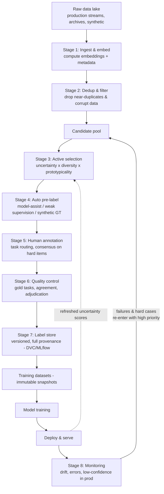
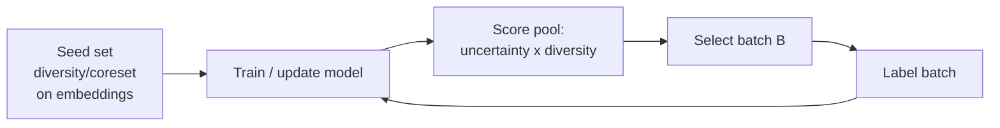

# Case Study: Data Labeling & Annotation Pipeline (with Active Learning)

> **Q27** · Tag: **[Domain]** · Family: ML Infrastructure & Platform
>
> **Prompt:** *"Design the labeling pipeline that feeds all our models."*
>
> **Teaches:** Label quality, active learning, and weak supervision.

---

## 0. How to read this document

This is not a cheat sheet to memorize. It is a **mental model** you internalize until the pipeline draws itself on the whiteboard.

Each section does three things: (1) states the idea, (2) grounds it with an analogy so it *sticks*, and (3) tells you what to actually **say in the room**. Callout boxes flag the moves that separate a senior answer from a junior one:

> 🎯 **Say this** — a line to actually speak in the interview.
> 🪤 **Trap** — the mistake most candidates make here.
> 🧠 **Senior signal** — the insight that makes an interviewer lean in.

If you only take one thing away: **this question is not "how do we get data labeled." It is "how do we spend a fixed labeling budget to maximize the quality of every model in the company."** That reframe is the whole game. Everything below is a consequence of it.

---

## The 60-second answer

If you had to compress the whole design into one breath: the real question is how do we spend a fixed labeling budget to maximize downstream model quality per labeling dollar, not simply how do we get data labeled. Active learning decides what to label next by combining **uncertainty** (least-confidence, margin, entropy, or ensemble/query-by-committee disagreement) with **diversity** (core-set/k-center coverage or clustering, since a naive top-uncertainty batch is often redundant) and **prototypicality** (representative, high-density examples for seed sets, since outliers confuse early learning and are disproportionately mislabeled) — unifying methods like BADGE fold uncertainty and diversity into one gradient-embedding score. Before any of that, **semantic dedup** in embedding space strips near-duplicates so you never pay to label the same frame twice. To bootstrap cheaply, **weak supervision** combines many noisy labeling functions via a label model (e.g., Snorkel) that learns each function's reliability from agreement patterns alone, and **synthetic data** (e.g., rendered scenes) supplies free, pixel-exact labels for rare classes at the cost of a sim-to-real domain gap closed via domain randomization and fine-tuning. Every label, human or machine, then passes through **quality control** — gold/honeypot tasks, multi-annotator consensus, and Dawid–Skene weighted voting, with disagreements escalated to an adjudication tier — because bad labels silently poison every model trained on them. Finally, a **feedback loop** closes the system: production failures, low-confidence predictions, and drift-detected regions flow back into the label queue as high-priority items, so the pipeline keeps learning from its own mistakes instead of only fighting yesterday's battles.

---

## 1. The one-paragraph mental model

You are designing a **factory that manufactures the fuel that every other ML system burns.** Raw data is crude oil; labeled data is refined fuel; your models are the engines. You cannot afford to refine every barrel, so you refine the *most valuable* barrels first (**active learning**). You never refine the same barrel twice (**semantic dedup**). You run quality inspectors on the line (**consensus + gold sets**). You have cheap synthetic refineries for common blends (**weak supervision + synthetic data**). And there is a return pipe from the engines telling you exactly which fuel they're choking on (**the feedback loop**). Miss any one of these and the factory still runs — it just wastes money, ships bad fuel, or slowly goes blind to the road ahead.

Hold that picture. Every design decision below is "how do we build one part of that refinery well."

---

## 2. Why this question is different

Almost every *other* system design question in the loop — recommendations, fraud, search, ETA — has the same shape: **input → model → prediction served to a user.** The output is a prediction, the user is a human or another service, and latency is measured in milliseconds.

This question inverts all three:

| | A "normal" ML system | The labeling pipeline |
|---|---|---|
| **The product is…** | a prediction | *labeled training data* |
| **The "user" is…** | an end customer | *your own ML teams* |
| **Latency is measured in…** | milliseconds | *hours-to-weeks* |
| **The core resource is…** | compute / QPS | *human annotation budget* |
| **You optimize…** | accuracy at serving | *model improvement per labeling dollar* |

> 🧠 **Senior signal:** open by naming this inversion out loud. *"Before I design anything — the output of this system isn't a served prediction, it's labeled data, and the customer is our own model teams. That means my north-star metric is downstream model quality per labeling dollar, and my hardest constraint is human budget, not latency. Let me scope from there."* You have just told the interviewer you understand **data-centric AI**, which is precisely where senior signal lives and where most candidates are weak.

This question rewards candidates who can speak concretely about how labels are actually produced, not just how models are trained. Most CV candidates hand-wave the data and obsess over model architecture — going two levels deeper than that, with specifics about selection, quality control, and provenance, is what makes an interviewer sit up.

---

## 3. The framework, applied (your Big-O skeleton)

We'll walk all nine steps of the standard framework, but the center of gravity is steps 4–6 (data, features, and the pipeline architecture). Spend your first five minutes on 1–3 anyway — jumping to "we'll use uncertainty sampling" before scoping the budget is the single most common way to fail this question.

### Step 1 — Clarify & scope

Turn the vague prompt into a written spec *before* you model anything. Ask the interviewer (and write the answers on the board):

**Clarifying questions that earn points:**
- **Modality & task?** Images? Video? LiDAR point clouds? Text? Multimodal? And is the task classification, detection (boxes), segmentation (masks), keypoints/pose, or extraction? *This changes everything about cost — a segmentation mask is ~10–50× the human effort of a class label.*
- **How many models does this feed, and how diverse are they?** A pipeline for one detector is very different from a shared platform serving 40 teams.
- **What is the labeling budget?** Dollars/month, or annotator headcount. This is your hardest constraint — pin it down.
- **In-house experts, crowd (vendor/MTurk), or a mix?** Medical/legal/safety data needs experts and can't go to a crowd.
- **What's the quality bar?** "95% label accuracy" vs. "safety-critical, near-zero false negatives" are different systems.
- **Cold start or steady state?** Do we already have models running (so we have uncertainty signals), or is this day one with zero labels?
- **Freshness / drift?** Is the world changing fast (new fraud patterns, new products) so labels go stale, or is it stable?

**Then write the spec** as functional vs. non-functional requirements:

**Functional (what it must do):**
1. Ingest raw unlabeled data continuously.
2. **Decide what to label next** (the active-learning brain).
3. Pre-label cheaply where possible (models, heuristics, synthetic).
4. Route work to the right annotators with clear tasks.
5. **Enforce label quality** and adjudicate disagreements.
6. Deliver **versioned, reproducible** labeled datasets to training teams.
7. **Close the loop:** route production model failures back into the priority queue.

**Non-functional (the qualities):**
- **Cost-efficiency** — maximize model gain per labeling dollar (the whole point).
- **Quality** — measurable, monitored, and stable as throughput scales.
- **Throughput** — N labels/day, with the ability to burst for a new project.
- **Turnaround SLA** — "request labels → receive dataset" in days, not months.
- **Reproducibility / auditability** — full provenance on every label (who, what, when, which model selected it).
- **Coverage / fairness** — no systematic blind spots, especially on the rare classes that matter most.

> 🎯 **Say this** to anchor scope concretely: *"I'll design for the hard case — a shared platform feeding many CV models, mixed in-house + vendor annotators, a fixed monthly budget, where segmentation and detection labels are expensive and the long-tail classes are exactly the ones we're short on. If we solve that, the easy cases fall out."*

### Step 2 — Frame as an ML problem

Here's the subtlety: **the pipeline is not one model — it's a system containing several ML components**, plus a single overarching optimization objective.

**The objective, stated formally:** given an unlabeled pool $U$ and a budget $B$ (you can afford to label $B$ items this cycle), choose the subset $S \subseteq U$, $|S| = B$, that — once labeled and added to training — **maximizes downstream model performance.** That is the active learning problem. It's a subset-selection / optimization problem under a budget constraint, not a prediction problem.

**The ML components inside the system:**
- The **active selector** (uses a model's uncertainty + embeddings).
- The **dedup / coverage** component (embeddings + nearest-neighbor).
- The **auto-labelers** (a current model doing pre-labels; weak-supervision label functions; synthetic generators).
- The **quality-control models** (annotator reliability estimation, agreement scoring).

> 🪤 **Trap:** answering "we hire annotators and give them a tool." That's the 10% of the system that isn't ML. The interviewer is testing whether you can put ML *in the loop* of producing the data — that's the interesting 90%.

Also do the honest baseline check the framework demands: **is ML even needed to decide what to label?** The baseline is **random sampling**. State plainly *when random wins*: if labels are cheap and abundant relative to your needs, random is simpler, unbiased, and hard to beat. **Active learning earns its complexity only when labels are expensive relative to data** — which, for expensive CV labels on a long-tailed distribution, they emphatically are. Naming when your fancy approach is *not* worth it is a senior move.

### Step 3 — Metrics

Three tiers, same as always, but the specifics are unusual — lean in on them.

**Offline / proxy metrics:**
- **Label quality:** accuracy against a trusted **gold set**; inter-annotator agreement — **Cohen's κ** (two raters) or **Krippendorff's α** (many raters, missing data). Raw agreement % lies when classes are imbalanced; κ/α correct for chance agreement.
- **Active-learning efficiency:** the **label-efficiency curve** — plot downstream model accuracy vs. number of labels. Your strategy is good if it reaches a target accuracy with **fewer labels than random**. The area between your curve and the random curve is your ROI.
- **Labeling throughput/cost:** labels/annotator-hour, cost/label, rework rate.

**North-star / business metric:**
- **Downstream model quality gained per labeling dollar.** Everything ladders up to this.
- **Time-to-labeled-dataset** for a brand-new task (platform agility).

**Guardrail metrics:**
- Label quality must **not degrade as throughput scales** (the classic failure when you rush).
- **Coverage of rare classes** — active learning can quietly starve or over-sample regions of the input space.
- **Annotator wellbeing / burnout** — a real guardrail for moderation-style work, and interviewers respect that you name it.

> 🧠 **Senior signal — the offline↔online gap, this question's version:** Active learning deliberately makes your labeled set **non-i.i.d.** — it over-samples hard/informative regions. Two consequences most candidates miss: **(1)** the resulting model can be **miscalibrated** because its training distribution no longer matches reality; **(2)** you **cannot reuse this AL-selected set as an unbiased evaluation set** — it's skewed toward hard cases. **Fix:** always run a small **random-sampled reference stream** alongside the active stream. Random gives you an unbiased eval/calibration set and a canary for blind spots; active gives you efficiency. Split the budget, e.g. 80% active / 20% random. Saying this unprompted is a top-decile answer.

### Step 4 — Data (this *is* the product)

Since labels are the output, "data" here means: **where does raw data come from, and what are your sources of labels, ranked by cost and quality?**

**Raw data sources:** production streams (camera feeds, user uploads, robot logs), historical archives, and **synthetic generators** (more on this below).

**The label-source hierarchy** — think of it as a cost/quality ladder, and design the pipeline to **push each item to the cheapest source that meets the quality bar**:

| Source | Cost | Quality | Best for |
|---|---|---|---|
| **Expert humans** | 💰💰💰 | Highest | Gold sets, safety-critical, ambiguous edge cases |
| **Crowd / vendor humans** | 💰💰 | Medium (noisy) | Bulk labeling of well-specified tasks |
| **Model-assisted (human corrects a pre-label)** | 💰 | Medium-high | Anything an existing model can rough-draft |
| **Weak supervision (labeling functions)** | 💰 (upfront) | Noisy but scalable | Big pools with writable heuristics |
| **Synthetic (renderer, free ground truth)** | ~free per label | Perfect labels, but *domain gap* | Rare classes, exact geometry, pre-training |
| **Model pseudo-labels (self-training)** | ~free | Confident-only | Padding out confident regions |

**Class imbalance is the plot twist.** The rare classes — the long tail — are exactly the ones your models are worst at and the ones you most need labels for. But they're *rare in the pool*, so random sampling barely touches them. This is a core reason active learning and targeted mining exist: to **go hunting for the rare stuff** instead of waiting for it to show up.

> 🎯 **Say this:** *"Labeling budget is a portfolio allocation problem. I want every item to be labeled by the cheapest source that clears the quality bar — synthetic and weak supervision for the common, well-specified cases; humans reserved for the ambiguous long tail where their judgment actually earns its cost."*

### Step 5 — Features (for the selector) & the leakage trap

The active selector needs signals to score each candidate. Its "features" are:
- **Uncertainty scores** from the current model (entropy, margin, ensemble disagreement — §6.2).
- **Embeddings** — for diversity, coverage, and dedup (§6.1, §6.2).
- **Prototypicality / density** — is this a representative example or a weird outlier? (§6.2).
- **Metadata** — source, timestamp, geography, sensor, capture conditions.

> 🧠 **Senior signal — leakage lives here too.** If you select samples *and* measure improvement with the *same* model, you can fool yourself. And you must track **which model version produced the uncertainty score for each selected item** — otherwise, six months later, you can't reproduce or debug why the pool skewed the way it did. This is **point-in-time correctness for the selection decision**, and it's the same discipline as a feature store's point-in-time joins. A data/label versioning tool (e.g., DVC) paired with an experiment-tracking tool (e.g., MLflow) is the concrete way to enforce this.

### Step 6 — The model / the architecture (the heart of the answer)

This is where you spend the most whiteboard time. Draw the pipeline as a sequence of stages, then deep-dive the two or three the interviewer probes. Here is the full flow:

Walk the stages:

**Stage 1 — Ingest & embed.** Raw data lands in a lake. Immediately compute an **embedding** for each item (from a pretrained backbone / foundation model) and attach metadata. The embedding is the workhorse for the next two stages — it's your universal coordinate system for "how similar are these two items."

**Stage 2 — Dedup & filter (§6.1).** Remove near-duplicates and junk *before* you spend a cent on selection or humans.

**Stage 3 — Active selection (§6.2).** The brain. Score the deduped pool and pick the batch worth the most.

**Stage 4 — Auto pre-label (§6.3).** Before a human sees an item, get a cheap draft label on it (model-assist, weak supervision, or use synthetic data with free ground truth). Humans *correct* rather than *create* — often a 2–5× speedup.

**Stage 5 — Human annotation.** Route tasks to the right annotator pool with crisp instructions and a good UI. Send hard/important items to **multiple** annotators for consensus.

**Stage 6 — Quality control (§6.4).** Gold/honeypot tasks, agreement scoring, adjudication tier, per-annotator quality tracking.

**Stage 7 — Label store.** Every label stored with **full provenance** and the dataset **versioned** so training is reproducible.

**Stage 8 — Monitoring & feedback (§6.5).** Production failures and low-confidence predictions flow **back** into the pool as high-priority candidates. This is the loop that keeps the system alive.

Now the deep dives.

---

#### 6.1 Semantic dedup — stop paying to label the same thing twice

**The problem, concretely:** a 10-second robot camera clip at 30 fps is 300 frames that are *nearly identical*. Paying a human to draw masks on all 300 is like paying someone to proofread 300 photocopies of one page. Worse, feeding 300 near-duplicate frames into training adds almost zero information but skews your data distribution toward "whatever the camera happened to point at a lot."

**The mechanism:** embed everything (Stage 1), then find near-duplicates in embedding space via **approximate nearest neighbor (ANN)** search or **clustering**. Within each tight cluster of near-duplicates, keep one (or a few diverse) representative and drop the rest. You can also filter corrupt/blurred/irrelevant frames here.

> 💡 **Make it concrete** — if you have a real example from your own work (e.g., a video or sensor pipeline where consecutive frames were near-duplicates, and dedup in embedding space cut redundant labeling before selection even ran), use it here. A specific number beats a generic claim.

> 🪤 **Trap:** dedup by exact hash / pixel diff. That catches literal duplicates but misses *near*-duplicates (a 1-pixel shift, a re-encode, a slightly different crop), which are the expensive ones. **Semantic** (embedding) dedup is the point.

#### 6.2 Active selection — what to label next (the "nail this" centerpiece)

You have a budget for $B$ labels this cycle. Which $B$ items from the pool? This decomposes into two forces that must be **combined**:

**Force 1 — Uncertainty (informativeness): "label what the model is unsure about."**

*Analogy:* a student with limited study time re-does the problems they get *wrong*, not the ones they already ace. Uncertain examples are where the decision boundary is fuzzy — labeling them sharpens it most.

How to measure model uncertainty:
- **Least confidence:** pick $x$ with the lowest top-class probability, $1 - \max_y P(y\mid x)$.
- **Margin sampling:** pick $x$ with the smallest gap between the top-1 and top-2 class probabilities — the model is torn between two answers.
- **Entropy:** pick $x$ with the highest predictive entropy $-\sum_y P(y\mid x)\log P(y\mid x)$ — good for many classes.
- **Ensemble / committee disagreement (query-by-committee, BALD):** train several models (or use MC-dropout) and pick where they *disagree* most. This captures **epistemic** uncertainty ("the model doesn't know because it hasn't seen this") and is more robust than a single softmax, which can be confidently wrong.

**Force 2 — Diversity / representativeness: "cover the space; don't pile up on one spot."**

*Analogy:* if you only study what confuses you, you might spend the whole night on 50 variations of one ambiguous (possibly mislabeled) question and never review three entire topics. Coverage matters.

How to enforce diversity:
- **Core-set / k-center greedy:** choose points so that *every* unlabeled point is close to *some* labeled point — a coverage guarantee over the input space.
- **Clustering:** cluster embeddings, sample across clusters so no region is starved.
- **Density weighting:** down-weight low-density outliers so you don't waste budget on one-off weirdos.

**Why you MUST combine them — the batch problem (this is the senior insight):**

You can't retrain after every *single* label — that's computationally absurd. So you always select in **batches**. And here's the killer: **if you take the top-$B$ most uncertain items, they're often near-identical to each other** (the model is uncertain about one hard region, and that region has many similar points). You just paid for $B$ labels and learned *one* thing.

So batch active learning **needs diversity built in**. The elegant unifying methods:
- **BADGE** — represent each point by its *gradient embedding*. The **magnitude** encodes uncertainty (how much this point would move the model); the **direction** encodes what kind of update. Then run k-means++ seeding to pick a batch that is simultaneously **high-magnitude (uncertain)** and **spread out (diverse)**. One trick, both forces.
- **Cluster-Margin** — filter to the most uncertain-by-margin items, then cluster them and sample across clusters. Simpler, very effective.

**Force 3 — Prototypicality: "learn the concept from clean, representative examples first."**

*Analogy:* to teach a child "dog," you start with a golden retriever (prototypical), not a hairless chihuahua in a raincoat (outlier). Outliers confuse early learning and are disproportionately **mislabeled**.

Prototypicality / typicality scoring picks representative, high-density examples. It's essential for the **seed set** and for balancing an over-aggressive uncertainty sampler that would otherwise chase noisy outliers. It connects to the data-pruning literature (forgetting events, EL2N, memorization scores) — the same "which examples actually matter" question, viewed from the training side.

> 💡 **Make it concrete** — if you have a real example from your own work (e.g., a curation pipeline that combined uncertainty, diversity, and prototypicality, or a case where pure uncertainty sampling produced a batch of near-duplicate hard cases until diversity was added), use it here. A specific number beats a generic claim.

> 🪤 **Trap:** proposing "uncertainty sampling" and stopping. Every interviewer who knows this space is waiting for you to notice the batch/redundancy problem. Get there *before* they ask.

**The active learning loop** (draw this small cycle next to your architecture):

#### 6.3 Weak supervision & synthetic labels — manufacture labels cheaply

Humans are your most expensive resource. Two ways to make labels without (much) human effort:

**Weak supervision (labeling functions).** Instead of one careful human label per item, write many quick, noisy **labeling functions (LFs)** — heuristics, rules, patterns, existing-model outputs. *Analogy:* rather than one expert reading each email for spam, you write 20 rules ("has the word 'viagra'", "sender not in contacts", "10+ links"). Each rule is a noisy voter with unknown reliability. A **label model** (Snorkel-style) then learns *which LFs to trust and how they correlate* — purely from their agreement/disagreement patterns, **without ground truth** — and combines them into probabilistic labels. You then train your real model on those probabilistic labels, and it *generalizes beyond* the LFs' coverage. You trade a little per-label accuracy for enormous scale.

**Synthetic data with free ground truth.** *Analogy:* you can't crash 1,000 real planes to train pilots on engine failure, so you use a flight simulator. When you *render* a 3D scene, you **placed every object yourself**, so you know the perfect segmentation mask, 3D pose, and class of every pixel — the labels are free and pixel-exact. The catch is the **domain gap** (sim-to-real): synthetic images can look subtly different from real ones, so a model trained purely on them may stumble on reality. You close the gap with **domain randomization** (randomize textures, lighting, clutter, camera so the model can't overfit to sim artifacts) and **domain adaptation / fine-tuning on a small real set**.

> 💡 **Make it concrete** — tools like BlenderProc can render synthetic scenes with perfect auto-generated annotations (pixel-exact masks, 6-DoF poses) for objects that almost never appear in the real pool, with the sim-to-real gap controlled via domain randomization and a small real fine-tuning set. If you've built or used a synthetic-data pipeline like this, use it here — a specific number (e.g., how much cheaper than hand-masking rare objects) beats a generic claim. Most candidates have never generated a labeled example this way, so grounding the discussion in a concrete mechanism is a genuine differentiator.

> 🧠 **Senior signal:** frame synthetic + weak supervision as **the bottom of the cost ladder** from §Step 4. The pipeline's job is to route each item to the cheapest adequate source; humans are reserved for the ambiguous long tail where judgment is irreplaceable.

#### 6.4 Quality control — trust, but verify

Cheap noisy labels are worthless if you can't tell good from bad. Four mechanisms, layered:

- **Gold / honeypot tasks.** Secretly mix items with *known* answers into each annotator's stream. *Analogy:* a mystery shopper, or a driving test with a hidden examiner. If an annotator flunks the honeypots, their other work is suspect — you can down-weight or retrain them, and re-queue their output.
- **Consensus (multiple annotators per item).** For hard or high-stakes items, have several people label independently. Naive **majority vote** is the baseline, but it treats all annotators as equally reliable.
- **Weighted consensus (Dawid–Skene).** *Analogy:* a weighted jury. If juror A is right 95% of the time and juror B 60%, weight A's vote more. Dawid–Skene uses EM to **jointly estimate each annotator's reliability (their confusion matrix) and the true labels** — a principled upgrade over majority vote. This is what you name when asked "how do you combine multiple noisy annotations."
- **Adjudication tier.** When annotators disagree beyond a threshold, escalate to a senior reviewer/expert whose call is final and becomes gold.

Also: track **per-annotator quality over time** (agreement with consensus, honeypot accuracy, speed-vs-accuracy) to detect drift, fatigue, or bad actors. And feed **clear, versioned annotation guidelines** — most "annotator disagreement" is really *instruction* ambiguity, not human error.

> 🧠 **Senior signal:** label quality is not a one-time gate; it's a **monitored, continuous** property, exactly like model quality in production. Bad labels are *worse* than no labels because they silently poison every model that trains on them — and you may not notice for months.

#### 6.5 The feedback loop — how the system stays alive

*Analogy:* an **immune system.** When the model fails in production — a new object it's never seen, a rare lighting condition, an adversarial case — that failure is a pathogen. The feedback loop is the adaptive immune response: capture the failure, label it, feed it back so the model builds "antibodies." **A labeling pipeline with no feedback loop is an organism with no adaptive immunity — it can only ever fight yesterday's battles.**

Concretely, three signals flow from production back into the candidate pool as **high-priority** items:
1. **Explicit failures** — mispredictions surfaced by users, downstream checks, or human review.
2. **Low-confidence predictions in production** — the deployed model's own uncertainty, computed on live traffic (this is uncertainty sampling, but on the *real* distribution instead of a static pool).
3. **Drift-detected regions** — data that no longer looks like the training set (§Step 9).

> 💡 **Make it concrete** — if you have a real example from your own work (e.g., a real annotation-cost reduction from active learning, or a production system where failures were automatically captured, prioritized in the label queue, and folded back into the next training set), use it here. A specific number beats a generic claim. Closing the loop is the move this prompt explicitly asks for — land it hard, with or without a personal anecdote.

This question rewards depth — a good chance to show senior-level thinking on the data side. The two structural angles worth bringing to bear here, and to any adjacent question: the **data-centric** angle (curation, active learning, synthetic data, dedup) where most candidates over-index on architecture instead, and the **MLOps/reproducibility** angle (how the pipeline ships and stays healthy) where most candidates hand-wave.

### Step 7 — Training (of the pipeline's own models)

The pipeline contains models that themselves need training and retraining:
- The **selection model** is retrained each cycle as new labels arrive — that's the AL loop (§6.2). Cadence is a knob: retrain every batch (max efficiency, max cost) vs. every N batches (cheaper, slightly stale scores).
- Reproducibility is non-negotiable: **version the pool, the selection decision, the labels, and the code together.** A DVC (data/label versioning) + MLflow (experiment/lineage) stack is a concrete answer. Being able to reconstruct "dataset v37 = these labels, selected by model v12, adjudicated on these dates" is what lets you debug a bad model months later.
- Efficiency tie-in: once you have the labeled set, training itself can be made cheaper with data-centric tricks — **InfoBatch-style loss-based pruning, mixed precision, multi-GPU**. Mention that data-centric thinking runs end-to-end, from *which data to label* to *which data to keep in the training loop*.

### Step 8 — Evaluation & serving (delivery)

"Serving" here means **delivering versioned labeled datasets to model teams** — think of the pipeline as an internal platform with a request API: *"I need N labels for task T on data slice S by date D."*

Roll out changes to the pipeline the same way you'd roll out a model:
- **Offline:** measure label quality on gold sets; measure the **label-efficiency curve** (does the new strategy hit target accuracy with fewer labels than the incumbent?).
- **Shadow:** run a new selection strategy in parallel on a slice, compare downstream model gains, without spending real budget on it yet.
- **A/B on budget:** split the labeling budget between strategies, train downstream models on each, compare **actual model performance** — the only metric that ultimately matters.
- Deliver datasets as **immutable, versioned snapshots** so a training run is always reproducible.

### Step 9 — Monitoring & iteration (closing the lifecycle)

Monitor three distinct things, because they fail differently:
1. **Input / pool composition** — are you over-sampling one region of input space? AL can create **blind spots**; your random reference stream (§Step 3) is the canary.
2. **Label quality** — annotator agreement, honeypot accuracy, rework rate. Alert when these drift *down*, which usually means either annotator fatigue or a task-instruction problem.
3. **Downstream outcomes** — which labeled batches actually improved models? Retire strategies that don't pay off.

**Data drift vs. concept drift** (the distinction the framework wants you to name):
- **Data drift** — the *inputs* change (new camera, new store layout, new season). $P(x)$ shifts.
- **Concept drift** — the *input→label relationship* changes (what counts as "spam" or "defective" evolves). $P(y\mid x)$ shifts. This one is nastier: your old labels can become *wrong*, not just insufficient.

Either drift is a **retraining trigger** that fires new priorities into the labeling queue — connecting monitoring right back to Stage 3. The lifecycle is a circle, not a line.

---

## 4. The cold-start problem (a favorite follow-up)

On day one you have **no model**, so you can't compute uncertainty. What do you do? Don't freeze — reach for representation you *already* have:

1. **Foundation-model embeddings + diversity sampling.** You don't need labels to embed data with a pretrained backbone. Cluster the pool and label a **diverse, prototypical seed set** across clusters — instant broad coverage with zero uncertainty signal needed.
2. **Zero-shot / weak labels to bootstrap.** Use a pretrained or foundation model's zero-shot predictions (and their confidence) as a *rough* uncertainty proxy to jump-start selection.
3. **Synthetic pre-training.** For rare classes, generate synthetic labeled data (BlenderProc) to train a *first* model — which then produces the uncertainty scores that let the normal AL loop take over.

> 🎯 **Say this:** *"Cold start is where diversity beats uncertainty — with no model, I seed with coreset/coverage sampling on foundation-model embeddings, optionally bootstrap with synthetic data for rare classes, and switch to the uncertainty×diversity loop once the first model exists."*

---

## 5. Curveball follow-ups & how to swing at them

Interviewers add constraints mid-answer to see if your design bends without breaking. Prepare these:

- **"Labels are delayed 3 weeks (e.g., chargebacks, outcomes)."** → Decouple *selection* from *label arrival*. Select and dispatch continuously; the training-set update is asynchronous and versioned as labels land. Track label latency as a first-class metric. Use pseudo-labels/weak supervision to bridge the gap where a provisional label is good enough.
- **"Now it must run at the edge / on-device."** → The *selector* can run on-device: compute uncertainty on the robot/camera and only **upload the informative + low-confidence frames**, saving bandwidth and privacy. This is uncertainty sampling pushed to the sensor — a natural extension of the feedback loop discussed in §6.5.
- **"Annotators are expensive experts (radiologists), budget is tiny."** → Maximize model-assist (pre-label so the expert only *corrects*), aggressive dedup, and reserve experts strictly for adjudication + gold. Weak supervision to cover the easy bulk.
- **"How do you know your active learner isn't creating blind spots?"** → The random reference stream (§Step 3), pool-composition monitoring (§Step 9), and per-class coverage guardrails. Name that AL trades unbiasedness for efficiency, so you *deliberately* keep an unbiased channel.
- **"A downstream model regressed after your last dataset ship — debug it."** → Provenance + versioning: diff dataset v_n vs v_{n-1}, check for a label-quality drop (annotator drift, honeypot failures), a distribution skew from an over-aggressive selection batch, or concept drift making old labels stale. This is the reproducibility story paying off.
- **"Cut labeling cost 50% next quarter."** → Dedup harder, push more volume to weak supervision + synthetic, model-assist everything, and reallocate saved human budget to the long tail where it has the highest marginal value.

---

## 6. Common failure modes (the traps that sink candidates)

1. **"We hire annotators and build a tool."** — Missing the ML-in-the-loop. This is the biggest one.
2. **Pure uncertainty sampling.** — Ignoring the batch/redundancy problem; forgetting diversity.
3. **No quality-control story.** — Treating human labels as ground truth. Bad labels silently poison everything.
4. **No provenance / versioning.** — Can't reproduce, can't debug, can't roll back.
5. **No feedback loop.** — A static pipeline that fights only yesterday's battles.
6. **Ignoring AL's sampling bias.** — No random reference stream; miscalibration and blind spots go unnoticed.
7. **No baseline.** — Not stating when random sampling is actually the right, simpler choice.
8. **Jumping to technique before scoping budget & quality bar.** — The universal senior-loop failure.

---

## Interview delivery guide — the 30-minute answer, choreographed

A timing template so you never freeze at the whiteboard:

- **0–5 min — Reframe & scope.** State the inversion (product = labeled data, customer = model teams, constraint = human budget, north-star = model gain per dollar). Ask the clarifying questions. Write functional + non-functional requirements.
- **5–8 min — Frame & metrics.** Objective = maximize downstream model quality under a label budget. Name the offline↔online gap (AL sampling bias) and the random-reference-stream fix. State the label-efficiency curve as your key proxy metric.
- **8–20 min — Architecture (spend your time here).** Draw the 8-stage pipeline. Deep-dive the three the prompt flags: **active selection** (uncertainty × diversity × prototypicality; the batch problem), **semantic dedup**, and **weak supervision / synthetic labels**. Then **quality control** (gold sets, Dawid–Skene) and the **feedback loop**.
- **20–26 min — Lifecycle.** Versioning/provenance (DVC/MLflow), delivery as immutable snapshots, shadow/A-B rollout of selection strategies, monitoring (data vs. concept drift, blind-spot canary), retraining triggers.
- **26–30 min — Curveballs & wrap.** Cold start, delayed labels, or edge, depending on where the interviewer pushed. Close by restating the north-star: *every design choice buys more model quality per labeling dollar.*

---

## 8. Flashcards

| Cue | What you must be able to say |
|---|---|
| The reframe | Product = labeled data, customer = your own model teams, constraint = human budget, north-star = model quality gained per labeling dollar. |
| When does active learning (AL) *not* pay off? | When labels are cheap and abundant relative to need — random sampling is simpler and hard to beat. AL earns its complexity only when labels are expensive relative to data. |
| Uncertainty sampling | Pick items the current model is least confident on: least-confidence, margin, entropy, or ensemble/committee disagreement (query-by-committee, BALD) for epistemic uncertainty. |
| Diversity / core-set sampling | Choose points so every unlabeled point is close to some labeled point (k-center greedy); or cluster embeddings and sample across clusters. Prevents redundant batches. |
| The batch-redundancy problem | Top-B most-uncertain items are often near-identical (same confusing region), so a naive uncertainty-only batch teaches the model almost nothing new. Batch AL must combine uncertainty with diversity. |
| BADGE | Represents each point by a gradient embedding: magnitude encodes uncertainty, direction encodes diversity; k-means++ seeding picks a batch that is both uncertain and spread out. |
| Prototypicality / typicality sampling | Prefer representative, high-density examples (not outliers) for seed sets and early training — outliers are disproportionately mislabeled and confuse early learning. |
| Semantic dedup | Remove *near*-duplicates in embedding space (via ANN search or clustering), not just exact-hash duplicates — the near-duplicates are the expensive, information-poor ones. |
| Weak supervision | Combine many cheap, noisy labeling functions via a label model (e.g., Snorkel) that learns each function's reliability from agreement patterns alone, without ground truth. |
| Synthetic data with free ground truth | Rendering a scene means you know every object's exact label; the tradeoff is the sim-to-real domain gap, closed via domain randomization and a small real fine-tuning set. |
| Dawid–Skene | EM algorithm that jointly estimates each annotator's reliability (confusion matrix) and the true label from multiple noisy annotations — a principled upgrade over majority vote. |
| Gold sets / honeypots | Items with known answers secretly mixed into an annotator's stream, used to measure and monitor annotator quality over time. |
| Cohen's κ vs. Krippendorff's α | Both measure inter-annotator agreement correcting for chance; κ is for two raters, α generalizes to many raters and missing data. Raw agreement % is misleading under class imbalance. |
| The random-reference-stream fix | AL deliberately makes the labeled set non-i.i.d. (biased toward hard/informative regions), which can miscalibrate models and hide blind spots. Fix: always label a small random-sampled stream alongside the active stream for unbiased eval/calibration. |
| Cold start (no model yet) | Use foundation-model embeddings for diversity/core-set seed-set sampling (no uncertainty signal needed); optionally bootstrap with zero-shot labels or synthetic data until a first model exists. |
| Closing the loop | Production failures, low-confidence predictions, and drift-detected regions all flow back into the candidate pool as high-priority items — without this, the pipeline only ever fights yesterday's battles. |
| Data drift vs. concept drift | Data drift: $P(x)$ shifts (new inputs). Concept drift: $P(y\mid x)$ shifts (the labeling rule itself changes) — concept drift can make old labels actively wrong, not just insufficient. |
| Label-efficiency curve | Downstream accuracy vs. number of labels used; a good AL strategy reaches a target accuracy with fewer labels than random — the area between the curves is the ROI. |

---

## 9. Quick-reference cheat sheet

**The reframe:** product = labeled data · customer = model teams · constraint = human budget · north-star = model quality gained per labeling dollar.

**The 8 stages:** ingest+embed → dedup → **active select** → pre-label (weak/synthetic) → human annotate → **QC** → versioned label store → deliver; with a **feedback loop** from production back to the pool.

**Active selection = uncertainty × diversity × prototypicality**, always in **batches** (so diversity is mandatory). Uncertainty: margin / entropy / ensemble-disagreement. Diversity: coreset / clustering. Unifier: BADGE.

**Cheap labels ladder:** synthetic (free, domain gap) → weak supervision (LFs + label model) → model-assist (human corrects) → crowd → expert. Route each item to the cheapest adequate source.

**Quality control:** gold/honeypots · consensus · **Dawid–Skene** weighted vote · adjudication tier · per-annotator tracking · versioned guidelines.

**Don't forget:** random reference stream (fights AL sampling bias) · provenance + versioning (DVC/MLflow) · data drift vs. concept drift · cold start via coreset-on-embeddings.

**When NOT to use AL:** labels cheap & abundant → random sampling wins. AL earns its keep only when labels are expensive relative to data.

---

## 10. Glossary

- **Active learning (AL):** iteratively selecting the most valuable unlabeled data to label, to reach target accuracy with fewer labels.
- **Uncertainty sampling:** AL by picking examples the model is least confident on (least-confidence / margin / entropy).
- **Query-by-committee / BALD:** AL by ensemble/Bayesian disagreement; captures epistemic uncertainty.
- **Core-set / k-center:** diversity selection guaranteeing coverage of the input space.
- **BADGE:** batch AL via gradient embeddings — uncertainty (magnitude) + diversity (direction) in one selection.
- **Prototypicality / typicality:** how representative an example is; guards against chasing noisy outliers.
- **Semantic dedup:** removing *near*-duplicates in embedding space (not just exact hashes).
- **Weak supervision / labeling functions:** noisy heuristic labelers combined by a **label model** (e.g., Snorkel) without ground truth.
- **Dawid–Skene:** EM method estimating annotator reliability + true labels from multiple noisy annotations.
- **Gold set / honeypot:** known-answer tasks hidden in the stream to measure annotator quality.
- **Domain randomization / sim-to-real gap:** techniques for making synthetic-trained models transfer to reality.
- **Data drift vs. concept drift:** $P(x)$ shift vs. $P(y\mid x)$ shift.
- **Label-efficiency curve:** accuracy vs. #labels; the core way to prove an AL strategy beats random.

**Transfers to:** [Q13](./13-large-scale-image-auto-tagging.md) (active learning for auto-tagging), [Q12](./12-object-detection-av-robotics.md) (mining rare classes for AV/robotics), Q18 (coming soon — data curation for LLM fine-tuning), Q28 (coming soon — drift → retraining triggers), Q23 (coming soon — point-in-time correctness / provenance). Master this one and you've pre-loaded the data-centric half of several other questions.

---

## 11. Further reading & tools

**Papers**
- [Dawid & Skene, "Maximum Likelihood Estimation of Observer Error-Rates Using the EM Algorithm"](https://scholar.google.com/scholar?q=Maximum+Likelihood+Estimation+of+Observer+Error-Rates+Using+the+EM+Algorithm) — the EM method for combining noisy annotator labels.
- [Ash et al., "Deep Batch Active Learning by Diverse, Uncertain Gradient Lower Bounds" (BADGE)](https://scholar.google.com/scholar?q=Deep+Batch+Active+Learning+by+Diverse%2C+Uncertain+Gradient+Lower+Bounds) — the gradient-embedding batch active-learning method covered in §6.2.
- [Settles, "Active Learning Literature Survey"](https://scholar.google.com/scholar?q=Active+Learning+Literature+Survey) — a broad survey of uncertainty, query-by-committee, and other AL strategies.
- [Ratner et al., "Snorkel: Rapid Training Data Creation with Weak Supervision"](https://scholar.google.com/scholar?q=Snorkel%3A+Rapid+Training+Data+Creation+with+Weak+Supervision) — the label-model approach to combining labeling functions.
- [Cohen, "A Coefficient of Agreement for Nominal Scales"](https://scholar.google.com/scholar?q=A+Coefficient+of+Agreement+for+Nominal+Scales) — Cohen's κ, inter-annotator agreement for two raters.
- [Krippendorff, "Computing Krippendorff's Alpha-Reliability"](https://scholar.google.com/scholar?q=Computing+Krippendorff%27s+Alpha-Reliability) — Krippendorff's α, generalizes agreement to many raters and missing data.
- [Qin et al., "InfoBatch: Lossless Training Speed Up by Unbiased Dynamic Data Pruning"](https://scholar.google.com/scholar?q=InfoBatch%3A+Lossless+Training+Speed+Up+by+Unbiased+Dynamic+Data+Pruning) — loss-based data pruning during training, referenced in Step 7.

**Tools**
- [Snorkel](https://github.com/snorkel-team/snorkel) — open-source framework for weak supervision / labeling functions.
- [BlenderProc](https://github.com/DLR-RM/BlenderProc) — a procedural rendering pipeline for generating synthetic images with pixel-exact ground-truth labels.
- [DVC](https://dvc.org/) — data and label versioning for reproducible datasets.
- [MLflow](https://mlflow.org/) — experiment tracking and lineage.

---

*Part of the [ML System Design Case Studies](../README.md) series.*
